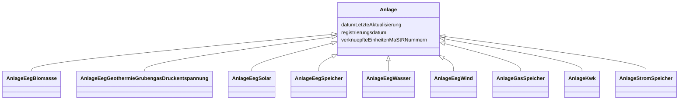

---
search:
  boost: 10.0
---

# Class: Anlage 


_Gemeinsame Attribute der Anlage-Klassen._


<div data-search-exclude markdown="1">


* __NOTE__: this is an abstract class and should not be instantiated directly


URI: [mastr:class/Anlage](https://example.org/mastr/class/Anlage)





## Inheritance
* **Anlage**
    * [AnlageEegBiomasse](../classes/AnlageEegBiomasse.md)
    * [AnlageEegGeothermieGrubengasDruckentspannung](../classes/AnlageEegGeothermieGrubengasDruckentspannung.md)
    * [AnlageEegSolar](../classes/AnlageEegSolar.md)
    * [AnlageEegSpeicher](../classes/AnlageEegSpeicher.md)
    * [AnlageEegWasser](../classes/AnlageEegWasser.md)
    * [AnlageEegWind](../classes/AnlageEegWind.md)
    * [AnlageGasSpeicher](../classes/AnlageGasSpeicher.md)
    * [AnlageKwk](../classes/AnlageKwk.md)
    * [AnlageStromSpeicher](../classes/AnlageStromSpeicher.md)


## Slots

| Name | Cardinality and Range | Description | Inheritance |
| ---  | --- | --- | --- |
| [registrierungsdatum](../slots/registrierungsdatum.md) | 0..1 <br/> [Date](../types/Date.md) | Registrierungsdatum der EEG- Anlage | direct |
| [datumLetzteAktualisierung](../slots/datumLetzteAktualisierung.md) | 0..1 <br/> [Datetime](../types/Datetime.md) | Datum der letzten Aktualisierung an diesem Objekt | direct |
| [verknuepfteEinheitenMaStRNummern](../slots/verknuepfteEinheitenMaStRNummern.md) | 0..1 <br/> [String](../types/String.md) | Liste von MaStR Nummern mit den verknüpften Stromerzeugern | direct |


## Identifier and Mapping Information


### Schema Source


* from schema: https://example.org/mastr


## Mappings

| Mapping Type | Mapped Value |
| ---  | ---  |
| self | mastr:Anlage |
| native | mastr:Anlage |


## LinkML Source

<!-- TODO: investigate https://stackoverflow.com/questions/37606292/how-to-create-tabbed-code-blocks-in-mkdocs-or-sphinx -->

### Direct

<details>
```yaml
name: Anlage
description: Gemeinsame Attribute der Anlage-Klassen.
from_schema: https://example.org/mastr
abstract: true
attributes:
  registrierungsdatum:
    name: registrierungsdatum
    instantiates:
    - xsd:element
    description: Registrierungsdatum der EEG- Anlage
    from_schema: https://example.org/mastr
    rank: 1000
    domain_of:
    - Anlage
    - AnlageEegSpeicher
    - AnlageGasSpeicher
    - AnlageKwk
    - AnlageStromSpeicher
    - Einheit
    - EinheitGenehmigung
    range: date
  datumLetzteAktualisierung:
    name: datumLetzteAktualisierung
    instantiates:
    - xsd:element
    description: Datum der letzten Aktualisierung an diesem Objekt
    from_schema: https://example.org/mastr
    rank: 1000
    domain_of:
    - Anlage
    - Einheit
    - EinheitGenehmigung
    - Ertuechtigung
    - GeloeschteUndDeaktivierteEinheit
    - GeloeschterUndDeaktivierterMarktakteur
    - Lokation
    - MarktakteurUndRolle
    - Netz
    range: datetime
  verknuepfteEinheitenMaStRNummern:
    name: verknuepfteEinheitenMaStRNummern
    instantiates:
    - xsd:element
    description: Liste von MaStR Nummern mit den verknüpften Stromerzeugern
    from_schema: https://example.org/mastr
    rank: 1000
    domain_of:
    - Anlage
    - EinheitGasverbraucher
    - EinheitGenehmigung
    - Lokation
    range: string

```
</details>

### Induced

<details>
```yaml
name: Anlage
description: Gemeinsame Attribute der Anlage-Klassen.
from_schema: https://example.org/mastr
abstract: true
attributes:
  registrierungsdatum:
    name: registrierungsdatum
    instantiates:
    - xsd:element
    description: Registrierungsdatum der EEG- Anlage
    from_schema: https://example.org/mastr
    rank: 1000
    owner: Anlage
    domain_of:
    - Anlage
    - AnlageEegSpeicher
    - AnlageGasSpeicher
    - AnlageKwk
    - AnlageStromSpeicher
    - Einheit
    - EinheitGenehmigung
    range: date
  datumLetzteAktualisierung:
    name: datumLetzteAktualisierung
    instantiates:
    - xsd:element
    description: Datum der letzten Aktualisierung an diesem Objekt
    from_schema: https://example.org/mastr
    rank: 1000
    owner: Anlage
    domain_of:
    - Anlage
    - Einheit
    - EinheitGenehmigung
    - Ertuechtigung
    - GeloeschteUndDeaktivierteEinheit
    - GeloeschterUndDeaktivierterMarktakteur
    - Lokation
    - MarktakteurUndRolle
    - Netz
    range: datetime
  verknuepfteEinheitenMaStRNummern:
    name: verknuepfteEinheitenMaStRNummern
    instantiates:
    - xsd:element
    description: Liste von MaStR Nummern mit den verknüpften Stromerzeugern
    from_schema: https://example.org/mastr
    rank: 1000
    owner: Anlage
    domain_of:
    - Anlage
    - EinheitGasverbraucher
    - EinheitGenehmigung
    - Lokation
    range: string

```
</details></div>