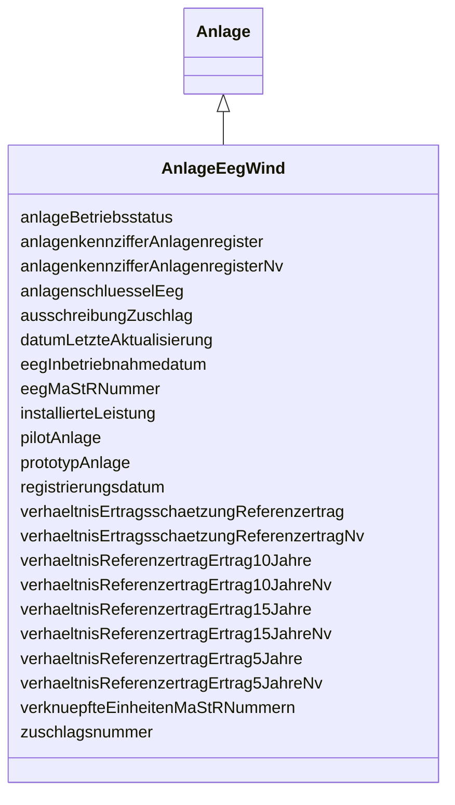

---
search:
  boost: 10.0
---

# Class: AnlageEegWind 

<div data-search-exclude markdown="1">


URI: [mastr:class/AnlageEegWind](https://example.org/mastr/class/AnlageEegWind)





## Inheritance
* [Anlage](../classes/Anlage.md)
    * **AnlageEegWind**


## Slots

| Name | Cardinality and Range | Description | Inheritance |
| ---  | --- | --- | --- |
| [eegInbetriebnahmedatum](../slots/eegInbetriebnahmedatum.md) | 0..1 <br/> [Date](../types/Date.md) | Inbetriebnahmedatum der EEG-Anlage | direct |
| [eegMaStRNummer](../slots/eegMaStRNummer.md) | 0..1 <br/> [String](../types/String.md) | MaStR-Nummer der Anlage | direct |
| [anlagenkennzifferAnlagenregister](../slots/anlagenkennzifferAnlagenregister.md) | 0..1 <br/> [String](../types/String.md) | Anlagenkennziffer aus der Registrierungsbestätigung des Anlagenregister | direct |
| [anlagenkennzifferAnlagenregisterNv](../slots/anlagenkennzifferAnlagenregisterNv.md) | 0..1 <br/> [Integer](../types/Integer.md) | Anlagenkennziffer aus der Registrierungsbestätigung des Anlagenregister | direct |
| [anlagenschluesselEeg](../slots/anlagenschluesselEeg.md) | 0..1 <br/> [String](../types/String.md) | Vom Netzbetreiber vergebene Kennziffer zur Identifikation der EEG-Anlage | direct |
| [prototypAnlage](../slots/prototypAnlage.md) | 0..1 <br/> [Integer](../types/Integer.md) | Die Windenergieanlage ist als Prototyp zertifiziert | direct |
| [pilotAnlage](../slots/pilotAnlage.md) | 0..1 <br/> [Integer](../types/Integer.md) | Die Windenergieanlage ist eine Pilotwindanlage | direct |
| [installierteLeistung](../slots/installierteLeistung.md) | 0..1 <br/> [Float](../types/Float.md) | Installierte Nettonennleistung der EEG-Anlage | direct |
| [verhaeltnisErtragsschaetzungReferenzertrag](../slots/verhaeltnisErtragsschaetzungReferenzertrag.md) | 0..1 <br/> [Float](../types/Float.md) | Verhältnis der Ertragseinschätzung zum Referenzertrag ermittelt nach Anlage 2... | direct |
| [verhaeltnisErtragsschaetzungReferenzertragNv](../slots/verhaeltnisErtragsschaetzungReferenzertragNv.md) | 0..1 <br/> [Integer](../types/Integer.md) | Verhältnis der Ertragseinschätzung zum Referenzertrag ermittelt nach Anlage 2... | direct |
| [verhaeltnisReferenzertragErtrag5Jahre](../slots/verhaeltnisReferenzertragErtrag5Jahre.md) | 0..1 <br/> [Float](../types/Float.md) | Verhältnis des Ertrags zum Referenzertrag nach Ablauf des Referenzzeitraums v... | direct |
| [verhaeltnisReferenzertragErtrag5JahreNv](../slots/verhaeltnisReferenzertragErtrag5JahreNv.md) | 0..1 <br/> [Integer](../types/Integer.md) | Verhältnis des Ertrags zum Referenzertrag nach Ablauf des Referenzzeitraums v... | direct |
| [verhaeltnisReferenzertragErtrag10Jahre](../slots/verhaeltnisReferenzertragErtrag10Jahre.md) | 0..1 <br/> [Float](../types/Float.md) | Verhältnis des Ertrags zum Referenzertrag nach Ablauf des Referenzzeitraums v... | direct |
| [verhaeltnisReferenzertragErtrag10JahreNv](../slots/verhaeltnisReferenzertragErtrag10JahreNv.md) | 0..1 <br/> [Integer](../types/Integer.md) |  | direct |
| [verhaeltnisReferenzertragErtrag15Jahre](../slots/verhaeltnisReferenzertragErtrag15Jahre.md) | 0..1 <br/> [Float](../types/Float.md) | Verhältnis des Ertrags zum Referenzertrag nach Ablauf des Referenzzeitraums v... | direct |
| [verhaeltnisReferenzertragErtrag15JahreNv](../slots/verhaeltnisReferenzertragErtrag15JahreNv.md) | 0..1 <br/> [Integer](../types/Integer.md) | Verhältnis des Ertrags zum Referenzertrag nach Ablauf des Referenzzeitraums v... | direct |
| [ausschreibungZuschlag](../slots/ausschreibungZuschlag.md) | 0..1 <br/> [Integer](../types/Integer.md) | Angabe ob für die EEG-Anlage Im Rahmen des Ausschreibungsverfahren der Bundes... | direct |
| [zuschlagsnummer](../slots/zuschlagsnummer.md) | 0..1 <br/> [String](../types/String.md) | Von der Bundesnetzagentur im Rahmen des Ausschreibungsverfahrens vergebene Nu... | direct |
| [anlageBetriebsstatus](../slots/anlageBetriebsstatus.md) | 0..1 <br/> [Integer](../types/Integer.md) | Betriebsstatus der Anlage, welche sich aus den zugeordneten Einheiten ergibt | direct |
| [registrierungsdatum](../slots/registrierungsdatum.md) | 0..1 <br/> [Date](../types/Date.md) | Registrierungsdatum der EEG- Anlage | [Anlage](../classes/Anlage.md) |
| [datumLetzteAktualisierung](../slots/datumLetzteAktualisierung.md) | 0..1 <br/> [Datetime](../types/Datetime.md) | Datum der letzten Aktualisierung an diesem Objekt | [Anlage](../classes/Anlage.md) |
| [verknuepfteEinheitenMaStRNummern](../slots/verknuepfteEinheitenMaStRNummern.md) | 0..1 <br/> [String](../types/String.md) | Liste von MaStR Nummern mit den verknüpften Stromerzeugern | [Anlage](../classes/Anlage.md) |


## Identifier and Mapping Information


### Schema Source


* from schema: https://example.org/mastr


## Mappings

| Mapping Type | Mapped Value |
| ---  | ---  |
| self | mastr:AnlageEegWind |
| native | mastr:AnlageEegWind |


## LinkML Source

<!-- TODO: investigate https://stackoverflow.com/questions/37606292/how-to-create-tabbed-code-blocks-in-mkdocs-or-sphinx -->

### Direct

<details>
```yaml
name: AnlageEegWind
from_schema: https://example.org/mastr
is_a: Anlage
attributes:
  eegInbetriebnahmedatum:
    name: eegInbetriebnahmedatum
    instantiates:
    - xsd:element
    description: Inbetriebnahmedatum der EEG-Anlage
    from_schema: https://example.org/mastr
    domain_of:
    - AnlageEegBiomasse
    - AnlageEegGeothermieGrubengasDruckentspannung
    - AnlageEegSolar
    - AnlageEegSpeicher
    - AnlageEegWasser
    - AnlageEegWind
    range: date
  eegMaStRNummer:
    name: eegMaStRNummer
    instantiates:
    - xsd:element
    description: MaStR-Nummer der Anlage
    from_schema: https://example.org/mastr
    domain_of:
    - AnlageEegBiomasse
    - AnlageEegGeothermieGrubengasDruckentspannung
    - AnlageEegSolar
    - AnlageEegSpeicher
    - AnlageEegWasser
    - AnlageEegWind
    - EinheitBiomasse
    - EinheitGeothermieGrubengasDruckentspannung
    - EinheitSolar
    - EinheitStromSpeicher
    - EinheitWasser
    - EinheitWind
    range: string
  anlagenkennzifferAnlagenregister:
    name: anlagenkennzifferAnlagenregister
    instantiates:
    - xsd:element
    description: Anlagenkennziffer aus der Registrierungsbestätigung des Anlagenregister
    from_schema: https://example.org/mastr
    domain_of:
    - AnlageEegBiomasse
    - AnlageEegGeothermieGrubengasDruckentspannung
    - AnlageEegSolar
    - AnlageEegWasser
    - AnlageEegWind
    range: string
  anlagenkennzifferAnlagenregisterNv:
    name: anlagenkennzifferAnlagenregisterNv
    instantiates:
    - xsd:element
    description: Anlagenkennziffer aus der Registrierungsbestätigung des Anlagenregister.
      Nicht- vorhanden Flag
    from_schema: https://example.org/mastr
    domain_of:
    - AnlageEegBiomasse
    - AnlageEegGeothermieGrubengasDruckentspannung
    - AnlageEegSolar
    - AnlageEegWasser
    - AnlageEegWind
    range: integer
  anlagenschluesselEeg:
    name: anlagenschluesselEeg
    instantiates:
    - xsd:element
    description: Vom Netzbetreiber vergebene Kennziffer zur Identifikation der EEG-Anlage
    from_schema: https://example.org/mastr
    domain_of:
    - AnlageEegBiomasse
    - AnlageEegGeothermieGrubengasDruckentspannung
    - AnlageEegSolar
    - AnlageEegSpeicher
    - AnlageEegWasser
    - AnlageEegWind
    range: string
  prototypAnlage:
    name: prototypAnlage
    instantiates:
    - xsd:element
    description: Die Windenergieanlage ist als Prototyp zertifiziert.
    from_schema: https://example.org/mastr
    rank: 1000
    domain_of:
    - AnlageEegWind
    range: integer
  pilotAnlage:
    name: pilotAnlage
    instantiates:
    - xsd:element
    description: Die Windenergieanlage ist eine Pilotwindanlage
    from_schema: https://example.org/mastr
    rank: 1000
    domain_of:
    - AnlageEegWind
    range: integer
  installierteLeistung:
    name: installierteLeistung
    instantiates:
    - xsd:element
    description: Installierte Nettonennleistung der EEG-Anlage
    from_schema: https://example.org/mastr
    domain_of:
    - AnlageEegBiomasse
    - AnlageEegGeothermieGrubengasDruckentspannung
    - AnlageEegSolar
    - AnlageEegWasser
    - AnlageEegWind
    range: float
  verhaeltnisErtragsschaetzungReferenzertrag:
    name: verhaeltnisErtragsschaetzungReferenzertrag
    instantiates:
    - xsd:element
    description: Verhältnis der Ertragseinschätzung zum Referenzertrag ermittelt nach
      Anlage 2 des EEG
    from_schema: https://example.org/mastr
    rank: 1000
    domain_of:
    - AnlageEegWind
    range: float
  verhaeltnisErtragsschaetzungReferenzertragNv:
    name: verhaeltnisErtragsschaetzungReferenzertragNv
    instantiates:
    - xsd:element
    description: Verhältnis der Ertragseinschätzung zum Referenzertrag ermittelt nach
      Anlage 2 des EEG. Nicht- vorhanden Flag
    from_schema: https://example.org/mastr
    rank: 1000
    domain_of:
    - AnlageEegWind
    range: integer
  verhaeltnisReferenzertragErtrag5Jahre:
    name: verhaeltnisReferenzertragErtrag5Jahre
    instantiates:
    - xsd:element
    description: Verhältnis des Ertrags zum Referenzertrag nach Ablauf des Referenzzeitraums
      von 5 Jahren ermittelt nach Anlage 2 des EEG
    from_schema: https://example.org/mastr
    rank: 1000
    domain_of:
    - AnlageEegWind
    range: float
  verhaeltnisReferenzertragErtrag5JahreNv:
    name: verhaeltnisReferenzertragErtrag5JahreNv
    instantiates:
    - xsd:element
    description: Verhältnis des Ertrags zum Referenzertrag nach Ablauf des Referenzzeitraums
      von 5 Jahren ermittelt nach Anlage 2 des EEG. Nicht-vorhanden Flag
    from_schema: https://example.org/mastr
    rank: 1000
    domain_of:
    - AnlageEegWind
    range: integer
  verhaeltnisReferenzertragErtrag10Jahre:
    name: verhaeltnisReferenzertragErtrag10Jahre
    instantiates:
    - xsd:element
    description: Verhältnis des Ertrags zum Referenzertrag nach Ablauf des Referenzzeitraums
      von 10 Jahren ermittelt nach Anlage 2 des EEG
    from_schema: https://example.org/mastr
    rank: 1000
    domain_of:
    - AnlageEegWind
    range: float
  verhaeltnisReferenzertragErtrag10JahreNv:
    name: verhaeltnisReferenzertragErtrag10JahreNv
    instantiates:
    - xsd:element
    from_schema: https://example.org/mastr
    rank: 1000
    domain_of:
    - AnlageEegWind
    range: integer
  verhaeltnisReferenzertragErtrag15Jahre:
    name: verhaeltnisReferenzertragErtrag15Jahre
    instantiates:
    - xsd:element
    description: Verhältnis des Ertrags zum Referenzertrag nach Ablauf des Referenzzeitraums
      von 15 Jahren ermittelt nach Anlage 2 des EEG
    from_schema: https://example.org/mastr
    rank: 1000
    domain_of:
    - AnlageEegWind
    range: float
  verhaeltnisReferenzertragErtrag15JahreNv:
    name: verhaeltnisReferenzertragErtrag15JahreNv
    instantiates:
    - xsd:element
    description: Verhältnis des Ertrags zum Referenzertrag nach Ablauf des Referenzzeitraums
      von 15 Jahren ermittelt nach Anlage 2 des EEG. Nicht-vorhanden Flag
    from_schema: https://example.org/mastr
    rank: 1000
    domain_of:
    - AnlageEegWind
    range: integer
  ausschreibungZuschlag:
    name: ausschreibungZuschlag
    instantiates:
    - xsd:element
    description: Angabe ob für die EEG-Anlage Im Rahmen des Ausschreibungsverfahren
      der Bundesnetzagentur ein Zuschlag erlangt wurde
    from_schema: https://example.org/mastr
    domain_of:
    - AnlageEegBiomasse
    - AnlageEegSolar
    - AnlageEegSpeicher
    - AnlageEegWind
    - AnlageKwk
    range: integer
  zuschlagsnummer:
    name: zuschlagsnummer
    instantiates:
    - xsd:element
    description: Von der Bundesnetzagentur im Rahmen des Ausschreibungsverfahrens
      vergebene Nummern
    from_schema: https://example.org/mastr
    domain_of:
    - AnlageEegBiomasse
    - AnlageEegSolar
    - AnlageEegSpeicher
    - AnlageEegWind
    range: string
  anlageBetriebsstatus:
    name: anlageBetriebsstatus
    instantiates:
    - xsd:element
    description: 'Betriebsstatus der Anlage, welche sich aus den zugeordneten Einheiten
      ergibt. Katalogkategorie: Anlagenbetriebsstatus'
    from_schema: https://example.org/mastr
    domain_of:
    - AnlageEegBiomasse
    - AnlageEegGeothermieGrubengasDruckentspannung
    - AnlageEegSolar
    - AnlageEegWasser
    - AnlageEegWind
    - AnlageGasSpeicher
    - AnlageKwk
    - AnlageStromSpeicher
    range: integer

```
</details>

### Induced

<details>
```yaml
name: AnlageEegWind
from_schema: https://example.org/mastr
is_a: Anlage
attributes:
  eegInbetriebnahmedatum:
    name: eegInbetriebnahmedatum
    instantiates:
    - xsd:element
    description: Inbetriebnahmedatum der EEG-Anlage
    from_schema: https://example.org/mastr
    owner: AnlageEegWind
    domain_of:
    - AnlageEegBiomasse
    - AnlageEegGeothermieGrubengasDruckentspannung
    - AnlageEegSolar
    - AnlageEegSpeicher
    - AnlageEegWasser
    - AnlageEegWind
    range: date
  eegMaStRNummer:
    name: eegMaStRNummer
    instantiates:
    - xsd:element
    description: MaStR-Nummer der Anlage
    from_schema: https://example.org/mastr
    owner: AnlageEegWind
    domain_of:
    - AnlageEegBiomasse
    - AnlageEegGeothermieGrubengasDruckentspannung
    - AnlageEegSolar
    - AnlageEegSpeicher
    - AnlageEegWasser
    - AnlageEegWind
    - EinheitBiomasse
    - EinheitGeothermieGrubengasDruckentspannung
    - EinheitSolar
    - EinheitStromSpeicher
    - EinheitWasser
    - EinheitWind
    range: string
  anlagenkennzifferAnlagenregister:
    name: anlagenkennzifferAnlagenregister
    instantiates:
    - xsd:element
    description: Anlagenkennziffer aus der Registrierungsbestätigung des Anlagenregister
    from_schema: https://example.org/mastr
    owner: AnlageEegWind
    domain_of:
    - AnlageEegBiomasse
    - AnlageEegGeothermieGrubengasDruckentspannung
    - AnlageEegSolar
    - AnlageEegWasser
    - AnlageEegWind
    range: string
  anlagenkennzifferAnlagenregisterNv:
    name: anlagenkennzifferAnlagenregisterNv
    instantiates:
    - xsd:element
    description: Anlagenkennziffer aus der Registrierungsbestätigung des Anlagenregister.
      Nicht- vorhanden Flag
    from_schema: https://example.org/mastr
    owner: AnlageEegWind
    domain_of:
    - AnlageEegBiomasse
    - AnlageEegGeothermieGrubengasDruckentspannung
    - AnlageEegSolar
    - AnlageEegWasser
    - AnlageEegWind
    range: integer
  anlagenschluesselEeg:
    name: anlagenschluesselEeg
    instantiates:
    - xsd:element
    description: Vom Netzbetreiber vergebene Kennziffer zur Identifikation der EEG-Anlage
    from_schema: https://example.org/mastr
    owner: AnlageEegWind
    domain_of:
    - AnlageEegBiomasse
    - AnlageEegGeothermieGrubengasDruckentspannung
    - AnlageEegSolar
    - AnlageEegSpeicher
    - AnlageEegWasser
    - AnlageEegWind
    range: string
  prototypAnlage:
    name: prototypAnlage
    instantiates:
    - xsd:element
    description: Die Windenergieanlage ist als Prototyp zertifiziert.
    from_schema: https://example.org/mastr
    rank: 1000
    owner: AnlageEegWind
    domain_of:
    - AnlageEegWind
    range: integer
  pilotAnlage:
    name: pilotAnlage
    instantiates:
    - xsd:element
    description: Die Windenergieanlage ist eine Pilotwindanlage
    from_schema: https://example.org/mastr
    rank: 1000
    owner: AnlageEegWind
    domain_of:
    - AnlageEegWind
    range: integer
  installierteLeistung:
    name: installierteLeistung
    instantiates:
    - xsd:element
    description: Installierte Nettonennleistung der EEG-Anlage
    from_schema: https://example.org/mastr
    owner: AnlageEegWind
    domain_of:
    - AnlageEegBiomasse
    - AnlageEegGeothermieGrubengasDruckentspannung
    - AnlageEegSolar
    - AnlageEegWasser
    - AnlageEegWind
    range: float
  verhaeltnisErtragsschaetzungReferenzertrag:
    name: verhaeltnisErtragsschaetzungReferenzertrag
    instantiates:
    - xsd:element
    description: Verhältnis der Ertragseinschätzung zum Referenzertrag ermittelt nach
      Anlage 2 des EEG
    from_schema: https://example.org/mastr
    rank: 1000
    owner: AnlageEegWind
    domain_of:
    - AnlageEegWind
    range: float
  verhaeltnisErtragsschaetzungReferenzertragNv:
    name: verhaeltnisErtragsschaetzungReferenzertragNv
    instantiates:
    - xsd:element
    description: Verhältnis der Ertragseinschätzung zum Referenzertrag ermittelt nach
      Anlage 2 des EEG. Nicht- vorhanden Flag
    from_schema: https://example.org/mastr
    rank: 1000
    owner: AnlageEegWind
    domain_of:
    - AnlageEegWind
    range: integer
  verhaeltnisReferenzertragErtrag5Jahre:
    name: verhaeltnisReferenzertragErtrag5Jahre
    instantiates:
    - xsd:element
    description: Verhältnis des Ertrags zum Referenzertrag nach Ablauf des Referenzzeitraums
      von 5 Jahren ermittelt nach Anlage 2 des EEG
    from_schema: https://example.org/mastr
    rank: 1000
    owner: AnlageEegWind
    domain_of:
    - AnlageEegWind
    range: float
  verhaeltnisReferenzertragErtrag5JahreNv:
    name: verhaeltnisReferenzertragErtrag5JahreNv
    instantiates:
    - xsd:element
    description: Verhältnis des Ertrags zum Referenzertrag nach Ablauf des Referenzzeitraums
      von 5 Jahren ermittelt nach Anlage 2 des EEG. Nicht-vorhanden Flag
    from_schema: https://example.org/mastr
    rank: 1000
    owner: AnlageEegWind
    domain_of:
    - AnlageEegWind
    range: integer
  verhaeltnisReferenzertragErtrag10Jahre:
    name: verhaeltnisReferenzertragErtrag10Jahre
    instantiates:
    - xsd:element
    description: Verhältnis des Ertrags zum Referenzertrag nach Ablauf des Referenzzeitraums
      von 10 Jahren ermittelt nach Anlage 2 des EEG
    from_schema: https://example.org/mastr
    rank: 1000
    owner: AnlageEegWind
    domain_of:
    - AnlageEegWind
    range: float
  verhaeltnisReferenzertragErtrag10JahreNv:
    name: verhaeltnisReferenzertragErtrag10JahreNv
    instantiates:
    - xsd:element
    from_schema: https://example.org/mastr
    rank: 1000
    owner: AnlageEegWind
    domain_of:
    - AnlageEegWind
    range: integer
  verhaeltnisReferenzertragErtrag15Jahre:
    name: verhaeltnisReferenzertragErtrag15Jahre
    instantiates:
    - xsd:element
    description: Verhältnis des Ertrags zum Referenzertrag nach Ablauf des Referenzzeitraums
      von 15 Jahren ermittelt nach Anlage 2 des EEG
    from_schema: https://example.org/mastr
    rank: 1000
    owner: AnlageEegWind
    domain_of:
    - AnlageEegWind
    range: float
  verhaeltnisReferenzertragErtrag15JahreNv:
    name: verhaeltnisReferenzertragErtrag15JahreNv
    instantiates:
    - xsd:element
    description: Verhältnis des Ertrags zum Referenzertrag nach Ablauf des Referenzzeitraums
      von 15 Jahren ermittelt nach Anlage 2 des EEG. Nicht-vorhanden Flag
    from_schema: https://example.org/mastr
    rank: 1000
    owner: AnlageEegWind
    domain_of:
    - AnlageEegWind
    range: integer
  ausschreibungZuschlag:
    name: ausschreibungZuschlag
    instantiates:
    - xsd:element
    description: Angabe ob für die EEG-Anlage Im Rahmen des Ausschreibungsverfahren
      der Bundesnetzagentur ein Zuschlag erlangt wurde
    from_schema: https://example.org/mastr
    owner: AnlageEegWind
    domain_of:
    - AnlageEegBiomasse
    - AnlageEegSolar
    - AnlageEegSpeicher
    - AnlageEegWind
    - AnlageKwk
    range: integer
  zuschlagsnummer:
    name: zuschlagsnummer
    instantiates:
    - xsd:element
    description: Von der Bundesnetzagentur im Rahmen des Ausschreibungsverfahrens
      vergebene Nummern
    from_schema: https://example.org/mastr
    owner: AnlageEegWind
    domain_of:
    - AnlageEegBiomasse
    - AnlageEegSolar
    - AnlageEegSpeicher
    - AnlageEegWind
    range: string
  anlageBetriebsstatus:
    name: anlageBetriebsstatus
    instantiates:
    - xsd:element
    description: 'Betriebsstatus der Anlage, welche sich aus den zugeordneten Einheiten
      ergibt. Katalogkategorie: Anlagenbetriebsstatus'
    from_schema: https://example.org/mastr
    owner: AnlageEegWind
    domain_of:
    - AnlageEegBiomasse
    - AnlageEegGeothermieGrubengasDruckentspannung
    - AnlageEegSolar
    - AnlageEegWasser
    - AnlageEegWind
    - AnlageGasSpeicher
    - AnlageKwk
    - AnlageStromSpeicher
    range: integer
  registrierungsdatum:
    name: registrierungsdatum
    instantiates:
    - xsd:element
    description: Registrierungsdatum der EEG- Anlage
    from_schema: https://example.org/mastr
    rank: 1000
    owner: AnlageEegWind
    domain_of:
    - Anlage
    - AnlageEegSpeicher
    - AnlageGasSpeicher
    - AnlageKwk
    - AnlageStromSpeicher
    - Einheit
    - EinheitGenehmigung
    range: date
  datumLetzteAktualisierung:
    name: datumLetzteAktualisierung
    instantiates:
    - xsd:element
    description: Datum der letzten Aktualisierung an diesem Objekt
    from_schema: https://example.org/mastr
    rank: 1000
    owner: AnlageEegWind
    domain_of:
    - Anlage
    - Einheit
    - EinheitGenehmigung
    - Ertuechtigung
    - GeloeschteUndDeaktivierteEinheit
    - GeloeschterUndDeaktivierterMarktakteur
    - Lokation
    - MarktakteurUndRolle
    - Netz
    range: datetime
  verknuepfteEinheitenMaStRNummern:
    name: verknuepfteEinheitenMaStRNummern
    instantiates:
    - xsd:element
    description: Liste von MaStR Nummern mit den verknüpften Stromerzeugern
    from_schema: https://example.org/mastr
    rank: 1000
    owner: AnlageEegWind
    domain_of:
    - Anlage
    - EinheitGasverbraucher
    - EinheitGenehmigung
    - Lokation
    range: string

```
</details></div>