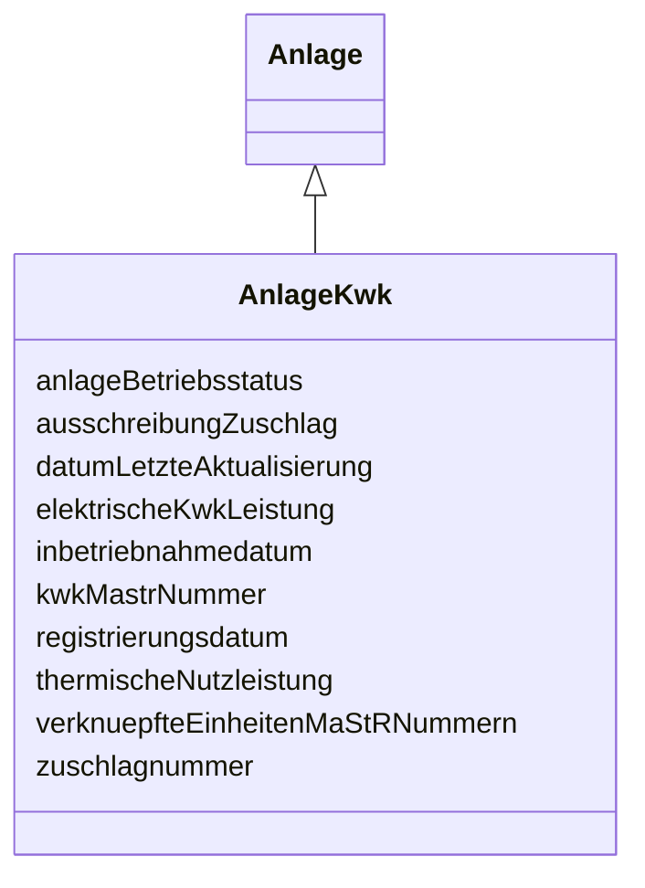

---
search:
  boost: 10.0
---

# Class: AnlageKwk 

<div data-search-exclude markdown="1">


URI: [mastr:class/AnlageKwk](https://example.org/mastr/class/AnlageKwk)





## Inheritance
* [Anlage](../classes/Anlage.md)
    * **AnlageKwk**


## Slots

| Name | Cardinality and Range | Description | Inheritance |
| ---  | --- | --- | --- |
| [kwkMastrNummer](../slots/kwkMastrNummer.md) | 0..1 <br/> [String](../types/String.md) | MaStR-Nummer der Anlage | direct |
| [ausschreibungZuschlag](../slots/ausschreibungZuschlag.md) | 0..1 <br/> [Integer](../types/Integer.md) | Wurde für die KWK-Anlage Im Rahmen des Ausschreibungsverfahren der Bundesnetz... | direct |
| [zuschlagnummer](../slots/zuschlagnummer.md) | 0..1 <br/> [String](../types/String.md) | Von der Bundesnetzagentur im Rahmen des Ausschreibungsverfahrens vergebene Nu... | direct |
| [inbetriebnahmedatum](../slots/inbetriebnahmedatum.md) | 0..1 <br/> [Date](../types/Date.md) | Inbetriebnahmedatum der KWK-Anlage | direct |
| [registrierungsdatum](../slots/registrierungsdatum.md) | 0..1 <br/> [Date](../types/Date.md) | Registrierungsdatum der KWK- Anlage | direct |
| [thermischeNutzleistung](../slots/thermischeNutzleistung.md) | 0..1 <br/> [Float](../types/Float.md) | Die höchste Nutzwärmeerzeugung unter Nennbedingungen, die die KWKG-Anlage abg... | direct |
| [elektrischeKwkLeistung](../slots/elektrischeKwkLeistung.md) | 0..1 <br/> [Float](../types/Float.md) | Die höchste an den Generatorklemmen abgebbare elektrische Wirkleistung der An... | direct |
| [anlageBetriebsstatus](../slots/anlageBetriebsstatus.md) | 0..1 <br/> [Integer](../types/Integer.md) | Betriebsstatus der Anlage, welche sich aus den zugeordneten Einheiten ergibt | direct |
| [datumLetzteAktualisierung](../slots/datumLetzteAktualisierung.md) | 0..1 <br/> [Datetime](../types/Datetime.md) | Datum der letzten Aktualisierung an diesem Objekt | [Anlage](../classes/Anlage.md) |
| [verknuepfteEinheitenMaStRNummern](../slots/verknuepfteEinheitenMaStRNummern.md) | 0..1 <br/> [String](../types/String.md) | Liste von MaStR Nummern mit den verknüpften Stromerzeugern | [Anlage](../classes/Anlage.md) |


## Identifier and Mapping Information


### Schema Source


* from schema: https://example.org/mastr


## Mappings

| Mapping Type | Mapped Value |
| ---  | ---  |
| self | mastr:AnlageKwk |
| native | mastr:AnlageKwk |


## LinkML Source

<!-- TODO: investigate https://stackoverflow.com/questions/37606292/how-to-create-tabbed-code-blocks-in-mkdocs-or-sphinx -->

### Direct

<details>
```yaml
name: AnlageKwk
from_schema: https://example.org/mastr
is_a: Anlage
attributes:
  kwkMastrNummer:
    name: kwkMastrNummer
    instantiates:
    - xsd:element
    description: MaStR-Nummer der Anlage
    from_schema: https://example.org/mastr
    rank: 1000
    domain_of:
    - AnlageKwk
    range: string
  ausschreibungZuschlag:
    name: ausschreibungZuschlag
    instantiates:
    - xsd:element
    description: Wurde für die KWK-Anlage Im Rahmen des Ausschreibungsverfahren der
      Bundesnetzagentur ein Zuschlag erlangt?
    from_schema: https://example.org/mastr
    domain_of:
    - AnlageEegBiomasse
    - AnlageEegSolar
    - AnlageEegSpeicher
    - AnlageEegWind
    - AnlageKwk
    range: integer
  zuschlagnummer:
    name: zuschlagnummer
    instantiates:
    - xsd:element
    description: Von der Bundesnetzagentur im Rahmen des Ausschreibungsverfahrens
      vergebene Nummer.
    from_schema: https://example.org/mastr
    rank: 1000
    domain_of:
    - AnlageKwk
    range: string
  inbetriebnahmedatum:
    name: inbetriebnahmedatum
    instantiates:
    - xsd:element
    description: Inbetriebnahmedatum der KWK-Anlage
    from_schema: https://example.org/mastr
    rank: 1000
    domain_of:
    - AnlageKwk
    - Einheit
    range: date
  registrierungsdatum:
    name: registrierungsdatum
    instantiates:
    - xsd:element
    description: Registrierungsdatum der KWK- Anlage
    from_schema: https://example.org/mastr
    domain_of:
    - Anlage
    - AnlageEegSpeicher
    - AnlageGasSpeicher
    - AnlageKwk
    - AnlageStromSpeicher
    - Einheit
    - EinheitGenehmigung
    range: date
  thermischeNutzleistung:
    name: thermischeNutzleistung
    instantiates:
    - xsd:element
    description: Die höchste Nutzwärmeerzeugung unter Nennbedingungen, die die KWKG-Anlage
      abgeben kann.
    from_schema: https://example.org/mastr
    rank: 1000
    domain_of:
    - AnlageKwk
    range: float
  elektrischeKwkLeistung:
    name: elektrischeKwkLeistung
    instantiates:
    - xsd:element
    description: Die höchste an den Generatorklemmen abgebbare elektrische Wirkleistung
      der Anlage
    from_schema: https://example.org/mastr
    rank: 1000
    domain_of:
    - AnlageKwk
    range: float
  anlageBetriebsstatus:
    name: anlageBetriebsstatus
    instantiates:
    - xsd:element
    description: 'Betriebsstatus der Anlage, welche sich aus den zugeordneten Einheiten
      ergibt. Katalogkategorie: Anlagenbetriebsstatus'
    from_schema: https://example.org/mastr
    domain_of:
    - AnlageEegBiomasse
    - AnlageEegGeothermieGrubengasDruckentspannung
    - AnlageEegSolar
    - AnlageEegWasser
    - AnlageEegWind
    - AnlageGasSpeicher
    - AnlageKwk
    - AnlageStromSpeicher
    range: integer

```
</details>

### Induced

<details>
```yaml
name: AnlageKwk
from_schema: https://example.org/mastr
is_a: Anlage
attributes:
  kwkMastrNummer:
    name: kwkMastrNummer
    instantiates:
    - xsd:element
    description: MaStR-Nummer der Anlage
    from_schema: https://example.org/mastr
    rank: 1000
    owner: AnlageKwk
    domain_of:
    - AnlageKwk
    range: string
  ausschreibungZuschlag:
    name: ausschreibungZuschlag
    instantiates:
    - xsd:element
    description: Wurde für die KWK-Anlage Im Rahmen des Ausschreibungsverfahren der
      Bundesnetzagentur ein Zuschlag erlangt?
    from_schema: https://example.org/mastr
    owner: AnlageKwk
    domain_of:
    - AnlageEegBiomasse
    - AnlageEegSolar
    - AnlageEegSpeicher
    - AnlageEegWind
    - AnlageKwk
    range: integer
  zuschlagnummer:
    name: zuschlagnummer
    instantiates:
    - xsd:element
    description: Von der Bundesnetzagentur im Rahmen des Ausschreibungsverfahrens
      vergebene Nummer.
    from_schema: https://example.org/mastr
    rank: 1000
    owner: AnlageKwk
    domain_of:
    - AnlageKwk
    range: string
  inbetriebnahmedatum:
    name: inbetriebnahmedatum
    instantiates:
    - xsd:element
    description: Inbetriebnahmedatum der KWK-Anlage
    from_schema: https://example.org/mastr
    rank: 1000
    owner: AnlageKwk
    domain_of:
    - AnlageKwk
    - Einheit
    range: date
  registrierungsdatum:
    name: registrierungsdatum
    instantiates:
    - xsd:element
    description: Registrierungsdatum der KWK- Anlage
    from_schema: https://example.org/mastr
    owner: AnlageKwk
    domain_of:
    - Anlage
    - AnlageEegSpeicher
    - AnlageGasSpeicher
    - AnlageKwk
    - AnlageStromSpeicher
    - Einheit
    - EinheitGenehmigung
    range: date
  thermischeNutzleistung:
    name: thermischeNutzleistung
    instantiates:
    - xsd:element
    description: Die höchste Nutzwärmeerzeugung unter Nennbedingungen, die die KWKG-Anlage
      abgeben kann.
    from_schema: https://example.org/mastr
    rank: 1000
    owner: AnlageKwk
    domain_of:
    - AnlageKwk
    range: float
  elektrischeKwkLeistung:
    name: elektrischeKwkLeistung
    instantiates:
    - xsd:element
    description: Die höchste an den Generatorklemmen abgebbare elektrische Wirkleistung
      der Anlage
    from_schema: https://example.org/mastr
    rank: 1000
    owner: AnlageKwk
    domain_of:
    - AnlageKwk
    range: float
  anlageBetriebsstatus:
    name: anlageBetriebsstatus
    instantiates:
    - xsd:element
    description: 'Betriebsstatus der Anlage, welche sich aus den zugeordneten Einheiten
      ergibt. Katalogkategorie: Anlagenbetriebsstatus'
    from_schema: https://example.org/mastr
    owner: AnlageKwk
    domain_of:
    - AnlageEegBiomasse
    - AnlageEegGeothermieGrubengasDruckentspannung
    - AnlageEegSolar
    - AnlageEegWasser
    - AnlageEegWind
    - AnlageGasSpeicher
    - AnlageKwk
    - AnlageStromSpeicher
    range: integer
  datumLetzteAktualisierung:
    name: datumLetzteAktualisierung
    instantiates:
    - xsd:element
    description: Datum der letzten Aktualisierung an diesem Objekt
    from_schema: https://example.org/mastr
    rank: 1000
    owner: AnlageKwk
    domain_of:
    - Anlage
    - Einheit
    - EinheitGenehmigung
    - Ertuechtigung
    - GeloeschteUndDeaktivierteEinheit
    - GeloeschterUndDeaktivierterMarktakteur
    - Lokation
    - MarktakteurUndRolle
    - Netz
    range: datetime
  verknuepfteEinheitenMaStRNummern:
    name: verknuepfteEinheitenMaStRNummern
    instantiates:
    - xsd:element
    description: Liste von MaStR Nummern mit den verknüpften Stromerzeugern
    from_schema: https://example.org/mastr
    rank: 1000
    owner: AnlageKwk
    domain_of:
    - Anlage
    - EinheitGasverbraucher
    - EinheitGenehmigung
    - Lokation
    range: string

```
</details></div>