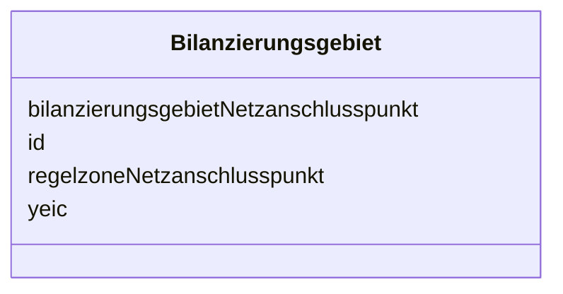

---
search:
  boost: 10.0
---

# Class: Bilanzierungsgebiet 

<div data-search-exclude markdown="1">


URI: [mastr:class/Bilanzierungsgebiet](https://example.org/mastr/class/Bilanzierungsgebiet)





<!-- no inheritance hierarchy -->

## Slots

| Name | Cardinality and Range | Description | Inheritance |
| ---  | --- | --- | --- |
| [id](../slots/id.md) | 0..1 <br/> [Integer](../types/Integer.md) | Id des Bilanzierungsgebietes | direct |
| [yeic](../slots/yeic.md) | 0..1 <br/> [String](../types/String.md) | Y-Code des Bilanzierungsgebietes | direct |
| [bilanzierungsgebietNetzanschlusspunkt](../slots/bilanzierungsgebietNetzanschlusspunkt.md) | 0..1 <br/> [String](../types/String.md) | Bezeichnung des Bilanzierungsgebietes | direct |
| [regelzoneNetzanschlusspunkt](../slots/regelzoneNetzanschlusspunkt.md) | 0..1 <br/> [Integer](../types/Integer.md) | Regelzone des Netzanschlusspunktes | direct |


## Identifier and Mapping Information


### Schema Source


* from schema: https://example.org/mastr


## Mappings

| Mapping Type | Mapped Value |
| ---  | ---  |
| self | mastr:Bilanzierungsgebiet |
| native | mastr:Bilanzierungsgebiet |


## LinkML Source

<!-- TODO: investigate https://stackoverflow.com/questions/37606292/how-to-create-tabbed-code-blocks-in-mkdocs-or-sphinx -->

### Direct

<details>
```yaml
name: Bilanzierungsgebiet
from_schema: https://example.org/mastr
attributes:
  id:
    name: id
    instantiates:
    - xsd:element
    description: Id des Bilanzierungsgebietes
    from_schema: https://example.org/mastr
    rank: 1000
    domain_of:
    - Bilanzierungsgebiet
    - Einheitentyp
    - Ertuechtigung
    - Katalogkategorie
    - Katalogwert
    - Lokationstyp
    - Marktfunktion
    - Marktrolle
    range: integer
  yeic:
    name: yeic
    instantiates:
    - xsd:element
    description: Y-Code des Bilanzierungsgebietes
    from_schema: https://example.org/mastr
    rank: 1000
    domain_of:
    - Bilanzierungsgebiet
    range: string
  bilanzierungsgebietNetzanschlusspunkt:
    name: bilanzierungsgebietNetzanschlusspunkt
    instantiates:
    - xsd:element
    description: Bezeichnung des Bilanzierungsgebietes
    from_schema: https://example.org/mastr
    rank: 1000
    domain_of:
    - Bilanzierungsgebiet
    range: string
  regelzoneNetzanschlusspunkt:
    name: regelzoneNetzanschlusspunkt
    instantiates:
    - xsd:element
    description: 'Regelzone des Netzanschlusspunktes. Katalogkategorie: Regelzone'
    from_schema: https://example.org/mastr
    rank: 1000
    domain_of:
    - Bilanzierungsgebiet
    - Netzanschlusspunkt
    range: integer

```
</details>

### Induced

<details>
```yaml
name: Bilanzierungsgebiet
from_schema: https://example.org/mastr
attributes:
  id:
    name: id
    instantiates:
    - xsd:element
    description: Id des Bilanzierungsgebietes
    from_schema: https://example.org/mastr
    rank: 1000
    owner: Bilanzierungsgebiet
    domain_of:
    - Bilanzierungsgebiet
    - Einheitentyp
    - Ertuechtigung
    - Katalogkategorie
    - Katalogwert
    - Lokationstyp
    - Marktfunktion
    - Marktrolle
    range: integer
  yeic:
    name: yeic
    instantiates:
    - xsd:element
    description: Y-Code des Bilanzierungsgebietes
    from_schema: https://example.org/mastr
    rank: 1000
    owner: Bilanzierungsgebiet
    domain_of:
    - Bilanzierungsgebiet
    range: string
  bilanzierungsgebietNetzanschlusspunkt:
    name: bilanzierungsgebietNetzanschlusspunkt
    instantiates:
    - xsd:element
    description: Bezeichnung des Bilanzierungsgebietes
    from_schema: https://example.org/mastr
    rank: 1000
    owner: Bilanzierungsgebiet
    domain_of:
    - Bilanzierungsgebiet
    range: string
  regelzoneNetzanschlusspunkt:
    name: regelzoneNetzanschlusspunkt
    instantiates:
    - xsd:element
    description: 'Regelzone des Netzanschlusspunktes. Katalogkategorie: Regelzone'
    from_schema: https://example.org/mastr
    rank: 1000
    owner: Bilanzierungsgebiet
    domain_of:
    - Bilanzierungsgebiet
    - Netzanschlusspunkt
    range: integer

```
</details></div>