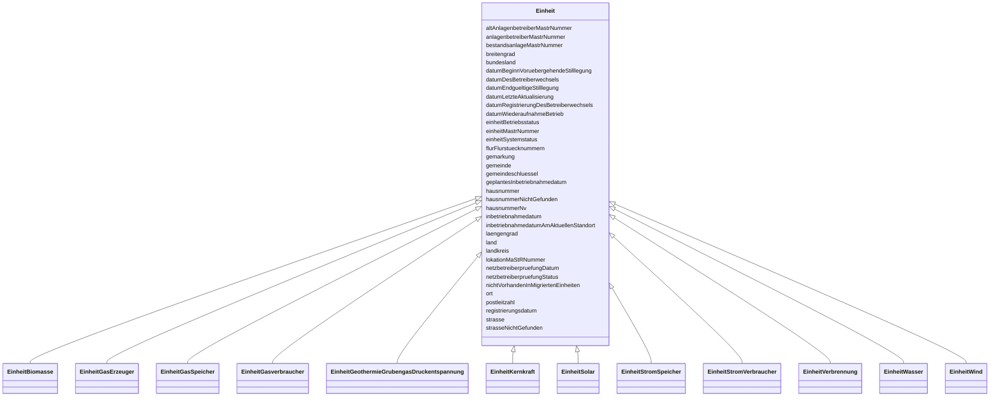

---
search:
  boost: 10.0
---

# Class: Einheit 


_Gemeinsame Attribute der Einheit-Klassen._


<div data-search-exclude markdown="1">


* __NOTE__: this is an abstract class and should not be instantiated directly


URI: [mastr:class/Einheit](https://example.org/mastr/class/Einheit)





## Inheritance
* **Einheit**
    * [EinheitBiomasse](../classes/EinheitBiomasse.md)
    * [EinheitGasErzeuger](../classes/EinheitGasErzeuger.md)
    * [EinheitGasSpeicher](../classes/EinheitGasSpeicher.md)
    * [EinheitGasverbraucher](../classes/EinheitGasverbraucher.md)
    * [EinheitGeothermieGrubengasDruckentspannung](../classes/EinheitGeothermieGrubengasDruckentspannung.md)
    * [EinheitKernkraft](../classes/EinheitKernkraft.md)
    * [EinheitSolar](../classes/EinheitSolar.md)
    * [EinheitStromSpeicher](../classes/EinheitStromSpeicher.md)
    * [EinheitStromVerbraucher](../classes/EinheitStromVerbraucher.md)
    * [EinheitVerbrennung](../classes/EinheitVerbrennung.md)
    * [EinheitWasser](../classes/EinheitWasser.md)
    * [EinheitWind](../classes/EinheitWind.md)


## Slots

| Name | Cardinality and Range | Description | Inheritance |
| ---  | --- | --- | --- |
| [einheitMastrNummer](../slots/einheitMastrNummer.md) | 0..1 <br/> [String](../types/String.md) | MaStR-Nummer der Einheit | direct |
| [datumLetzteAktualisierung](../slots/datumLetzteAktualisierung.md) | 0..1 <br/> [Datetime](../types/Datetime.md) | Datum der letzten Aktualisierung an diesem Objekt | direct |
| [lokationMaStRNummer](../slots/lokationMaStRNummer.md) | 0..1 <br/> [String](../types/String.md) | MaStR-Nummer der Lokation | direct |
| [netzbetreiberpruefungStatus](../slots/netzbetreiberpruefungStatus.md) | 0..1 <br/> [Integer](../types/Integer.md) | Der Status der letzten Netzbetreiberprüfung, insofern eine durchgeführt wurde | direct |
| [netzbetreiberpruefungDatum](../slots/netzbetreiberpruefungDatum.md) | 0..1 <br/> [Date](../types/Date.md) | Datum der letzten Netzbetreiberprüfung, insofern eine durchgeführt wurde | direct |
| [anlagenbetreiberMastrNummer](../slots/anlagenbetreiberMastrNummer.md) | 0..1 <br/> [String](../types/String.md) | MaStRNummer des Betreibers der Einheit | direct |
| [land](../slots/land.md) | 0..1 <br/> [Integer](../types/Integer.md) | Standort der Einheit: Land: Katalogkategorie: Land | direct |
| [bundesland](../slots/bundesland.md) | 0..1 <br/> [Integer](../types/Integer.md) | Standort der Einheit: Bundesland | direct |
| [landkreis](../slots/landkreis.md) | 0..1 <br/> [String](../types/String.md) | Standort der Einheit: Landkreis | direct |
| [gemeinde](../slots/gemeinde.md) | 0..1 <br/> [String](../types/String.md) | Standort der Einheit: Gemeinde | direct |
| [gemeindeschluessel](../slots/gemeindeschluessel.md) | 0..1 <br/> [String](../types/String.md) | Standort der Einheit: Gemeindeschlüssel | direct |
| [postleitzahl](../slots/postleitzahl.md) | 0..1 <br/> [String](../types/String.md) | Standort der Einheit: Postleitzahl | direct |
| [strasse](../slots/strasse.md) | 0..1 <br/> [String](../types/String.md) | Standort der Einheit: Straße | direct |
| [gemarkung](../slots/gemarkung.md) | 0..1 <br/> [String](../types/String.md) | Standort der Einheit: Gemarkung | direct |
| [flurFlurstuecknummern](../slots/flurFlurstuecknummern.md) | 0..1 <br/> [String](../types/String.md) | Standort der Einheit: Flur und/oder Flurstücke | direct |
| [strasseNichtGefunden](../slots/strasseNichtGefunden.md) | 0..1 <br/> [Integer](../types/Integer.md) | Angabe, dass die angegebene Straße nicht aus dem BKG- Adressdatenbestand stam... | direct |
| [hausnummer](../slots/hausnummer.md) | 0..1 <br/> [String](../types/String.md) | Standort der Einheit: Hausnummer | direct |
| [hausnummerNv](../slots/hausnummerNv.md) | 0..1 <br/> [Integer](../types/Integer.md) | Standort der Einheit: Hausnummer | direct |
| [hausnummerNichtGefunden](../slots/hausnummerNichtGefunden.md) | 0..1 <br/> [Integer](../types/Integer.md) | Angabe, dass die angegebene Hausnummer nicht aus dem BKG- Adressdatenbestand ... | direct |
| [ort](../slots/ort.md) | 0..1 <br/> [String](../types/String.md) | Standort der Einheit: Ort | direct |
| [laengengrad](../slots/laengengrad.md) | 0..1 <br/> [Float](../types/Float.md) | Koordinaten der Einheit: Längengrad | direct |
| [breitengrad](../slots/breitengrad.md) | 0..1 <br/> [Float](../types/Float.md) | Koordinaten der Einheit: Breitengrad | direct |
| [registrierungsdatum](../slots/registrierungsdatum.md) | 0..1 <br/> [Date](../types/Date.md) | Registrierungsdatum der Einheit | direct |
| [inbetriebnahmedatum](../slots/inbetriebnahmedatum.md) | 0..1 <br/> [Date](../types/Date.md) | Datum der Inbetriebnahme | direct |
| [datumEndgueltigeStilllegung](../slots/datumEndgueltigeStilllegung.md) | 0..1 <br/> [Date](../types/Date.md) | Datum der endgültigen Stilllegung der Einheit | direct |
| [datumBeginnVoruebergehendeStilllegung](../slots/datumBeginnVoruebergehendeStilllegung.md) | 0..1 <br/> [Date](../types/Date.md) | Beginn der vorläufigen Stilllegung der Einheit | direct |
| [datumWiederaufnahmeBetrieb](../slots/datumWiederaufnahmeBetrieb.md) | 0..1 <br/> [Date](../types/Date.md) | Datum der Wiederaufnahme des Betriebs | direct |
| [geplantesInbetriebnahmedatum](../slots/geplantesInbetriebnahmedatum.md) | 0..1 <br/> [Date](../types/Date.md) | Geplantes Inbetriebnahmedatum der Stromerzeugungsseinheit | direct |
| [einheitSystemstatus](../slots/einheitSystemstatus.md) | 0..1 <br/> [Integer](../types/Integer.md) | Systemstatus der Einheit | direct |
| [einheitBetriebsstatus](../slots/einheitBetriebsstatus.md) | 0..1 <br/> [Integer](../types/Integer.md) | Betriebsstatus der Einheit | direct |
| [bestandsanlageMastrNummer](../slots/bestandsanlageMastrNummer.md) | 0..1 <br/> [String](../types/String.md) | Angaben über optional vorhandene MaStR-Nummer aus der Bestandsanlagenverwaltu... | direct |
| [nichtVorhandenInMigriertenEinheiten](../slots/nichtVorhandenInMigriertenEinheiten.md) | 0..1 <br/> [Integer](../types/Integer.md) | Angabe über das Nichtvorhandensein in den migrierten Einheiten | direct |
| [altAnlagenbetreiberMastrNummer](../slots/altAnlagenbetreiberMastrNummer.md) | 0..1 <br/> [String](../types/String.md) | MaStR-Nummer des ehemaligen Betreibers der Einheit, wenn ein Betreiberwechsel... | direct |
| [datumDesBetreiberwechsels](../slots/datumDesBetreiberwechsels.md) | 0..1 <br/> [Date](../types/Date.md) | Datum des realen Betreiberwechsels | direct |
| [datumRegistrierungDesBetreiberwechsels](../slots/datumRegistrierungDesBetreiberwechsels.md) | 0..1 <br/> [Date](../types/Date.md) | Datum der Registrierung des Betreiberwechsels | direct |
| [inbetriebnahmedatumAmAktuellenStandort](../slots/inbetriebnahmedatumAmAktuellenStandort.md) | 0..1 <br/> [Datetime](../types/Datetime.md) | Datum der Inbetriebnahme am aktuellen Standort | direct |


## Identifier and Mapping Information


### Schema Source


* from schema: https://example.org/mastr


## Mappings

| Mapping Type | Mapped Value |
| ---  | ---  |
| self | mastr:Einheit |
| native | mastr:Einheit |


## LinkML Source

<!-- TODO: investigate https://stackoverflow.com/questions/37606292/how-to-create-tabbed-code-blocks-in-mkdocs-or-sphinx -->

### Direct

<details>
```yaml
name: Einheit
description: Gemeinsame Attribute der Einheit-Klassen.
from_schema: https://example.org/mastr
abstract: true
attributes:
  einheitMastrNummer:
    name: einheitMastrNummer
    instantiates:
    - xsd:element
    description: MaStR-Nummer der Einheit
    from_schema: https://example.org/mastr
    rank: 1000
    domain_of:
    - Einheit
    - EinheitenAenderungNetzbetreiberzuordnung
    - GeloeschteUndDeaktivierteEinheit
    range: string
  datumLetzteAktualisierung:
    name: datumLetzteAktualisierung
    instantiates:
    - xsd:element
    description: Datum der letzten Aktualisierung an diesem Objekt
    from_schema: https://example.org/mastr
    domain_of:
    - Anlage
    - Einheit
    - EinheitGenehmigung
    - Ertuechtigung
    - GeloeschteUndDeaktivierteEinheit
    - GeloeschterUndDeaktivierterMarktakteur
    - Lokation
    - MarktakteurUndRolle
    - Netz
    range: datetime
  lokationMaStRNummer:
    name: lokationMaStRNummer
    instantiates:
    - xsd:element
    description: MaStR-Nummer der Lokation
    from_schema: https://example.org/mastr
    rank: 1000
    domain_of:
    - Einheit
    - Netzanschlusspunkt
    range: string
  netzbetreiberpruefungStatus:
    name: netzbetreiberpruefungStatus
    instantiates:
    - xsd:element
    description: 'Der Status der letzten Netzbetreiberprüfung, insofern eine durchgeführt
      wurde. Systemkatalog: Status der Netzbetreiberprüfung'
    from_schema: https://example.org/mastr
    rank: 1000
    domain_of:
    - Einheit
    range: integer
  netzbetreiberpruefungDatum:
    name: netzbetreiberpruefungDatum
    instantiates:
    - xsd:element
    description: Datum der letzten Netzbetreiberprüfung, insofern eine durchgeführt
      wurde
    from_schema: https://example.org/mastr
    rank: 1000
    domain_of:
    - Einheit
    range: date
  anlagenbetreiberMastrNummer:
    name: anlagenbetreiberMastrNummer
    instantiates:
    - xsd:element
    description: MaStRNummer des Betreibers der Einheit
    from_schema: https://example.org/mastr
    rank: 1000
    domain_of:
    - Einheit
    - EinheitBiomasse
    range: string
  land:
    name: land
    instantiates:
    - xsd:element
    description: 'Standort der Einheit: Land: Katalogkategorie: Land'
    from_schema: https://example.org/mastr
    rank: 1000
    domain_of:
    - Einheit
    - Marktakteur
    range: integer
  bundesland:
    name: bundesland
    instantiates:
    - xsd:element
    description: 'Standort der Einheit: Bundesland. Katalogkategorie: BundesländerEinheit'
    from_schema: https://example.org/mastr
    rank: 1000
    domain_of:
    - Einheit
    - Marktakteur
    - Netz
    range: integer
  landkreis:
    name: landkreis
    instantiates:
    - xsd:element
    description: 'Standort der Einheit: Landkreis'
    from_schema: https://example.org/mastr
    rank: 1000
    domain_of:
    - Einheit
    range: string
  gemeinde:
    name: gemeinde
    instantiates:
    - xsd:element
    description: 'Standort der Einheit: Gemeinde'
    from_schema: https://example.org/mastr
    rank: 1000
    domain_of:
    - Einheit
    range: string
  gemeindeschluessel:
    name: gemeindeschluessel
    instantiates:
    - xsd:element
    description: 'Standort der Einheit: Gemeindeschlüssel'
    from_schema: https://example.org/mastr
    rank: 1000
    domain_of:
    - Einheit
    range: string
  postleitzahl:
    name: postleitzahl
    instantiates:
    - xsd:element
    description: 'Standort der Einheit: Postleitzahl'
    from_schema: https://example.org/mastr
    rank: 1000
    domain_of:
    - Einheit
    - Marktakteur
    range: string
  strasse:
    name: strasse
    instantiates:
    - xsd:element
    description: 'Standort der Einheit: Straße'
    from_schema: https://example.org/mastr
    rank: 1000
    domain_of:
    - Einheit
    - Marktakteur
    range: string
  gemarkung:
    name: gemarkung
    instantiates:
    - xsd:element
    description: 'Standort der Einheit: Gemarkung'
    from_schema: https://example.org/mastr
    rank: 1000
    domain_of:
    - Einheit
    range: string
  flurFlurstuecknummern:
    name: flurFlurstuecknummern
    instantiates:
    - xsd:element
    description: 'Standort der Einheit: Flur und/oder Flurstücke'
    from_schema: https://example.org/mastr
    rank: 1000
    domain_of:
    - Einheit
    range: string
  strasseNichtGefunden:
    name: strasseNichtGefunden
    instantiates:
    - xsd:element
    description: Angabe, dass die angegebene Straße nicht aus dem BKG- Adressdatenbestand
      stammt
    from_schema: https://example.org/mastr
    rank: 1000
    domain_of:
    - Einheit
    - EinheitSolar
    - EinheitWind
    range: integer
  hausnummer:
    name: hausnummer
    instantiates:
    - xsd:element
    description: 'Standort der Einheit: Hausnummer'
    from_schema: https://example.org/mastr
    rank: 1000
    domain_of:
    - Einheit
    - Marktakteur
    range: string
  hausnummerNv:
    name: hausnummerNv
    instantiates:
    - xsd:element
    description: 'Standort der Einheit: Hausnummer. Nicht-vorhanden Flag'
    from_schema: https://example.org/mastr
    rank: 1000
    domain_of:
    - Einheit
    - EinheitSolar
    - EinheitWasser
    - EinheitWind
    - Marktakteur
    range: integer
  hausnummerNichtGefunden:
    name: hausnummerNichtGefunden
    instantiates:
    - xsd:element
    description: Angabe, dass die angegebene Hausnummer nicht aus dem BKG- Adressdatenbestand
      stammt
    from_schema: https://example.org/mastr
    rank: 1000
    domain_of:
    - Einheit
    - EinheitSolar
    - EinheitStromVerbraucher
    - EinheitWasser
    - EinheitWind
    range: integer
  ort:
    name: ort
    instantiates:
    - xsd:element
    description: 'Standort der Einheit: Ort'
    from_schema: https://example.org/mastr
    rank: 1000
    domain_of:
    - Einheit
    - Marktakteur
    range: string
  laengengrad:
    name: laengengrad
    instantiates:
    - xsd:element
    description: 'Koordinaten der Einheit: Längengrad'
    from_schema: https://example.org/mastr
    rank: 1000
    domain_of:
    - Einheit
    range: float
  breitengrad:
    name: breitengrad
    instantiates:
    - xsd:element
    description: 'Koordinaten der Einheit: Breitengrad'
    from_schema: https://example.org/mastr
    rank: 1000
    domain_of:
    - Einheit
    range: float
  registrierungsdatum:
    name: registrierungsdatum
    instantiates:
    - xsd:element
    description: Registrierungsdatum der Einheit
    from_schema: https://example.org/mastr
    domain_of:
    - Anlage
    - AnlageEegSpeicher
    - AnlageGasSpeicher
    - AnlageKwk
    - AnlageStromSpeicher
    - Einheit
    - EinheitGenehmigung
    range: date
  inbetriebnahmedatum:
    name: inbetriebnahmedatum
    instantiates:
    - xsd:element
    description: Datum der Inbetriebnahme
    from_schema: https://example.org/mastr
    domain_of:
    - AnlageKwk
    - Einheit
    range: date
  datumEndgueltigeStilllegung:
    name: datumEndgueltigeStilllegung
    instantiates:
    - xsd:element
    description: Datum der endgültigen Stilllegung der Einheit
    from_schema: https://example.org/mastr
    rank: 1000
    domain_of:
    - Einheit
    range: date
  datumBeginnVoruebergehendeStilllegung:
    name: datumBeginnVoruebergehendeStilllegung
    instantiates:
    - xsd:element
    description: Beginn der vorläufigen Stilllegung der Einheit
    from_schema: https://example.org/mastr
    rank: 1000
    domain_of:
    - Einheit
    range: date
  datumWiederaufnahmeBetrieb:
    name: datumWiederaufnahmeBetrieb
    instantiates:
    - xsd:element
    description: Datum der Wiederaufnahme des Betriebs
    from_schema: https://example.org/mastr
    rank: 1000
    domain_of:
    - Einheit
    range: date
  geplantesInbetriebnahmedatum:
    name: geplantesInbetriebnahmedatum
    instantiates:
    - xsd:element
    description: Geplantes Inbetriebnahmedatum der Stromerzeugungsseinheit
    from_schema: https://example.org/mastr
    rank: 1000
    domain_of:
    - Einheit
    range: date
  einheitSystemstatus:
    name: einheitSystemstatus
    instantiates:
    - xsd:element
    description: 'Systemstatus der Einheit. Katalogkategorie: AnlagenSystemStatus'
    from_schema: https://example.org/mastr
    rank: 1000
    domain_of:
    - Einheit
    - GeloeschteUndDeaktivierteEinheit
    range: integer
  einheitBetriebsstatus:
    name: einheitBetriebsstatus
    instantiates:
    - xsd:element
    description: 'Betriebsstatus der Einheit. Katalogkategorie: Anlagenbetriebsstatus'
    from_schema: https://example.org/mastr
    rank: 1000
    domain_of:
    - Einheit
    - GeloeschteUndDeaktivierteEinheit
    range: integer
  bestandsanlageMastrNummer:
    name: bestandsanlageMastrNummer
    instantiates:
    - xsd:element
    description: Angaben über optional vorhandene MaStR-Nummer aus der Bestandsanlagenverwaltung
    from_schema: https://example.org/mastr
    rank: 1000
    domain_of:
    - Einheit
    - EinheitSolar
    - EinheitWind
    range: string
  nichtVorhandenInMigriertenEinheiten:
    name: nichtVorhandenInMigriertenEinheiten
    instantiates:
    - xsd:element
    description: Angabe über das Nichtvorhandensein in den migrierten Einheiten
    from_schema: https://example.org/mastr
    rank: 1000
    domain_of:
    - Einheit
    range: integer
  altAnlagenbetreiberMastrNummer:
    name: altAnlagenbetreiberMastrNummer
    instantiates:
    - xsd:element
    description: MaStR-Nummer des ehemaligen Betreibers der Einheit, wenn ein Betreiberwechsel
      durchgeführt wurde
    from_schema: https://example.org/mastr
    rank: 1000
    domain_of:
    - Einheit
    range: string
  datumDesBetreiberwechsels:
    name: datumDesBetreiberwechsels
    instantiates:
    - xsd:element
    description: Datum des realen Betreiberwechsels
    from_schema: https://example.org/mastr
    rank: 1000
    domain_of:
    - Einheit
    range: date
  datumRegistrierungDesBetreiberwechsels:
    name: datumRegistrierungDesBetreiberwechsels
    instantiates:
    - xsd:element
    description: Datum der Registrierung des Betreiberwechsels
    from_schema: https://example.org/mastr
    rank: 1000
    domain_of:
    - Einheit
    range: date
  inbetriebnahmedatumAmAktuellenStandort:
    name: inbetriebnahmedatumAmAktuellenStandort
    instantiates:
    - xsd:element
    description: Datum der Inbetriebnahme am aktuellen Standort
    from_schema: https://example.org/mastr
    rank: 1000
    domain_of:
    - Einheit
    - EinheitGasSpeicher
    range: datetime

```
</details>

### Induced

<details>
```yaml
name: Einheit
description: Gemeinsame Attribute der Einheit-Klassen.
from_schema: https://example.org/mastr
abstract: true
attributes:
  einheitMastrNummer:
    name: einheitMastrNummer
    instantiates:
    - xsd:element
    description: MaStR-Nummer der Einheit
    from_schema: https://example.org/mastr
    rank: 1000
    owner: Einheit
    domain_of:
    - Einheit
    - EinheitenAenderungNetzbetreiberzuordnung
    - GeloeschteUndDeaktivierteEinheit
    range: string
  datumLetzteAktualisierung:
    name: datumLetzteAktualisierung
    instantiates:
    - xsd:element
    description: Datum der letzten Aktualisierung an diesem Objekt
    from_schema: https://example.org/mastr
    owner: Einheit
    domain_of:
    - Anlage
    - Einheit
    - EinheitGenehmigung
    - Ertuechtigung
    - GeloeschteUndDeaktivierteEinheit
    - GeloeschterUndDeaktivierterMarktakteur
    - Lokation
    - MarktakteurUndRolle
    - Netz
    range: datetime
  lokationMaStRNummer:
    name: lokationMaStRNummer
    instantiates:
    - xsd:element
    description: MaStR-Nummer der Lokation
    from_schema: https://example.org/mastr
    rank: 1000
    owner: Einheit
    domain_of:
    - Einheit
    - Netzanschlusspunkt
    range: string
  netzbetreiberpruefungStatus:
    name: netzbetreiberpruefungStatus
    instantiates:
    - xsd:element
    description: 'Der Status der letzten Netzbetreiberprüfung, insofern eine durchgeführt
      wurde. Systemkatalog: Status der Netzbetreiberprüfung'
    from_schema: https://example.org/mastr
    rank: 1000
    owner: Einheit
    domain_of:
    - Einheit
    range: integer
  netzbetreiberpruefungDatum:
    name: netzbetreiberpruefungDatum
    instantiates:
    - xsd:element
    description: Datum der letzten Netzbetreiberprüfung, insofern eine durchgeführt
      wurde
    from_schema: https://example.org/mastr
    rank: 1000
    owner: Einheit
    domain_of:
    - Einheit
    range: date
  anlagenbetreiberMastrNummer:
    name: anlagenbetreiberMastrNummer
    instantiates:
    - xsd:element
    description: MaStRNummer des Betreibers der Einheit
    from_schema: https://example.org/mastr
    rank: 1000
    owner: Einheit
    domain_of:
    - Einheit
    - EinheitBiomasse
    range: string
  land:
    name: land
    instantiates:
    - xsd:element
    description: 'Standort der Einheit: Land: Katalogkategorie: Land'
    from_schema: https://example.org/mastr
    rank: 1000
    owner: Einheit
    domain_of:
    - Einheit
    - Marktakteur
    range: integer
  bundesland:
    name: bundesland
    instantiates:
    - xsd:element
    description: 'Standort der Einheit: Bundesland. Katalogkategorie: BundesländerEinheit'
    from_schema: https://example.org/mastr
    rank: 1000
    owner: Einheit
    domain_of:
    - Einheit
    - Marktakteur
    - Netz
    range: integer
  landkreis:
    name: landkreis
    instantiates:
    - xsd:element
    description: 'Standort der Einheit: Landkreis'
    from_schema: https://example.org/mastr
    rank: 1000
    owner: Einheit
    domain_of:
    - Einheit
    range: string
  gemeinde:
    name: gemeinde
    instantiates:
    - xsd:element
    description: 'Standort der Einheit: Gemeinde'
    from_schema: https://example.org/mastr
    rank: 1000
    owner: Einheit
    domain_of:
    - Einheit
    range: string
  gemeindeschluessel:
    name: gemeindeschluessel
    instantiates:
    - xsd:element
    description: 'Standort der Einheit: Gemeindeschlüssel'
    from_schema: https://example.org/mastr
    rank: 1000
    owner: Einheit
    domain_of:
    - Einheit
    range: string
  postleitzahl:
    name: postleitzahl
    instantiates:
    - xsd:element
    description: 'Standort der Einheit: Postleitzahl'
    from_schema: https://example.org/mastr
    rank: 1000
    owner: Einheit
    domain_of:
    - Einheit
    - Marktakteur
    range: string
  strasse:
    name: strasse
    instantiates:
    - xsd:element
    description: 'Standort der Einheit: Straße'
    from_schema: https://example.org/mastr
    rank: 1000
    owner: Einheit
    domain_of:
    - Einheit
    - Marktakteur
    range: string
  gemarkung:
    name: gemarkung
    instantiates:
    - xsd:element
    description: 'Standort der Einheit: Gemarkung'
    from_schema: https://example.org/mastr
    rank: 1000
    owner: Einheit
    domain_of:
    - Einheit
    range: string
  flurFlurstuecknummern:
    name: flurFlurstuecknummern
    instantiates:
    - xsd:element
    description: 'Standort der Einheit: Flur und/oder Flurstücke'
    from_schema: https://example.org/mastr
    rank: 1000
    owner: Einheit
    domain_of:
    - Einheit
    range: string
  strasseNichtGefunden:
    name: strasseNichtGefunden
    instantiates:
    - xsd:element
    description: Angabe, dass die angegebene Straße nicht aus dem BKG- Adressdatenbestand
      stammt
    from_schema: https://example.org/mastr
    rank: 1000
    owner: Einheit
    domain_of:
    - Einheit
    - EinheitSolar
    - EinheitWind
    range: integer
  hausnummer:
    name: hausnummer
    instantiates:
    - xsd:element
    description: 'Standort der Einheit: Hausnummer'
    from_schema: https://example.org/mastr
    rank: 1000
    owner: Einheit
    domain_of:
    - Einheit
    - Marktakteur
    range: string
  hausnummerNv:
    name: hausnummerNv
    instantiates:
    - xsd:element
    description: 'Standort der Einheit: Hausnummer. Nicht-vorhanden Flag'
    from_schema: https://example.org/mastr
    rank: 1000
    owner: Einheit
    domain_of:
    - Einheit
    - EinheitSolar
    - EinheitWasser
    - EinheitWind
    - Marktakteur
    range: integer
  hausnummerNichtGefunden:
    name: hausnummerNichtGefunden
    instantiates:
    - xsd:element
    description: Angabe, dass die angegebene Hausnummer nicht aus dem BKG- Adressdatenbestand
      stammt
    from_schema: https://example.org/mastr
    rank: 1000
    owner: Einheit
    domain_of:
    - Einheit
    - EinheitSolar
    - EinheitStromVerbraucher
    - EinheitWasser
    - EinheitWind
    range: integer
  ort:
    name: ort
    instantiates:
    - xsd:element
    description: 'Standort der Einheit: Ort'
    from_schema: https://example.org/mastr
    rank: 1000
    owner: Einheit
    domain_of:
    - Einheit
    - Marktakteur
    range: string
  laengengrad:
    name: laengengrad
    instantiates:
    - xsd:element
    description: 'Koordinaten der Einheit: Längengrad'
    from_schema: https://example.org/mastr
    rank: 1000
    owner: Einheit
    domain_of:
    - Einheit
    range: float
  breitengrad:
    name: breitengrad
    instantiates:
    - xsd:element
    description: 'Koordinaten der Einheit: Breitengrad'
    from_schema: https://example.org/mastr
    rank: 1000
    owner: Einheit
    domain_of:
    - Einheit
    range: float
  registrierungsdatum:
    name: registrierungsdatum
    instantiates:
    - xsd:element
    description: Registrierungsdatum der Einheit
    from_schema: https://example.org/mastr
    owner: Einheit
    domain_of:
    - Anlage
    - AnlageEegSpeicher
    - AnlageGasSpeicher
    - AnlageKwk
    - AnlageStromSpeicher
    - Einheit
    - EinheitGenehmigung
    range: date
  inbetriebnahmedatum:
    name: inbetriebnahmedatum
    instantiates:
    - xsd:element
    description: Datum der Inbetriebnahme
    from_schema: https://example.org/mastr
    owner: Einheit
    domain_of:
    - AnlageKwk
    - Einheit
    range: date
  datumEndgueltigeStilllegung:
    name: datumEndgueltigeStilllegung
    instantiates:
    - xsd:element
    description: Datum der endgültigen Stilllegung der Einheit
    from_schema: https://example.org/mastr
    rank: 1000
    owner: Einheit
    domain_of:
    - Einheit
    range: date
  datumBeginnVoruebergehendeStilllegung:
    name: datumBeginnVoruebergehendeStilllegung
    instantiates:
    - xsd:element
    description: Beginn der vorläufigen Stilllegung der Einheit
    from_schema: https://example.org/mastr
    rank: 1000
    owner: Einheit
    domain_of:
    - Einheit
    range: date
  datumWiederaufnahmeBetrieb:
    name: datumWiederaufnahmeBetrieb
    instantiates:
    - xsd:element
    description: Datum der Wiederaufnahme des Betriebs
    from_schema: https://example.org/mastr
    rank: 1000
    owner: Einheit
    domain_of:
    - Einheit
    range: date
  geplantesInbetriebnahmedatum:
    name: geplantesInbetriebnahmedatum
    instantiates:
    - xsd:element
    description: Geplantes Inbetriebnahmedatum der Stromerzeugungsseinheit
    from_schema: https://example.org/mastr
    rank: 1000
    owner: Einheit
    domain_of:
    - Einheit
    range: date
  einheitSystemstatus:
    name: einheitSystemstatus
    instantiates:
    - xsd:element
    description: 'Systemstatus der Einheit. Katalogkategorie: AnlagenSystemStatus'
    from_schema: https://example.org/mastr
    rank: 1000
    owner: Einheit
    domain_of:
    - Einheit
    - GeloeschteUndDeaktivierteEinheit
    range: integer
  einheitBetriebsstatus:
    name: einheitBetriebsstatus
    instantiates:
    - xsd:element
    description: 'Betriebsstatus der Einheit. Katalogkategorie: Anlagenbetriebsstatus'
    from_schema: https://example.org/mastr
    rank: 1000
    owner: Einheit
    domain_of:
    - Einheit
    - GeloeschteUndDeaktivierteEinheit
    range: integer
  bestandsanlageMastrNummer:
    name: bestandsanlageMastrNummer
    instantiates:
    - xsd:element
    description: Angaben über optional vorhandene MaStR-Nummer aus der Bestandsanlagenverwaltung
    from_schema: https://example.org/mastr
    rank: 1000
    owner: Einheit
    domain_of:
    - Einheit
    - EinheitSolar
    - EinheitWind
    range: string
  nichtVorhandenInMigriertenEinheiten:
    name: nichtVorhandenInMigriertenEinheiten
    instantiates:
    - xsd:element
    description: Angabe über das Nichtvorhandensein in den migrierten Einheiten
    from_schema: https://example.org/mastr
    rank: 1000
    owner: Einheit
    domain_of:
    - Einheit
    range: integer
  altAnlagenbetreiberMastrNummer:
    name: altAnlagenbetreiberMastrNummer
    instantiates:
    - xsd:element
    description: MaStR-Nummer des ehemaligen Betreibers der Einheit, wenn ein Betreiberwechsel
      durchgeführt wurde
    from_schema: https://example.org/mastr
    rank: 1000
    owner: Einheit
    domain_of:
    - Einheit
    range: string
  datumDesBetreiberwechsels:
    name: datumDesBetreiberwechsels
    instantiates:
    - xsd:element
    description: Datum des realen Betreiberwechsels
    from_schema: https://example.org/mastr
    rank: 1000
    owner: Einheit
    domain_of:
    - Einheit
    range: date
  datumRegistrierungDesBetreiberwechsels:
    name: datumRegistrierungDesBetreiberwechsels
    instantiates:
    - xsd:element
    description: Datum der Registrierung des Betreiberwechsels
    from_schema: https://example.org/mastr
    rank: 1000
    owner: Einheit
    domain_of:
    - Einheit
    range: date
  inbetriebnahmedatumAmAktuellenStandort:
    name: inbetriebnahmedatumAmAktuellenStandort
    instantiates:
    - xsd:element
    description: Datum der Inbetriebnahme am aktuellen Standort
    from_schema: https://example.org/mastr
    rank: 1000
    owner: Einheit
    domain_of:
    - Einheit
    - EinheitGasSpeicher
    range: datetime

```
</details></div>