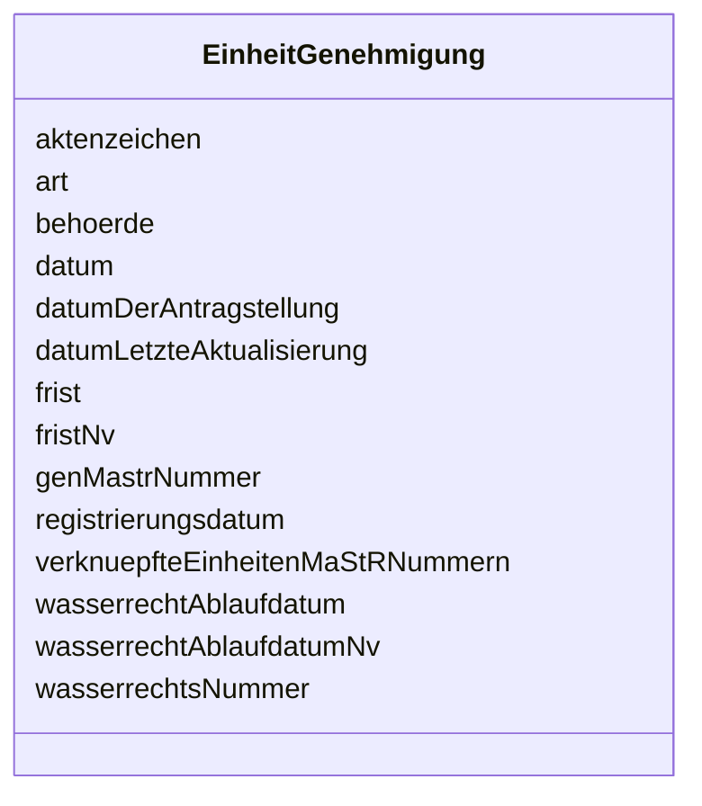

---
search:
  boost: 10.0
---

# Class: EinheitGenehmigung 

<div data-search-exclude markdown="1">


URI: [mastr:class/EinheitGenehmigung](https://example.org/mastr/class/EinheitGenehmigung)





<!-- no inheritance hierarchy -->

## Slots

| Name | Cardinality and Range | Description | Inheritance |
| ---  | --- | --- | --- |
| [genMastrNummer](../slots/genMastrNummer.md) | 0..1 <br/> [String](../types/String.md) | MaStR-Nummer der Genehmigung | direct |
| [datumLetzteAktualisierung](../slots/datumLetzteAktualisierung.md) | 0..1 <br/> [Datetime](../types/Datetime.md) | Datum der letzten Aktualisierung an diesem Objekt | direct |
| [art](../slots/art.md) | 0..1 <br/> [Integer](../types/Integer.md) | Art der Genehmigung | direct |
| [datum](../slots/datum.md) | 0..1 <br/> [Date](../types/Date.md) | Datum, ab dem die Genehmigung für Bau oder Betrieb der Stromerzeugungseinheit... | direct |
| [behoerde](../slots/behoerde.md) | 0..1 <br/> [String](../types/String.md) | Behörde, die Genehmigung ausgestellt hat | direct |
| [aktenzeichen](../slots/aktenzeichen.md) | 0..1 <br/> [String](../types/String.md) | Aktenzeichen der Genehmigung, welche die Genehmigungsbehörde vergeben hat | direct |
| [frist](../slots/frist.md) | 0..1 <br/> [Date](../types/Date.md) | Datum, bis zu dem gemäß der Genehmigung mit der Errichtung oder dem Betrieb d... | direct |
| [fristNv](../slots/fristNv.md) | 0..1 <br/> [Integer](../types/Integer.md) | Datum, bis zu dem gemäß der Genehmigung mit der Errichtung oder dem Betrieb d... | direct |
| [wasserrechtsNummer](../slots/wasserrechtsNummer.md) | 0..1 <br/> [String](../types/String.md) | Nummer der wasserrechtlichen Genehmigung | direct |
| [wasserrechtAblaufdatum](../slots/wasserrechtAblaufdatum.md) | 0..1 <br/> [Date](../types/Date.md) | Datum, an dem die wasserrechtliche Genehmigung abläuft | direct |
| [wasserrechtAblaufdatumNv](../slots/wasserrechtAblaufdatumNv.md) | 0..1 <br/> [Integer](../types/Integer.md) | Datum, an dem die wasserrechtliche Genehmigung abläuft | direct |
| [registrierungsdatum](../slots/registrierungsdatum.md) | 0..1 <br/> [Date](../types/Date.md) | Registrierungsdatum der Genehmigung | direct |
| [verknuepfteEinheitenMaStRNummern](../slots/verknuepfteEinheitenMaStRNummern.md) | 0..1 <br/> [String](../types/String.md) | Liste von MaStR Nummern mit den verknüpften Stromerzeugern | direct |
| [datumDerAntragstellung](../slots/datumDerAntragstellung.md) | 0..1 <br/> [Date](../types/Date.md) | Datum der Antragstellung | direct |


## Identifier and Mapping Information


### Schema Source


* from schema: https://example.org/mastr


## Mappings

| Mapping Type | Mapped Value |
| ---  | ---  |
| self | mastr:EinheitGenehmigung |
| native | mastr:EinheitGenehmigung |


## LinkML Source

<!-- TODO: investigate https://stackoverflow.com/questions/37606292/how-to-create-tabbed-code-blocks-in-mkdocs-or-sphinx -->

### Direct

<details>
```yaml
name: EinheitGenehmigung
from_schema: https://example.org/mastr
attributes:
  genMastrNummer:
    name: genMastrNummer
    instantiates:
    - xsd:element
    description: MaStR-Nummer der Genehmigung
    from_schema: https://example.org/mastr
    domain_of:
    - EinheitBiomasse
    - EinheitGenehmigung
    - EinheitGeothermieGrubengasDruckentspannung
    - EinheitKernkraft
    - EinheitSolar
    - EinheitStromSpeicher
    - EinheitVerbrennung
    - EinheitWasser
    - EinheitWind
    range: string
  datumLetzteAktualisierung:
    name: datumLetzteAktualisierung
    instantiates:
    - xsd:element
    description: Datum der letzten Aktualisierung an diesem Objekt
    from_schema: https://example.org/mastr
    domain_of:
    - Anlage
    - Einheit
    - EinheitGenehmigung
    - Ertuechtigung
    - GeloeschteUndDeaktivierteEinheit
    - GeloeschterUndDeaktivierterMarktakteur
    - Lokation
    - MarktakteurUndRolle
    - Netz
    range: datetime
  art:
    name: art
    instantiates:
    - xsd:element
    description: 'Art der Genehmigung. Katalogkategorie: GenehmigungsArt'
    from_schema: https://example.org/mastr
    rank: 1000
    domain_of:
    - EinheitGenehmigung
    range: integer
  datum:
    name: datum
    instantiates:
    - xsd:element
    description: Datum, ab dem die Genehmigung für Bau oder Betrieb der Stromerzeugungseinheit
      erteilt ist
    from_schema: https://example.org/mastr
    rank: 1000
    domain_of:
    - EinheitGenehmigung
    range: date
  behoerde:
    name: behoerde
    instantiates:
    - xsd:element
    description: Behörde, die Genehmigung ausgestellt hat
    from_schema: https://example.org/mastr
    rank: 1000
    domain_of:
    - EinheitGenehmigung
    range: string
  aktenzeichen:
    name: aktenzeichen
    instantiates:
    - xsd:element
    description: Aktenzeichen der Genehmigung, welche die Genehmigungsbehörde vergeben
      hat
    from_schema: https://example.org/mastr
    rank: 1000
    domain_of:
    - EinheitGenehmigung
    range: string
  frist:
    name: frist
    instantiates:
    - xsd:element
    description: Datum, bis zu dem gemäß der Genehmigung mit der Errichtung oder dem
      Betrieb der Anlage begonnen werden muss
    from_schema: https://example.org/mastr
    rank: 1000
    domain_of:
    - EinheitGenehmigung
    range: date
  fristNv:
    name: fristNv
    instantiates:
    - xsd:element
    description: Datum, bis zu dem gemäß der Genehmigung mit der Errichtung oder dem
      Betrieb der Anlage begonnen werden muss. Nicht-vorhanden Flag
    from_schema: https://example.org/mastr
    rank: 1000
    domain_of:
    - EinheitGenehmigung
    range: integer
  wasserrechtsNummer:
    name: wasserrechtsNummer
    instantiates:
    - xsd:element
    description: Nummer der wasserrechtlichen Genehmigung
    from_schema: https://example.org/mastr
    rank: 1000
    domain_of:
    - EinheitGenehmigung
    range: string
  wasserrechtAblaufdatum:
    name: wasserrechtAblaufdatum
    instantiates:
    - xsd:element
    description: Datum, an dem die wasserrechtliche Genehmigung abläuft.
    from_schema: https://example.org/mastr
    rank: 1000
    domain_of:
    - EinheitGenehmigung
    range: date
  wasserrechtAblaufdatumNv:
    name: wasserrechtAblaufdatumNv
    instantiates:
    - xsd:element
    description: Datum, an dem die wasserrechtliche Genehmigung abläuft. Nicht- vorhanden
      Flag
    from_schema: https://example.org/mastr
    rank: 1000
    domain_of:
    - EinheitGenehmigung
    range: integer
  registrierungsdatum:
    name: registrierungsdatum
    instantiates:
    - xsd:element
    description: Registrierungsdatum der Genehmigung
    from_schema: https://example.org/mastr
    domain_of:
    - Anlage
    - AnlageEegSpeicher
    - AnlageGasSpeicher
    - AnlageKwk
    - AnlageStromSpeicher
    - Einheit
    - EinheitGenehmigung
    range: date
  verknuepfteEinheitenMaStRNummern:
    name: verknuepfteEinheitenMaStRNummern
    instantiates:
    - xsd:element
    description: Liste von MaStR Nummern mit den verknüpften Stromerzeugern
    from_schema: https://example.org/mastr
    domain_of:
    - Anlage
    - EinheitGasverbraucher
    - EinheitGenehmigung
    - Lokation
    range: string
  datumDerAntragstellung:
    name: datumDerAntragstellung
    instantiates:
    - xsd:element
    description: Datum der Antragstellung
    from_schema: https://example.org/mastr
    rank: 1000
    domain_of:
    - EinheitGenehmigung
    range: date

```
</details>

### Induced

<details>
```yaml
name: EinheitGenehmigung
from_schema: https://example.org/mastr
attributes:
  genMastrNummer:
    name: genMastrNummer
    instantiates:
    - xsd:element
    description: MaStR-Nummer der Genehmigung
    from_schema: https://example.org/mastr
    owner: EinheitGenehmigung
    domain_of:
    - EinheitBiomasse
    - EinheitGenehmigung
    - EinheitGeothermieGrubengasDruckentspannung
    - EinheitKernkraft
    - EinheitSolar
    - EinheitStromSpeicher
    - EinheitVerbrennung
    - EinheitWasser
    - EinheitWind
    range: string
  datumLetzteAktualisierung:
    name: datumLetzteAktualisierung
    instantiates:
    - xsd:element
    description: Datum der letzten Aktualisierung an diesem Objekt
    from_schema: https://example.org/mastr
    owner: EinheitGenehmigung
    domain_of:
    - Anlage
    - Einheit
    - EinheitGenehmigung
    - Ertuechtigung
    - GeloeschteUndDeaktivierteEinheit
    - GeloeschterUndDeaktivierterMarktakteur
    - Lokation
    - MarktakteurUndRolle
    - Netz
    range: datetime
  art:
    name: art
    instantiates:
    - xsd:element
    description: 'Art der Genehmigung. Katalogkategorie: GenehmigungsArt'
    from_schema: https://example.org/mastr
    rank: 1000
    owner: EinheitGenehmigung
    domain_of:
    - EinheitGenehmigung
    range: integer
  datum:
    name: datum
    instantiates:
    - xsd:element
    description: Datum, ab dem die Genehmigung für Bau oder Betrieb der Stromerzeugungseinheit
      erteilt ist
    from_schema: https://example.org/mastr
    rank: 1000
    owner: EinheitGenehmigung
    domain_of:
    - EinheitGenehmigung
    range: date
  behoerde:
    name: behoerde
    instantiates:
    - xsd:element
    description: Behörde, die Genehmigung ausgestellt hat
    from_schema: https://example.org/mastr
    rank: 1000
    owner: EinheitGenehmigung
    domain_of:
    - EinheitGenehmigung
    range: string
  aktenzeichen:
    name: aktenzeichen
    instantiates:
    - xsd:element
    description: Aktenzeichen der Genehmigung, welche die Genehmigungsbehörde vergeben
      hat
    from_schema: https://example.org/mastr
    rank: 1000
    owner: EinheitGenehmigung
    domain_of:
    - EinheitGenehmigung
    range: string
  frist:
    name: frist
    instantiates:
    - xsd:element
    description: Datum, bis zu dem gemäß der Genehmigung mit der Errichtung oder dem
      Betrieb der Anlage begonnen werden muss
    from_schema: https://example.org/mastr
    rank: 1000
    owner: EinheitGenehmigung
    domain_of:
    - EinheitGenehmigung
    range: date
  fristNv:
    name: fristNv
    instantiates:
    - xsd:element
    description: Datum, bis zu dem gemäß der Genehmigung mit der Errichtung oder dem
      Betrieb der Anlage begonnen werden muss. Nicht-vorhanden Flag
    from_schema: https://example.org/mastr
    rank: 1000
    owner: EinheitGenehmigung
    domain_of:
    - EinheitGenehmigung
    range: integer
  wasserrechtsNummer:
    name: wasserrechtsNummer
    instantiates:
    - xsd:element
    description: Nummer der wasserrechtlichen Genehmigung
    from_schema: https://example.org/mastr
    rank: 1000
    owner: EinheitGenehmigung
    domain_of:
    - EinheitGenehmigung
    range: string
  wasserrechtAblaufdatum:
    name: wasserrechtAblaufdatum
    instantiates:
    - xsd:element
    description: Datum, an dem die wasserrechtliche Genehmigung abläuft.
    from_schema: https://example.org/mastr
    rank: 1000
    owner: EinheitGenehmigung
    domain_of:
    - EinheitGenehmigung
    range: date
  wasserrechtAblaufdatumNv:
    name: wasserrechtAblaufdatumNv
    instantiates:
    - xsd:element
    description: Datum, an dem die wasserrechtliche Genehmigung abläuft. Nicht- vorhanden
      Flag
    from_schema: https://example.org/mastr
    rank: 1000
    owner: EinheitGenehmigung
    domain_of:
    - EinheitGenehmigung
    range: integer
  registrierungsdatum:
    name: registrierungsdatum
    instantiates:
    - xsd:element
    description: Registrierungsdatum der Genehmigung
    from_schema: https://example.org/mastr
    owner: EinheitGenehmigung
    domain_of:
    - Anlage
    - AnlageEegSpeicher
    - AnlageGasSpeicher
    - AnlageKwk
    - AnlageStromSpeicher
    - Einheit
    - EinheitGenehmigung
    range: date
  verknuepfteEinheitenMaStRNummern:
    name: verknuepfteEinheitenMaStRNummern
    instantiates:
    - xsd:element
    description: Liste von MaStR Nummern mit den verknüpften Stromerzeugern
    from_schema: https://example.org/mastr
    owner: EinheitGenehmigung
    domain_of:
    - Anlage
    - EinheitGasverbraucher
    - EinheitGenehmigung
    - Lokation
    range: string
  datumDerAntragstellung:
    name: datumDerAntragstellung
    instantiates:
    - xsd:element
    description: Datum der Antragstellung
    from_schema: https://example.org/mastr
    rank: 1000
    owner: EinheitGenehmigung
    domain_of:
    - EinheitGenehmigung
    range: date

```
</details></div>