---
search:
  boost: 10.0
---

# Class: EinheitWasser 

<div data-search-exclude markdown="1">


URI: [mastr:class/EinheitWasser](https://example.org/mastr/class/EinheitWasser)

```mermaid
 classDiagram
    class EinheitWasser
    click EinheitWasser href "../../classes/EinheitWasser/"
      Einheit <|-- EinheitWasser
        click Einheit href "../../classes/Einheit/"
      
      EinheitWasser : adresszusatz
        
      EinheitWasser : altAnlagenbetreiberMastrNummer
        
      EinheitWasser : anlagenbetreiberMastrNummer
        
      EinheitWasser : anschlussAnHoechstOderHochSpannung
        
      EinheitWasser : artDerWasserkraftanlage
        
      EinheitWasser : artDesZuflusses
        
      EinheitWasser : bestandsanlageMastrNummer
        
      EinheitWasser : bestandteilGrenzkraftwerk
        
      EinheitWasser : breitengrad
        
      EinheitWasser : bruttoleistung
        
      EinheitWasser : bundesland
        
      EinheitWasser : datumBeginnVoruebergehendeStilllegung
        
      EinheitWasser : datumDesBetreiberwechsels
        
      EinheitWasser : datumEndgueltigeStilllegung
        
      EinheitWasser : datumKapazitaetsreserve
        
      EinheitWasser : datumLetzteAktualisierung
        
      EinheitWasser : datumNetzreserve
        
      EinheitWasser : datumRegistrierungDesBetreiberwechsels
        
      EinheitWasser : datumWiederaufnahmeBetrieb
        
      EinheitWasser : eegMaStRNummer
        
      EinheitWasser : einheitBetriebsstatus
        
      EinheitWasser : einheitMastrNummer
        
      EinheitWasser : einheitSystemstatus
        
      EinheitWasser : einsatzverantwortlicher
        
      EinheitWasser : einspeisungsart
        
      EinheitWasser : energietraeger
        
      EinheitWasser : fernsteuerbarkeitDv
        
      EinheitWasser : fernsteuerbarkeitNb
        
      EinheitWasser : flurFlurstuecknummern
        
      EinheitWasser : gemarkung
        
      EinheitWasser : gemeinde
        
      EinheitWasser : gemeindeschluessel
        
      EinheitWasser : genMastrNummer
        
      EinheitWasser : geplantesInbetriebnahmedatum
        
      EinheitWasser : hausnummer
        
      EinheitWasser : hausnummerNichtGefunden
        
      EinheitWasser : hausnummerNv
        
      EinheitWasser : inbetriebnahmedatum
        
      EinheitWasser : inbetriebnahmedatumAmAktuellenStandort
        
      EinheitWasser : kapazitaetsreserveZugeordnet
        
      EinheitWasser : kraftwerksnummer
        
      EinheitWasser : kraftwerksnummerNv
        
      EinheitWasser : laengengrad
        
      EinheitWasser : land
        
      EinheitWasser : landkreis
        
      EinheitWasser : lokationMaStRNummer
        
      EinheitWasser : minderungStromerzeugung
        
      EinheitWasser : nameKraftwerk
        
      EinheitWasser : nameStromerzeugungseinheit
        
      EinheitWasser : nettonennleistung
        
      EinheitWasser : nettonennleistungDeutschland
        
      EinheitWasser : netzbetreiberpruefungDatum
        
      EinheitWasser : netzbetreiberpruefungStatus
        
      EinheitWasser : netzreserveZugeordnet
        
      EinheitWasser : nichtVorhandenInMigriertenEinheiten
        
      EinheitWasser : ort
        
      EinheitWasser : postleitzahl
        
      EinheitWasser : registrierungsdatum
        
      EinheitWasser : strasse
        
      EinheitWasser : strasseNichtGefunden
        
      EinheitWasser : weic
        
      EinheitWasser : weicDisplayName
        
      EinheitWasser : weicNv
        
      
```





## Inheritance
* [Einheit](../classes/Einheit.md)
    * **EinheitWasser**


## Slots

| Name | Cardinality and Range | Description | Inheritance |
| ---  | --- | --- | --- |
| [hausnummerNv](../slots/hausnummerNv.md) | 0..1 <br/> [Integer](../types/Integer.md) | Standort der Einheit: Hausnummer | direct |
| [hausnummerNichtGefunden](../slots/hausnummerNichtGefunden.md) | 0..1 <br/> [Integer](../types/Integer.md) | Angabe, dass die angegebene Hausnummer nicht aus dem BKG-Adressdatenbestand s... | direct |
| [adresszusatz](../slots/adresszusatz.md) | 0..1 <br/> [String](../types/String.md) | Standort der Einheit: Adresszusatz | direct |
| [nameStromerzeugungseinheit](../slots/nameStromerzeugungseinheit.md) | 0..1 <br/> [String](../types/String.md) | Vom Betreiber frei wählbare Bezeichnung der Stromerzeugungseinheit | direct |
| [weic](../slots/weic.md) | 0..1 <br/> [String](../types/String.md) | W-Code der Stromerzeugungseinheit | direct |
| [weicNv](../slots/weicNv.md) | 0..1 <br/> [Integer](../types/Integer.md) | W-Code der Stromerzeugungseinheit | direct |
| [weicDisplayName](../slots/weicDisplayName.md) | 0..1 <br/> [String](../types/String.md) | Displayname des W-EIC | direct |
| [kraftwerksnummer](../slots/kraftwerksnummer.md) | 0..1 <br/> [String](../types/String.md) | Bundesnetzagentur- Kraftwerksnummer | direct |
| [kraftwerksnummerNv](../slots/kraftwerksnummerNv.md) | 0..1 <br/> [Integer](../types/Integer.md) | Bundesnetzagentur- Kraftwerksnummer | direct |
| [energietraeger](../slots/energietraeger.md) | 0..1 <br/> [Integer](../types/Integer.md) | Energieträger der Einheit | direct |
| [bruttoleistung](../slots/bruttoleistung.md) | 0..1 <br/> [Float](../types/Float.md) | Bruttoleistung in kW | direct |
| [nettonennleistung](../slots/nettonennleistung.md) | 0..1 <br/> [Float](../types/Float.md) | Nettonennleistung in kW | direct |
| [anschlussAnHoechstOderHochSpannung](../slots/anschlussAnHoechstOderHochSpannung.md) | 0..1 <br/> [Integer](../types/Integer.md) | Die Stromerzeugungseinheit ist an ein Höchst- oder Hochspannungsnetz angeschl... | direct |
| [einsatzverantwortlicher](../slots/einsatzverantwortlicher.md) | 0..1 <br/> [String](../types/String.md) | Marktpartner-ID des Einsatzverantwortlichen | direct |
| [fernsteuerbarkeitNb](../slots/fernsteuerbarkeitNb.md) | 0..1 <br/> [Integer](../types/Integer.md) | Fernsteuerbarkeit der Einheit durch einen Netzbetreiber | direct |
| [fernsteuerbarkeitDv](../slots/fernsteuerbarkeitDv.md) | 0..1 <br/> [Integer](../types/Integer.md) | Fernsteuerbarkeit der Einheit durch einen Direktvermarkter | direct |
| [einspeisungsart](../slots/einspeisungsart.md) | 0..1 <br/> [Integer](../types/Integer.md) | Volleinspeisung oder Teileinspeisung | direct |
| [genMastrNummer](../slots/genMastrNummer.md) | 0..1 <br/> [String](../types/String.md) | MaStRNummer der zu dieser Einheit zugeordneten Genehmigung | direct |
| [nameKraftwerk](../slots/nameKraftwerk.md) | 0..1 <br/> [String](../types/String.md) | Name des Kraftwerks | direct |
| [artDerWasserkraftanlage](../slots/artDerWasserkraftanlage.md) | 0..1 <br/> [Integer](../types/Integer.md) | Art der Stromerzeugung aus Wasserkraft | direct |
| [minderungStromerzeugung](../slots/minderungStromerzeugung.md) | 0..1 <br/> [Integer](../types/Integer.md) | Auflagen, die zur Minderung der Stromerzeugung führen? | direct |
| [bestandteilGrenzkraftwerk](../slots/bestandteilGrenzkraftwerk.md) | 0..1 <br/> [Integer](../types/Integer.md) | Gehört die Stromerzeugungseinheit zu einem Grenzkraftwerk | direct |
| [nettonennleistungDeutschland](../slots/nettonennleistungDeutschland.md) | 0..1 <br/> [Float](../types/Float.md) | Die höchste elektrische Dauerleistung unter Nennbedingungen dieser Stromerzeu... | direct |
| [artDesZuflusses](../slots/artDesZuflusses.md) | 0..1 <br/> [Integer](../types/Integer.md) | Welche Art von Zufluss wird zur Stromerzeugung verwendet | direct |
| [eegMaStRNummer](../slots/eegMaStRNummer.md) | 0..1 <br/> [String](../types/String.md) | MaStR-Nummer der zugeordneten EEG-Anlage | direct |
| [netzreserveZugeordnet](../slots/netzreserveZugeordnet.md) | 0..1 <br/> [Integer](../types/Integer.md) | Ist die Einheit - unter Beteiligung der Bundesnetzagentur - der Netzreserve n... | direct |
| [datumNetzreserve](../slots/datumNetzreserve.md) | 0..1 <br/> [Datetime](../types/Datetime.md) | Datum der Überführung in die Netzreserve | direct |
| [kapazitaetsreserveZugeordnet](../slots/kapazitaetsreserveZugeordnet.md) | 0..1 <br/> [Integer](../types/Integer.md) | Ist die Einheit - unter Beteiligung des Übertragungsnetzbetreibers - der Kapa... | direct |
| [datumKapazitaetsreserve](../slots/datumKapazitaetsreserve.md) | 0..1 <br/> [Datetime](../types/Datetime.md) | Datum der Überführung in die Kapazitätsreserve | direct |
| [einheitMastrNummer](../slots/einheitMastrNummer.md) | 0..1 <br/> [String](../types/String.md) | MaStR-Nummer der Einheit | [Einheit](../classes/Einheit.md) |
| [datumLetzteAktualisierung](../slots/datumLetzteAktualisierung.md) | 0..1 <br/> [Datetime](../types/Datetime.md) | Datum der letzten Aktualisierung an diesem Objekt | [Einheit](../classes/Einheit.md) |
| [lokationMaStRNummer](../slots/lokationMaStRNummer.md) | 0..1 <br/> [String](../types/String.md) | MaStR-Nummer der Lokation | [Einheit](../classes/Einheit.md) |
| [netzbetreiberpruefungStatus](../slots/netzbetreiberpruefungStatus.md) | 0..1 <br/> [Integer](../types/Integer.md) | Der Status der letzten Netzbetreiberprüfung, insofern eine durchgeführt wurde | [Einheit](../classes/Einheit.md) |
| [netzbetreiberpruefungDatum](../slots/netzbetreiberpruefungDatum.md) | 0..1 <br/> [Date](../types/Date.md) | Datum der letzten Netzbetreiberprüfung, insofern eine durchgeführt wurde | [Einheit](../classes/Einheit.md) |
| [anlagenbetreiberMastrNummer](../slots/anlagenbetreiberMastrNummer.md) | 0..1 <br/> [String](../types/String.md) | MaStRNummer des Betreibers der Einheit | [Einheit](../classes/Einheit.md) |
| [land](../slots/land.md) | 0..1 <br/> [Integer](../types/Integer.md) | Standort der Einheit: Land: Katalogkategorie: Land | [Einheit](../classes/Einheit.md) |
| [bundesland](../slots/bundesland.md) | 0..1 <br/> [Integer](../types/Integer.md) | Standort der Einheit: Bundesland | [Einheit](../classes/Einheit.md) |
| [landkreis](../slots/landkreis.md) | 0..1 <br/> [String](../types/String.md) | Standort der Einheit: Landkreis | [Einheit](../classes/Einheit.md) |
| [gemeinde](../slots/gemeinde.md) | 0..1 <br/> [String](../types/String.md) | Standort der Einheit: Gemeinde | [Einheit](../classes/Einheit.md) |
| [gemeindeschluessel](../slots/gemeindeschluessel.md) | 0..1 <br/> [String](../types/String.md) | Standort der Einheit: Gemeindeschlüssel | [Einheit](../classes/Einheit.md) |
| [postleitzahl](../slots/postleitzahl.md) | 0..1 <br/> [String](../types/String.md) | Standort der Einheit: Postleitzahl | [Einheit](../classes/Einheit.md) |
| [strasse](../slots/strasse.md) | 0..1 <br/> [String](../types/String.md) | Standort der Einheit: Straße | [Einheit](../classes/Einheit.md) |
| [gemarkung](../slots/gemarkung.md) | 0..1 <br/> [String](../types/String.md) | Standort der Einheit: Gemarkung | [Einheit](../classes/Einheit.md) |
| [flurFlurstuecknummern](../slots/flurFlurstuecknummern.md) | 0..1 <br/> [String](../types/String.md) | Standort der Einheit: Flur und/oder Flurstücke | [Einheit](../classes/Einheit.md) |
| [strasseNichtGefunden](../slots/strasseNichtGefunden.md) | 0..1 <br/> [Integer](../types/Integer.md) | Angabe, dass die angegebene Straße nicht aus dem BKG- Adressdatenbestand stam... | [Einheit](../classes/Einheit.md) |
| [hausnummer](../slots/hausnummer.md) | 0..1 <br/> [String](../types/String.md) | Standort der Einheit: Hausnummer | [Einheit](../classes/Einheit.md) |
| [ort](../slots/ort.md) | 0..1 <br/> [String](../types/String.md) | Standort der Einheit: Ort | [Einheit](../classes/Einheit.md) |
| [laengengrad](../slots/laengengrad.md) | 0..1 <br/> [Float](../types/Float.md) | Koordinaten der Einheit: Längengrad | [Einheit](../classes/Einheit.md) |
| [breitengrad](../slots/breitengrad.md) | 0..1 <br/> [Float](../types/Float.md) | Koordinaten der Einheit: Breitengrad | [Einheit](../classes/Einheit.md) |
| [registrierungsdatum](../slots/registrierungsdatum.md) | 0..1 <br/> [Date](../types/Date.md) | Registrierungsdatum der Einheit | [Einheit](../classes/Einheit.md) |
| [inbetriebnahmedatum](../slots/inbetriebnahmedatum.md) | 0..1 <br/> [Date](../types/Date.md) | Datum der Inbetriebnahme | [Einheit](../classes/Einheit.md) |
| [datumEndgueltigeStilllegung](../slots/datumEndgueltigeStilllegung.md) | 0..1 <br/> [Date](../types/Date.md) | Datum der endgültigen Stilllegung der Einheit | [Einheit](../classes/Einheit.md) |
| [datumBeginnVoruebergehendeStilllegung](../slots/datumBeginnVoruebergehendeStilllegung.md) | 0..1 <br/> [Date](../types/Date.md) | Beginn der vorläufigen Stilllegung der Einheit | [Einheit](../classes/Einheit.md) |
| [datumWiederaufnahmeBetrieb](../slots/datumWiederaufnahmeBetrieb.md) | 0..1 <br/> [Date](../types/Date.md) | Datum der Wiederaufnahme des Betriebs | [Einheit](../classes/Einheit.md) |
| [geplantesInbetriebnahmedatum](../slots/geplantesInbetriebnahmedatum.md) | 0..1 <br/> [Date](../types/Date.md) | Geplantes Inbetriebnahmedatum der Stromerzeugungsseinheit | [Einheit](../classes/Einheit.md) |
| [einheitSystemstatus](../slots/einheitSystemstatus.md) | 0..1 <br/> [Integer](../types/Integer.md) | Systemstatus der Einheit | [Einheit](../classes/Einheit.md) |
| [einheitBetriebsstatus](../slots/einheitBetriebsstatus.md) | 0..1 <br/> [Integer](../types/Integer.md) | Betriebsstatus der Einheit | [Einheit](../classes/Einheit.md) |
| [bestandsanlageMastrNummer](../slots/bestandsanlageMastrNummer.md) | 0..1 <br/> [String](../types/String.md) | Angaben über optional vorhandene MaStR-Nummer aus der Bestandsanlagenverwaltu... | [Einheit](../classes/Einheit.md) |
| [nichtVorhandenInMigriertenEinheiten](../slots/nichtVorhandenInMigriertenEinheiten.md) | 0..1 <br/> [Integer](../types/Integer.md) | Angabe über das Nichtvorhandensein in den migrierten Einheiten | [Einheit](../classes/Einheit.md) |
| [altAnlagenbetreiberMastrNummer](../slots/altAnlagenbetreiberMastrNummer.md) | 0..1 <br/> [String](../types/String.md) | MaStR-Nummer des ehemaligen Betreibers der Einheit, wenn ein Betreiberwechsel... | [Einheit](../classes/Einheit.md) |
| [datumDesBetreiberwechsels](../slots/datumDesBetreiberwechsels.md) | 0..1 <br/> [Date](../types/Date.md) | Datum des realen Betreiberwechsels | [Einheit](../classes/Einheit.md) |
| [datumRegistrierungDesBetreiberwechsels](../slots/datumRegistrierungDesBetreiberwechsels.md) | 0..1 <br/> [Date](../types/Date.md) | Datum der Registrierung des Betreiberwechsels | [Einheit](../classes/Einheit.md) |
| [inbetriebnahmedatumAmAktuellenStandort](../slots/inbetriebnahmedatumAmAktuellenStandort.md) | 0..1 <br/> [Datetime](../types/Datetime.md) | Datum der Inbetriebnahme am aktuellen Standort | [Einheit](../classes/Einheit.md) |


## Identifier and Mapping Information


### Schema Source


* from schema: https://example.org/mastr


## Mappings

| Mapping Type | Mapped Value |
| ---  | ---  |
| self | mastr:EinheitWasser |
| native | mastr:EinheitWasser |


## LinkML Source

<!-- TODO: investigate https://stackoverflow.com/questions/37606292/how-to-create-tabbed-code-blocks-in-mkdocs-or-sphinx -->

### Direct

<details>
```yaml
name: EinheitWasser
from_schema: https://example.org/mastr
is_a: Einheit
attributes:
  hausnummerNv:
    name: hausnummerNv
    instantiates:
    - xsd:element
    description: 'Standort der Einheit: Hausnummer. Nicht- vorhanden Flag'
    from_schema: https://example.org/mastr
    domain_of:
    - Einheit
    - EinheitSolar
    - EinheitWasser
    - EinheitWind
    - Marktakteur
    range: integer
  hausnummerNichtGefunden:
    name: hausnummerNichtGefunden
    instantiates:
    - xsd:element
    description: Angabe, dass die angegebene Hausnummer nicht aus dem BKG-Adressdatenbestand
      stammt
    from_schema: https://example.org/mastr
    domain_of:
    - Einheit
    - EinheitSolar
    - EinheitStromVerbraucher
    - EinheitWasser
    - EinheitWind
    range: integer
  adresszusatz:
    name: adresszusatz
    instantiates:
    - xsd:element
    description: 'Standort der Einheit: Adresszusatz'
    from_schema: https://example.org/mastr
    domain_of:
    - EinheitBiomasse
    - EinheitGasErzeuger
    - EinheitGasSpeicher
    - EinheitGasverbraucher
    - EinheitGeothermieGrubengasDruckentspannung
    - EinheitSolar
    - EinheitStromSpeicher
    - EinheitStromVerbraucher
    - EinheitVerbrennung
    - EinheitWasser
    - EinheitWind
    - Marktakteur
    range: string
  nameStromerzeugungseinheit:
    name: nameStromerzeugungseinheit
    instantiates:
    - xsd:element
    description: Vom Betreiber frei wählbare Bezeichnung der Stromerzeugungseinheit.
    from_schema: https://example.org/mastr
    domain_of:
    - EinheitBiomasse
    - EinheitGeothermieGrubengasDruckentspannung
    - EinheitKernkraft
    - EinheitSolar
    - EinheitStromSpeicher
    - EinheitVerbrennung
    - EinheitWasser
    - EinheitWind
    range: string
  weic:
    name: weic
    instantiates:
    - xsd:element
    description: W-Code der Stromerzeugungseinheit
    from_schema: https://example.org/mastr
    domain_of:
    - EinheitBiomasse
    - EinheitGasSpeicher
    - EinheitGeothermieGrubengasDruckentspannung
    - EinheitKernkraft
    - EinheitSolar
    - EinheitStromSpeicher
    - EinheitVerbrennung
    - EinheitWasser
    - EinheitWind
    range: string
  weicNv:
    name: weicNv
    instantiates:
    - xsd:element
    description: W-Code der Stromerzeugungseinheit. Nicht-vorhanden Flag
    from_schema: https://example.org/mastr
    domain_of:
    - EinheitBiomasse
    - EinheitGeothermieGrubengasDruckentspannung
    - EinheitKernkraft
    - EinheitSolar
    - EinheitStromSpeicher
    - EinheitVerbrennung
    - EinheitWasser
    - EinheitWind
    range: integer
  weicDisplayName:
    name: weicDisplayName
    instantiates:
    - xsd:element
    description: Displayname des W-EIC
    from_schema: https://example.org/mastr
    domain_of:
    - EinheitBiomasse
    - EinheitGeothermieGrubengasDruckentspannung
    - EinheitKernkraft
    - EinheitSolar
    - EinheitStromSpeicher
    - EinheitVerbrennung
    - EinheitWasser
    - EinheitWind
    range: string
  kraftwerksnummer:
    name: kraftwerksnummer
    instantiates:
    - xsd:element
    description: Bundesnetzagentur- Kraftwerksnummer
    from_schema: https://example.org/mastr
    domain_of:
    - EinheitBiomasse
    - EinheitGeothermieGrubengasDruckentspannung
    - EinheitKernkraft
    - EinheitSolar
    - EinheitStromSpeicher
    - EinheitVerbrennung
    - EinheitWasser
    - EinheitWind
    range: string
  kraftwerksnummerNv:
    name: kraftwerksnummerNv
    instantiates:
    - xsd:element
    description: Bundesnetzagentur- Kraftwerksnummer. Nicht- vorhanden Flag
    from_schema: https://example.org/mastr
    domain_of:
    - EinheitBiomasse
    - EinheitGeothermieGrubengasDruckentspannung
    - EinheitKernkraft
    - EinheitSolar
    - EinheitStromSpeicher
    - EinheitVerbrennung
    - EinheitWasser
    - EinheitWind
    range: integer
  energietraeger:
    name: energietraeger
    instantiates:
    - xsd:element
    description: 'Energieträger der Einheit. Katalogkategorie: Energieträger'
    from_schema: https://example.org/mastr
    domain_of:
    - EinheitBiomasse
    - EinheitGeothermieGrubengasDruckentspannung
    - EinheitKernkraft
    - EinheitSolar
    - EinheitStromSpeicher
    - EinheitVerbrennung
    - EinheitWasser
    - EinheitWind
    range: integer
  bruttoleistung:
    name: bruttoleistung
    instantiates:
    - xsd:element
    description: Bruttoleistung in kW
    from_schema: https://example.org/mastr
    domain_of:
    - EinheitBiomasse
    - EinheitGeothermieGrubengasDruckentspannung
    - EinheitKernkraft
    - EinheitSolar
    - EinheitStromSpeicher
    - EinheitVerbrennung
    - EinheitWasser
    - EinheitWind
    range: float
  nettonennleistung:
    name: nettonennleistung
    instantiates:
    - xsd:element
    description: Nettonennleistung in kW
    from_schema: https://example.org/mastr
    domain_of:
    - EinheitBiomasse
    - EinheitGeothermieGrubengasDruckentspannung
    - EinheitKernkraft
    - EinheitSolar
    - EinheitStromSpeicher
    - EinheitVerbrennung
    - EinheitWasser
    - EinheitWind
    range: float
  anschlussAnHoechstOderHochSpannung:
    name: anschlussAnHoechstOderHochSpannung
    instantiates:
    - xsd:element
    description: Die Stromerzeugungseinheit ist an ein Höchst- oder Hochspannungsnetz
      angeschlossen
    from_schema: https://example.org/mastr
    domain_of:
    - EinheitBiomasse
    - EinheitGeothermieGrubengasDruckentspannung
    - EinheitKernkraft
    - EinheitSolar
    - EinheitStromSpeicher
    - EinheitVerbrennung
    - EinheitWasser
    - EinheitWind
    range: integer
  einsatzverantwortlicher:
    name: einsatzverantwortlicher
    instantiates:
    - xsd:element
    description: Marktpartner-ID des Einsatzverantwortlichen
    from_schema: https://example.org/mastr
    domain_of:
    - EinheitBiomasse
    - EinheitGeothermieGrubengasDruckentspannung
    - EinheitKernkraft
    - EinheitSolar
    - EinheitStromSpeicher
    - EinheitStromVerbraucher
    - EinheitVerbrennung
    - EinheitWasser
    - EinheitWind
    range: string
  fernsteuerbarkeitNb:
    name: fernsteuerbarkeitNb
    instantiates:
    - xsd:element
    description: Fernsteuerbarkeit der Einheit durch einen Netzbetreiber
    from_schema: https://example.org/mastr
    domain_of:
    - EinheitBiomasse
    - EinheitGeothermieGrubengasDruckentspannung
    - EinheitKernkraft
    - EinheitSolar
    - EinheitStromSpeicher
    - EinheitVerbrennung
    - EinheitWasser
    - EinheitWind
    range: integer
  fernsteuerbarkeitDv:
    name: fernsteuerbarkeitDv
    instantiates:
    - xsd:element
    description: Fernsteuerbarkeit der Einheit durch einen Direktvermarkter
    from_schema: https://example.org/mastr
    domain_of:
    - EinheitBiomasse
    - EinheitGeothermieGrubengasDruckentspannung
    - EinheitKernkraft
    - EinheitSolar
    - EinheitStromSpeicher
    - EinheitVerbrennung
    - EinheitWasser
    - EinheitWind
    range: integer
  einspeisungsart:
    name: einspeisungsart
    instantiates:
    - xsd:element
    description: 'Volleinspeisung oder Teileinspeisung. Katalogkategorie: Einspeisungsart'
    from_schema: https://example.org/mastr
    domain_of:
    - EinheitBiomasse
    - EinheitGeothermieGrubengasDruckentspannung
    - EinheitKernkraft
    - EinheitSolar
    - EinheitStromSpeicher
    - EinheitVerbrennung
    - EinheitWasser
    - EinheitWind
    range: integer
  genMastrNummer:
    name: genMastrNummer
    instantiates:
    - xsd:element
    description: MaStRNummer der zu dieser Einheit zugeordneten Genehmigung
    from_schema: https://example.org/mastr
    domain_of:
    - EinheitBiomasse
    - EinheitGenehmigung
    - EinheitGeothermieGrubengasDruckentspannung
    - EinheitKernkraft
    - EinheitSolar
    - EinheitStromSpeicher
    - EinheitVerbrennung
    - EinheitWasser
    - EinheitWind
    range: string
  nameKraftwerk:
    name: nameKraftwerk
    instantiates:
    - xsd:element
    description: Name des Kraftwerks
    from_schema: https://example.org/mastr
    domain_of:
    - EinheitKernkraft
    - EinheitVerbrennung
    - EinheitWasser
    range: string
  artDerWasserkraftanlage:
    name: artDerWasserkraftanlage
    instantiates:
    - xsd:element
    description: 'Art der Stromerzeugung aus Wasserkraft. Katalogkategorie: ArtDerWasserkraftanlage'
    from_schema: https://example.org/mastr
    rank: 1000
    domain_of:
    - EinheitWasser
    range: integer
  minderungStromerzeugung:
    name: minderungStromerzeugung
    instantiates:
    - xsd:element
    description: Auflagen, die zur Minderung der Stromerzeugung führen?
    from_schema: https://example.org/mastr
    rank: 1000
    domain_of:
    - EinheitWasser
    range: integer
  bestandteilGrenzkraftwerk:
    name: bestandteilGrenzkraftwerk
    instantiates:
    - xsd:element
    description: Gehört die Stromerzeugungseinheit zu einem Grenzkraftwerk
    from_schema: https://example.org/mastr
    domain_of:
    - EinheitStromSpeicher
    - EinheitVerbrennung
    - EinheitWasser
    range: integer
  nettonennleistungDeutschland:
    name: nettonennleistungDeutschland
    instantiates:
    - xsd:element
    description: Die höchste elektrische Dauerleistung unter Nennbedingungen dieser
      Stromerzeugungseinheit, die in ein deutsches Stromnetz eingespeist werden kann.
    from_schema: https://example.org/mastr
    domain_of:
    - EinheitStromSpeicher
    - EinheitVerbrennung
    - EinheitWasser
    range: float
  artDesZuflusses:
    name: artDesZuflusses
    instantiates:
    - xsd:element
    description: 'Welche Art von Zufluss wird zur Stromerzeugung verwendet. Katalogkategorie:
      Zuflussart'
    from_schema: https://example.org/mastr
    rank: 1000
    domain_of:
    - EinheitWasser
    range: integer
  eegMaStRNummer:
    name: eegMaStRNummer
    instantiates:
    - xsd:element
    description: MaStR-Nummer der zugeordneten EEG-Anlage
    from_schema: https://example.org/mastr
    domain_of:
    - AnlageEegBiomasse
    - AnlageEegGeothermieGrubengasDruckentspannung
    - AnlageEegSolar
    - AnlageEegSpeicher
    - AnlageEegWasser
    - AnlageEegWind
    - EinheitBiomasse
    - EinheitGeothermieGrubengasDruckentspannung
    - EinheitSolar
    - EinheitStromSpeicher
    - EinheitWasser
    - EinheitWind
    range: string
  netzreserveZugeordnet:
    name: netzreserveZugeordnet
    instantiates:
    - xsd:element
    description: Ist die Einheit - unter Beteiligung der Bundesnetzagentur - der Netzreserve
      nach EnWG zugeordnet
    from_schema: https://example.org/mastr
    domain_of:
    - EinheitBiomasse
    - EinheitGeothermieGrubengasDruckentspannung
    - EinheitKernkraft
    - EinheitStromSpeicher
    - EinheitVerbrennung
    - EinheitWasser
    range: integer
  datumNetzreserve:
    name: datumNetzreserve
    instantiates:
    - xsd:element
    description: Datum der Überführung in die Netzreserve
    from_schema: https://example.org/mastr
    domain_of:
    - EinheitBiomasse
    - EinheitGeothermieGrubengasDruckentspannung
    - EinheitKernkraft
    - EinheitStromSpeicher
    - EinheitVerbrennung
    - EinheitWasser
    range: datetime
  kapazitaetsreserveZugeordnet:
    name: kapazitaetsreserveZugeordnet
    instantiates:
    - xsd:element
    description: Ist die Einheit - unter Beteiligung des Übertragungsnetzbetreibers
      - der Kapazitätsreserve nach dem KapResV zugeordnet?
    from_schema: https://example.org/mastr
    domain_of:
    - EinheitBiomasse
    - EinheitGeothermieGrubengasDruckentspannung
    - EinheitKernkraft
    - EinheitStromSpeicher
    - EinheitVerbrennung
    - EinheitWasser
    range: integer
  datumKapazitaetsreserve:
    name: datumKapazitaetsreserve
    instantiates:
    - xsd:element
    description: Datum der Überführung in die Kapazitätsreserve
    from_schema: https://example.org/mastr
    domain_of:
    - EinheitBiomasse
    - EinheitGeothermieGrubengasDruckentspannung
    - EinheitKernkraft
    - EinheitStromSpeicher
    - EinheitVerbrennung
    - EinheitWasser
    range: datetime

```
</details>

### Induced

<details>
```yaml
name: EinheitWasser
from_schema: https://example.org/mastr
is_a: Einheit
attributes:
  hausnummerNv:
    name: hausnummerNv
    instantiates:
    - xsd:element
    description: 'Standort der Einheit: Hausnummer. Nicht- vorhanden Flag'
    from_schema: https://example.org/mastr
    owner: EinheitWasser
    domain_of:
    - Einheit
    - EinheitSolar
    - EinheitWasser
    - EinheitWind
    - Marktakteur
    range: integer
  hausnummerNichtGefunden:
    name: hausnummerNichtGefunden
    instantiates:
    - xsd:element
    description: Angabe, dass die angegebene Hausnummer nicht aus dem BKG-Adressdatenbestand
      stammt
    from_schema: https://example.org/mastr
    owner: EinheitWasser
    domain_of:
    - Einheit
    - EinheitSolar
    - EinheitStromVerbraucher
    - EinheitWasser
    - EinheitWind
    range: integer
  adresszusatz:
    name: adresszusatz
    instantiates:
    - xsd:element
    description: 'Standort der Einheit: Adresszusatz'
    from_schema: https://example.org/mastr
    owner: EinheitWasser
    domain_of:
    - EinheitBiomasse
    - EinheitGasErzeuger
    - EinheitGasSpeicher
    - EinheitGasverbraucher
    - EinheitGeothermieGrubengasDruckentspannung
    - EinheitSolar
    - EinheitStromSpeicher
    - EinheitStromVerbraucher
    - EinheitVerbrennung
    - EinheitWasser
    - EinheitWind
    - Marktakteur
    range: string
  nameStromerzeugungseinheit:
    name: nameStromerzeugungseinheit
    instantiates:
    - xsd:element
    description: Vom Betreiber frei wählbare Bezeichnung der Stromerzeugungseinheit.
    from_schema: https://example.org/mastr
    owner: EinheitWasser
    domain_of:
    - EinheitBiomasse
    - EinheitGeothermieGrubengasDruckentspannung
    - EinheitKernkraft
    - EinheitSolar
    - EinheitStromSpeicher
    - EinheitVerbrennung
    - EinheitWasser
    - EinheitWind
    range: string
  weic:
    name: weic
    instantiates:
    - xsd:element
    description: W-Code der Stromerzeugungseinheit
    from_schema: https://example.org/mastr
    owner: EinheitWasser
    domain_of:
    - EinheitBiomasse
    - EinheitGasSpeicher
    - EinheitGeothermieGrubengasDruckentspannung
    - EinheitKernkraft
    - EinheitSolar
    - EinheitStromSpeicher
    - EinheitVerbrennung
    - EinheitWasser
    - EinheitWind
    range: string
  weicNv:
    name: weicNv
    instantiates:
    - xsd:element
    description: W-Code der Stromerzeugungseinheit. Nicht-vorhanden Flag
    from_schema: https://example.org/mastr
    owner: EinheitWasser
    domain_of:
    - EinheitBiomasse
    - EinheitGeothermieGrubengasDruckentspannung
    - EinheitKernkraft
    - EinheitSolar
    - EinheitStromSpeicher
    - EinheitVerbrennung
    - EinheitWasser
    - EinheitWind
    range: integer
  weicDisplayName:
    name: weicDisplayName
    instantiates:
    - xsd:element
    description: Displayname des W-EIC
    from_schema: https://example.org/mastr
    owner: EinheitWasser
    domain_of:
    - EinheitBiomasse
    - EinheitGeothermieGrubengasDruckentspannung
    - EinheitKernkraft
    - EinheitSolar
    - EinheitStromSpeicher
    - EinheitVerbrennung
    - EinheitWasser
    - EinheitWind
    range: string
  kraftwerksnummer:
    name: kraftwerksnummer
    instantiates:
    - xsd:element
    description: Bundesnetzagentur- Kraftwerksnummer
    from_schema: https://example.org/mastr
    owner: EinheitWasser
    domain_of:
    - EinheitBiomasse
    - EinheitGeothermieGrubengasDruckentspannung
    - EinheitKernkraft
    - EinheitSolar
    - EinheitStromSpeicher
    - EinheitVerbrennung
    - EinheitWasser
    - EinheitWind
    range: string
  kraftwerksnummerNv:
    name: kraftwerksnummerNv
    instantiates:
    - xsd:element
    description: Bundesnetzagentur- Kraftwerksnummer. Nicht- vorhanden Flag
    from_schema: https://example.org/mastr
    owner: EinheitWasser
    domain_of:
    - EinheitBiomasse
    - EinheitGeothermieGrubengasDruckentspannung
    - EinheitKernkraft
    - EinheitSolar
    - EinheitStromSpeicher
    - EinheitVerbrennung
    - EinheitWasser
    - EinheitWind
    range: integer
  energietraeger:
    name: energietraeger
    instantiates:
    - xsd:element
    description: 'Energieträger der Einheit. Katalogkategorie: Energieträger'
    from_schema: https://example.org/mastr
    owner: EinheitWasser
    domain_of:
    - EinheitBiomasse
    - EinheitGeothermieGrubengasDruckentspannung
    - EinheitKernkraft
    - EinheitSolar
    - EinheitStromSpeicher
    - EinheitVerbrennung
    - EinheitWasser
    - EinheitWind
    range: integer
  bruttoleistung:
    name: bruttoleistung
    instantiates:
    - xsd:element
    description: Bruttoleistung in kW
    from_schema: https://example.org/mastr
    owner: EinheitWasser
    domain_of:
    - EinheitBiomasse
    - EinheitGeothermieGrubengasDruckentspannung
    - EinheitKernkraft
    - EinheitSolar
    - EinheitStromSpeicher
    - EinheitVerbrennung
    - EinheitWasser
    - EinheitWind
    range: float
  nettonennleistung:
    name: nettonennleistung
    instantiates:
    - xsd:element
    description: Nettonennleistung in kW
    from_schema: https://example.org/mastr
    owner: EinheitWasser
    domain_of:
    - EinheitBiomasse
    - EinheitGeothermieGrubengasDruckentspannung
    - EinheitKernkraft
    - EinheitSolar
    - EinheitStromSpeicher
    - EinheitVerbrennung
    - EinheitWasser
    - EinheitWind
    range: float
  anschlussAnHoechstOderHochSpannung:
    name: anschlussAnHoechstOderHochSpannung
    instantiates:
    - xsd:element
    description: Die Stromerzeugungseinheit ist an ein Höchst- oder Hochspannungsnetz
      angeschlossen
    from_schema: https://example.org/mastr
    owner: EinheitWasser
    domain_of:
    - EinheitBiomasse
    - EinheitGeothermieGrubengasDruckentspannung
    - EinheitKernkraft
    - EinheitSolar
    - EinheitStromSpeicher
    - EinheitVerbrennung
    - EinheitWasser
    - EinheitWind
    range: integer
  einsatzverantwortlicher:
    name: einsatzverantwortlicher
    instantiates:
    - xsd:element
    description: Marktpartner-ID des Einsatzverantwortlichen
    from_schema: https://example.org/mastr
    owner: EinheitWasser
    domain_of:
    - EinheitBiomasse
    - EinheitGeothermieGrubengasDruckentspannung
    - EinheitKernkraft
    - EinheitSolar
    - EinheitStromSpeicher
    - EinheitStromVerbraucher
    - EinheitVerbrennung
    - EinheitWasser
    - EinheitWind
    range: string
  fernsteuerbarkeitNb:
    name: fernsteuerbarkeitNb
    instantiates:
    - xsd:element
    description: Fernsteuerbarkeit der Einheit durch einen Netzbetreiber
    from_schema: https://example.org/mastr
    owner: EinheitWasser
    domain_of:
    - EinheitBiomasse
    - EinheitGeothermieGrubengasDruckentspannung
    - EinheitKernkraft
    - EinheitSolar
    - EinheitStromSpeicher
    - EinheitVerbrennung
    - EinheitWasser
    - EinheitWind
    range: integer
  fernsteuerbarkeitDv:
    name: fernsteuerbarkeitDv
    instantiates:
    - xsd:element
    description: Fernsteuerbarkeit der Einheit durch einen Direktvermarkter
    from_schema: https://example.org/mastr
    owner: EinheitWasser
    domain_of:
    - EinheitBiomasse
    - EinheitGeothermieGrubengasDruckentspannung
    - EinheitKernkraft
    - EinheitSolar
    - EinheitStromSpeicher
    - EinheitVerbrennung
    - EinheitWasser
    - EinheitWind
    range: integer
  einspeisungsart:
    name: einspeisungsart
    instantiates:
    - xsd:element
    description: 'Volleinspeisung oder Teileinspeisung. Katalogkategorie: Einspeisungsart'
    from_schema: https://example.org/mastr
    owner: EinheitWasser
    domain_of:
    - EinheitBiomasse
    - EinheitGeothermieGrubengasDruckentspannung
    - EinheitKernkraft
    - EinheitSolar
    - EinheitStromSpeicher
    - EinheitVerbrennung
    - EinheitWasser
    - EinheitWind
    range: integer
  genMastrNummer:
    name: genMastrNummer
    instantiates:
    - xsd:element
    description: MaStRNummer der zu dieser Einheit zugeordneten Genehmigung
    from_schema: https://example.org/mastr
    owner: EinheitWasser
    domain_of:
    - EinheitBiomasse
    - EinheitGenehmigung
    - EinheitGeothermieGrubengasDruckentspannung
    - EinheitKernkraft
    - EinheitSolar
    - EinheitStromSpeicher
    - EinheitVerbrennung
    - EinheitWasser
    - EinheitWind
    range: string
  nameKraftwerk:
    name: nameKraftwerk
    instantiates:
    - xsd:element
    description: Name des Kraftwerks
    from_schema: https://example.org/mastr
    owner: EinheitWasser
    domain_of:
    - EinheitKernkraft
    - EinheitVerbrennung
    - EinheitWasser
    range: string
  artDerWasserkraftanlage:
    name: artDerWasserkraftanlage
    instantiates:
    - xsd:element
    description: 'Art der Stromerzeugung aus Wasserkraft. Katalogkategorie: ArtDerWasserkraftanlage'
    from_schema: https://example.org/mastr
    rank: 1000
    owner: EinheitWasser
    domain_of:
    - EinheitWasser
    range: integer
  minderungStromerzeugung:
    name: minderungStromerzeugung
    instantiates:
    - xsd:element
    description: Auflagen, die zur Minderung der Stromerzeugung führen?
    from_schema: https://example.org/mastr
    rank: 1000
    owner: EinheitWasser
    domain_of:
    - EinheitWasser
    range: integer
  bestandteilGrenzkraftwerk:
    name: bestandteilGrenzkraftwerk
    instantiates:
    - xsd:element
    description: Gehört die Stromerzeugungseinheit zu einem Grenzkraftwerk
    from_schema: https://example.org/mastr
    owner: EinheitWasser
    domain_of:
    - EinheitStromSpeicher
    - EinheitVerbrennung
    - EinheitWasser
    range: integer
  nettonennleistungDeutschland:
    name: nettonennleistungDeutschland
    instantiates:
    - xsd:element
    description: Die höchste elektrische Dauerleistung unter Nennbedingungen dieser
      Stromerzeugungseinheit, die in ein deutsches Stromnetz eingespeist werden kann.
    from_schema: https://example.org/mastr
    owner: EinheitWasser
    domain_of:
    - EinheitStromSpeicher
    - EinheitVerbrennung
    - EinheitWasser
    range: float
  artDesZuflusses:
    name: artDesZuflusses
    instantiates:
    - xsd:element
    description: 'Welche Art von Zufluss wird zur Stromerzeugung verwendet. Katalogkategorie:
      Zuflussart'
    from_schema: https://example.org/mastr
    rank: 1000
    owner: EinheitWasser
    domain_of:
    - EinheitWasser
    range: integer
  eegMaStRNummer:
    name: eegMaStRNummer
    instantiates:
    - xsd:element
    description: MaStR-Nummer der zugeordneten EEG-Anlage
    from_schema: https://example.org/mastr
    owner: EinheitWasser
    domain_of:
    - AnlageEegBiomasse
    - AnlageEegGeothermieGrubengasDruckentspannung
    - AnlageEegSolar
    - AnlageEegSpeicher
    - AnlageEegWasser
    - AnlageEegWind
    - EinheitBiomasse
    - EinheitGeothermieGrubengasDruckentspannung
    - EinheitSolar
    - EinheitStromSpeicher
    - EinheitWasser
    - EinheitWind
    range: string
  netzreserveZugeordnet:
    name: netzreserveZugeordnet
    instantiates:
    - xsd:element
    description: Ist die Einheit - unter Beteiligung der Bundesnetzagentur - der Netzreserve
      nach EnWG zugeordnet
    from_schema: https://example.org/mastr
    owner: EinheitWasser
    domain_of:
    - EinheitBiomasse
    - EinheitGeothermieGrubengasDruckentspannung
    - EinheitKernkraft
    - EinheitStromSpeicher
    - EinheitVerbrennung
    - EinheitWasser
    range: integer
  datumNetzreserve:
    name: datumNetzreserve
    instantiates:
    - xsd:element
    description: Datum der Überführung in die Netzreserve
    from_schema: https://example.org/mastr
    owner: EinheitWasser
    domain_of:
    - EinheitBiomasse
    - EinheitGeothermieGrubengasDruckentspannung
    - EinheitKernkraft
    - EinheitStromSpeicher
    - EinheitVerbrennung
    - EinheitWasser
    range: datetime
  kapazitaetsreserveZugeordnet:
    name: kapazitaetsreserveZugeordnet
    instantiates:
    - xsd:element
    description: Ist die Einheit - unter Beteiligung des Übertragungsnetzbetreibers
      - der Kapazitätsreserve nach dem KapResV zugeordnet?
    from_schema: https://example.org/mastr
    owner: EinheitWasser
    domain_of:
    - EinheitBiomasse
    - EinheitGeothermieGrubengasDruckentspannung
    - EinheitKernkraft
    - EinheitStromSpeicher
    - EinheitVerbrennung
    - EinheitWasser
    range: integer
  datumKapazitaetsreserve:
    name: datumKapazitaetsreserve
    instantiates:
    - xsd:element
    description: Datum der Überführung in die Kapazitätsreserve
    from_schema: https://example.org/mastr
    owner: EinheitWasser
    domain_of:
    - EinheitBiomasse
    - EinheitGeothermieGrubengasDruckentspannung
    - EinheitKernkraft
    - EinheitStromSpeicher
    - EinheitVerbrennung
    - EinheitWasser
    range: datetime
  einheitMastrNummer:
    name: einheitMastrNummer
    instantiates:
    - xsd:element
    description: MaStR-Nummer der Einheit
    from_schema: https://example.org/mastr
    rank: 1000
    owner: EinheitWasser
    domain_of:
    - Einheit
    - EinheitenAenderungNetzbetreiberzuordnung
    - GeloeschteUndDeaktivierteEinheit
    range: string
  datumLetzteAktualisierung:
    name: datumLetzteAktualisierung
    instantiates:
    - xsd:element
    description: Datum der letzten Aktualisierung an diesem Objekt
    from_schema: https://example.org/mastr
    owner: EinheitWasser
    domain_of:
    - Anlage
    - Einheit
    - EinheitGenehmigung
    - Ertuechtigung
    - GeloeschteUndDeaktivierteEinheit
    - GeloeschterUndDeaktivierterMarktakteur
    - Lokation
    - MarktakteurUndRolle
    - Netz
    range: datetime
  lokationMaStRNummer:
    name: lokationMaStRNummer
    instantiates:
    - xsd:element
    description: MaStR-Nummer der Lokation
    from_schema: https://example.org/mastr
    rank: 1000
    owner: EinheitWasser
    domain_of:
    - Einheit
    - Netzanschlusspunkt
    range: string
  netzbetreiberpruefungStatus:
    name: netzbetreiberpruefungStatus
    instantiates:
    - xsd:element
    description: 'Der Status der letzten Netzbetreiberprüfung, insofern eine durchgeführt
      wurde. Systemkatalog: Status der Netzbetreiberprüfung'
    from_schema: https://example.org/mastr
    rank: 1000
    owner: EinheitWasser
    domain_of:
    - Einheit
    range: integer
  netzbetreiberpruefungDatum:
    name: netzbetreiberpruefungDatum
    instantiates:
    - xsd:element
    description: Datum der letzten Netzbetreiberprüfung, insofern eine durchgeführt
      wurde
    from_schema: https://example.org/mastr
    rank: 1000
    owner: EinheitWasser
    domain_of:
    - Einheit
    range: date
  anlagenbetreiberMastrNummer:
    name: anlagenbetreiberMastrNummer
    instantiates:
    - xsd:element
    description: MaStRNummer des Betreibers der Einheit
    from_schema: https://example.org/mastr
    rank: 1000
    owner: EinheitWasser
    domain_of:
    - Einheit
    - EinheitBiomasse
    range: string
  land:
    name: land
    instantiates:
    - xsd:element
    description: 'Standort der Einheit: Land: Katalogkategorie: Land'
    from_schema: https://example.org/mastr
    rank: 1000
    owner: EinheitWasser
    domain_of:
    - Einheit
    - Marktakteur
    range: integer
  bundesland:
    name: bundesland
    instantiates:
    - xsd:element
    description: 'Standort der Einheit: Bundesland. Katalogkategorie: BundesländerEinheit'
    from_schema: https://example.org/mastr
    rank: 1000
    owner: EinheitWasser
    domain_of:
    - Einheit
    - Marktakteur
    - Netz
    range: integer
  landkreis:
    name: landkreis
    instantiates:
    - xsd:element
    description: 'Standort der Einheit: Landkreis'
    from_schema: https://example.org/mastr
    rank: 1000
    owner: EinheitWasser
    domain_of:
    - Einheit
    range: string
  gemeinde:
    name: gemeinde
    instantiates:
    - xsd:element
    description: 'Standort der Einheit: Gemeinde'
    from_schema: https://example.org/mastr
    rank: 1000
    owner: EinheitWasser
    domain_of:
    - Einheit
    range: string
  gemeindeschluessel:
    name: gemeindeschluessel
    instantiates:
    - xsd:element
    description: 'Standort der Einheit: Gemeindeschlüssel'
    from_schema: https://example.org/mastr
    rank: 1000
    owner: EinheitWasser
    domain_of:
    - Einheit
    range: string
  postleitzahl:
    name: postleitzahl
    instantiates:
    - xsd:element
    description: 'Standort der Einheit: Postleitzahl'
    from_schema: https://example.org/mastr
    rank: 1000
    owner: EinheitWasser
    domain_of:
    - Einheit
    - Marktakteur
    range: string
  strasse:
    name: strasse
    instantiates:
    - xsd:element
    description: 'Standort der Einheit: Straße'
    from_schema: https://example.org/mastr
    rank: 1000
    owner: EinheitWasser
    domain_of:
    - Einheit
    - Marktakteur
    range: string
  gemarkung:
    name: gemarkung
    instantiates:
    - xsd:element
    description: 'Standort der Einheit: Gemarkung'
    from_schema: https://example.org/mastr
    rank: 1000
    owner: EinheitWasser
    domain_of:
    - Einheit
    range: string
  flurFlurstuecknummern:
    name: flurFlurstuecknummern
    instantiates:
    - xsd:element
    description: 'Standort der Einheit: Flur und/oder Flurstücke'
    from_schema: https://example.org/mastr
    rank: 1000
    owner: EinheitWasser
    domain_of:
    - Einheit
    range: string
  strasseNichtGefunden:
    name: strasseNichtGefunden
    instantiates:
    - xsd:element
    description: Angabe, dass die angegebene Straße nicht aus dem BKG- Adressdatenbestand
      stammt
    from_schema: https://example.org/mastr
    rank: 1000
    owner: EinheitWasser
    domain_of:
    - Einheit
    - EinheitSolar
    - EinheitWind
    range: integer
  hausnummer:
    name: hausnummer
    instantiates:
    - xsd:element
    description: 'Standort der Einheit: Hausnummer'
    from_schema: https://example.org/mastr
    rank: 1000
    owner: EinheitWasser
    domain_of:
    - Einheit
    - Marktakteur
    range: string
  ort:
    name: ort
    instantiates:
    - xsd:element
    description: 'Standort der Einheit: Ort'
    from_schema: https://example.org/mastr
    rank: 1000
    owner: EinheitWasser
    domain_of:
    - Einheit
    - Marktakteur
    range: string
  laengengrad:
    name: laengengrad
    instantiates:
    - xsd:element
    description: 'Koordinaten der Einheit: Längengrad'
    from_schema: https://example.org/mastr
    rank: 1000
    owner: EinheitWasser
    domain_of:
    - Einheit
    range: float
  breitengrad:
    name: breitengrad
    instantiates:
    - xsd:element
    description: 'Koordinaten der Einheit: Breitengrad'
    from_schema: https://example.org/mastr
    rank: 1000
    owner: EinheitWasser
    domain_of:
    - Einheit
    range: float
  registrierungsdatum:
    name: registrierungsdatum
    instantiates:
    - xsd:element
    description: Registrierungsdatum der Einheit
    from_schema: https://example.org/mastr
    owner: EinheitWasser
    domain_of:
    - Anlage
    - AnlageEegSpeicher
    - AnlageGasSpeicher
    - AnlageKwk
    - AnlageStromSpeicher
    - Einheit
    - EinheitGenehmigung
    range: date
  inbetriebnahmedatum:
    name: inbetriebnahmedatum
    instantiates:
    - xsd:element
    description: Datum der Inbetriebnahme
    from_schema: https://example.org/mastr
    owner: EinheitWasser
    domain_of:
    - AnlageKwk
    - Einheit
    range: date
  datumEndgueltigeStilllegung:
    name: datumEndgueltigeStilllegung
    instantiates:
    - xsd:element
    description: Datum der endgültigen Stilllegung der Einheit
    from_schema: https://example.org/mastr
    rank: 1000
    owner: EinheitWasser
    domain_of:
    - Einheit
    range: date
  datumBeginnVoruebergehendeStilllegung:
    name: datumBeginnVoruebergehendeStilllegung
    instantiates:
    - xsd:element
    description: Beginn der vorläufigen Stilllegung der Einheit
    from_schema: https://example.org/mastr
    rank: 1000
    owner: EinheitWasser
    domain_of:
    - Einheit
    range: date
  datumWiederaufnahmeBetrieb:
    name: datumWiederaufnahmeBetrieb
    instantiates:
    - xsd:element
    description: Datum der Wiederaufnahme des Betriebs
    from_schema: https://example.org/mastr
    rank: 1000
    owner: EinheitWasser
    domain_of:
    - Einheit
    range: date
  geplantesInbetriebnahmedatum:
    name: geplantesInbetriebnahmedatum
    instantiates:
    - xsd:element
    description: Geplantes Inbetriebnahmedatum der Stromerzeugungsseinheit
    from_schema: https://example.org/mastr
    rank: 1000
    owner: EinheitWasser
    domain_of:
    - Einheit
    range: date
  einheitSystemstatus:
    name: einheitSystemstatus
    instantiates:
    - xsd:element
    description: 'Systemstatus der Einheit. Katalogkategorie: AnlagenSystemStatus'
    from_schema: https://example.org/mastr
    rank: 1000
    owner: EinheitWasser
    domain_of:
    - Einheit
    - GeloeschteUndDeaktivierteEinheit
    range: integer
  einheitBetriebsstatus:
    name: einheitBetriebsstatus
    instantiates:
    - xsd:element
    description: 'Betriebsstatus der Einheit. Katalogkategorie: Anlagenbetriebsstatus'
    from_schema: https://example.org/mastr
    rank: 1000
    owner: EinheitWasser
    domain_of:
    - Einheit
    - GeloeschteUndDeaktivierteEinheit
    range: integer
  bestandsanlageMastrNummer:
    name: bestandsanlageMastrNummer
    instantiates:
    - xsd:element
    description: Angaben über optional vorhandene MaStR-Nummer aus der Bestandsanlagenverwaltung
    from_schema: https://example.org/mastr
    rank: 1000
    owner: EinheitWasser
    domain_of:
    - Einheit
    - EinheitSolar
    - EinheitWind
    range: string
  nichtVorhandenInMigriertenEinheiten:
    name: nichtVorhandenInMigriertenEinheiten
    instantiates:
    - xsd:element
    description: Angabe über das Nichtvorhandensein in den migrierten Einheiten
    from_schema: https://example.org/mastr
    rank: 1000
    owner: EinheitWasser
    domain_of:
    - Einheit
    range: integer
  altAnlagenbetreiberMastrNummer:
    name: altAnlagenbetreiberMastrNummer
    instantiates:
    - xsd:element
    description: MaStR-Nummer des ehemaligen Betreibers der Einheit, wenn ein Betreiberwechsel
      durchgeführt wurde
    from_schema: https://example.org/mastr
    rank: 1000
    owner: EinheitWasser
    domain_of:
    - Einheit
    range: string
  datumDesBetreiberwechsels:
    name: datumDesBetreiberwechsels
    instantiates:
    - xsd:element
    description: Datum des realen Betreiberwechsels
    from_schema: https://example.org/mastr
    rank: 1000
    owner: EinheitWasser
    domain_of:
    - Einheit
    range: date
  datumRegistrierungDesBetreiberwechsels:
    name: datumRegistrierungDesBetreiberwechsels
    instantiates:
    - xsd:element
    description: Datum der Registrierung des Betreiberwechsels
    from_schema: https://example.org/mastr
    rank: 1000
    owner: EinheitWasser
    domain_of:
    - Einheit
    range: date
  inbetriebnahmedatumAmAktuellenStandort:
    name: inbetriebnahmedatumAmAktuellenStandort
    instantiates:
    - xsd:element
    description: Datum der Inbetriebnahme am aktuellen Standort
    from_schema: https://example.org/mastr
    rank: 1000
    owner: EinheitWasser
    domain_of:
    - Einheit
    - EinheitGasSpeicher
    range: datetime

```
</details></div>