---
search:
  boost: 10.0
---

# Class: EinheitWind 

<div data-search-exclude markdown="1">


URI: [mastr:class/EinheitWind](https://example.org/mastr/class/EinheitWind)

```mermaid
 classDiagram
    class EinheitWind
    click EinheitWind href "../../classes/EinheitWind/"
      Einheit <|-- EinheitWind
        click Einheit href "../../classes/Einheit/"
      
      EinheitWind : adresszusatz
        
      EinheitWind : altAnlagenbetreiberMastrNummer
        
      EinheitWind : anlagenbetreiberMastrNummer
        
      EinheitWind : anschlussAnHoechstOderHochSpannung
        
      EinheitWind : auflageAbschaltungLeistungsbegrenzung
        
      EinheitWind : auflagenAbschaltungEiswurf
        
      EinheitWind : auflagenAbschaltungSchallimmissionsschutzNachts
        
      EinheitWind : auflagenAbschaltungSchallimmissionsschutzTagsueber
        
      EinheitWind : auflagenAbschaltungSchattenwurf
        
      EinheitWind : auflagenAbschaltungSonstige
        
      EinheitWind : auflagenAbschaltungTierschutz
        
      EinheitWind : bestandsanlageMastrNummer
        
      EinheitWind : breitengrad
        
      EinheitWind : bruttoleistung
        
      EinheitWind : buergerenergie
        
      EinheitWind : bundesland
        
      EinheitWind : datumBeginnVoruebergehendeStilllegung
        
      EinheitWind : datumDesBetreiberwechsels
        
      EinheitWind : datumEndgueltigeStilllegung
        
      EinheitWind : datumLetzteAktualisierung
        
      EinheitWind : datumRegistrierungDesBetreiberwechsels
        
      EinheitWind : datumWiederaufnahmeBetrieb
        
      EinheitWind : eegMaStRNummer
        
      EinheitWind : einheitBetriebsstatus
        
      EinheitWind : einheitMastrNummer
        
      EinheitWind : einheitSystemstatus
        
      EinheitWind : einsatzverantwortlicher
        
      EinheitWind : einspeisungsart
        
      EinheitWind : energietraeger
        
      EinheitWind : fernsteuerbarkeitDv
        
      EinheitWind : fernsteuerbarkeitNb
        
      EinheitWind : flughoehe
        
      EinheitWind : flugradius
        
      EinheitWind : flurFlurstuecknummern
        
      EinheitWind : gebietNachDemFlaechenentwicklungsplanNordsee
        
      EinheitWind : gebietNachDemFlaechenentwicklungsplanOstsee
        
      EinheitWind : gemarkung
        
      EinheitWind : gemeinde
        
      EinheitWind : gemeindeschluessel
        
      EinheitWind : genMastrNummer
        
      EinheitWind : geplantesInbetriebnahmedatum
        
      EinheitWind : groesseDerInAnspruchGenommenenFlaeche
        
      EinheitWind : hausnummer
        
      EinheitWind : hausnummerNichtGefunden
        
      EinheitWind : hausnummerNv
        
      EinheitWind : hersteller
        
      EinheitWind : inbetriebnahmedatum
        
      EinheitWind : inbetriebnahmedatumAmAktuellenStandort
        
      EinheitWind : kraftwerksnummer
        
      EinheitWind : kraftwerksnummerNv
        
      EinheitWind : kuestenentfernung
        
      EinheitWind : laengengrad
        
      EinheitWind : land
        
      EinheitWind : landkreis
        
      EinheitWind : lokationMaStRNummer
        
      EinheitWind : nabenhoehe
        
      EinheitWind : nachtkennzeichnung
        
      EinheitWind : nameStromerzeugungseinheit
        
      EinheitWind : nameWindpark
        
      EinheitWind : nettonennleistung
        
      EinheitWind : netzbetreiberpruefungDatum
        
      EinheitWind : netzbetreiberpruefungStatus
        
      EinheitWind : nichtVorhandenInMigriertenEinheiten
        
      EinheitWind : ort
        
      EinheitWind : postleitzahl
        
      EinheitWind : registrierungsdatum
        
      EinheitWind : rotorblattenteisungssystem
        
      EinheitWind : rotordurchmesser
        
      EinheitWind : seelage
        
      EinheitWind : strasse
        
      EinheitWind : strasseNichtGefunden
        
      EinheitWind : technologie
        
      EinheitWind : technologieFlugwindenergieanlage
        
      EinheitWind : typenbezeichnung
        
      EinheitWind : ueberwiegendeNutzungsartDerFlaecheVorErrichtung
        
      EinheitWind : vorherigerNutzungsartenbereichDerFlaeche
        
      EinheitWind : wassertiefe
        
      EinheitWind : weic
        
      EinheitWind : weicDisplayName
        
      EinheitWind : weicNv
        
      EinheitWind : windAnLandOderAufSee
        
      
```





## Inheritance
* [Einheit](../classes/Einheit.md)
    * **EinheitWind**


## Slots

| Name | Cardinality and Range | Description | Inheritance |
| ---  | --- | --- | --- |
| [strasseNichtGefunden](../slots/strasseNichtGefunden.md) | 0..1 <br/> [Integer](../types/Integer.md) | Angabe, dass die angegebene Straße nicht aus dem BKG-Adressdatenbestand stamm... | direct |
| [hausnummerNv](../slots/hausnummerNv.md) | 0..1 <br/> [Integer](../types/Integer.md) | Standort der Einheit: Hausnummer | direct |
| [hausnummerNichtGefunden](../slots/hausnummerNichtGefunden.md) | 0..1 <br/> [Integer](../types/Integer.md) | Angabe, dass die angegebene Hausnummer nicht aus dem BKG-Adressdatenbestand s... | direct |
| [adresszusatz](../slots/adresszusatz.md) | 0..1 <br/> [String](../types/String.md) | Standort der Einheit: Adresszusatz | direct |
| [bestandsanlageMastrNummer](../slots/bestandsanlageMastrNummer.md) | 0..1 <br/> [String](../types/String.md) | Angaben über optional vorhandene MaStR- Nummer aus der Bestandsanlagenverwalt... | direct |
| [nameStromerzeugungseinheit](../slots/nameStromerzeugungseinheit.md) | 0..1 <br/> [String](../types/String.md) | Vom Betreiber frei wählbare Bezeichnung der Stromerzeugungseinheit | direct |
| [weic](../slots/weic.md) | 0..1 <br/> [String](../types/String.md) | W-Code der Stromerzeugungseinheit | direct |
| [weicNv](../slots/weicNv.md) | 0..1 <br/> [Integer](../types/Integer.md) | W-Code der Stromerzeugungseinheit | direct |
| [weicDisplayName](../slots/weicDisplayName.md) | 0..1 <br/> [String](../types/String.md) | Displayname des W-EIC | direct |
| [kraftwerksnummer](../slots/kraftwerksnummer.md) | 0..1 <br/> [String](../types/String.md) | Bundesnetzagentur-Kraftwerksnummer | direct |
| [kraftwerksnummerNv](../slots/kraftwerksnummerNv.md) | 0..1 <br/> [Integer](../types/Integer.md) | Bundesnetzagentur-Kraftwerksnummer | direct |
| [energietraeger](../slots/energietraeger.md) | 0..1 <br/> [Integer](../types/Integer.md) | Energieträger der Einheit | direct |
| [bruttoleistung](../slots/bruttoleistung.md) | 0..1 <br/> [Float](../types/Float.md) | Bruttoleistung in kW | direct |
| [nettonennleistung](../slots/nettonennleistung.md) | 0..1 <br/> [Float](../types/Float.md) | Nettonennleistung in kW | direct |
| [anschlussAnHoechstOderHochSpannung](../slots/anschlussAnHoechstOderHochSpannung.md) | 0..1 <br/> [Integer](../types/Integer.md) | Die Stromerzeugungseinheit ist an ein Höchst- oder Hochspannungsnetz angeschl... | direct |
| [einsatzverantwortlicher](../slots/einsatzverantwortlicher.md) | 0..1 <br/> [String](../types/String.md) | Marktpartner-ID des Einsatzverantwortlichen | direct |
| [fernsteuerbarkeitNb](../slots/fernsteuerbarkeitNb.md) | 0..1 <br/> [Integer](../types/Integer.md) | Fernsteuerbarkeit der Einheit durch einen Netzbetreiber | direct |
| [fernsteuerbarkeitDv](../slots/fernsteuerbarkeitDv.md) | 0..1 <br/> [Integer](../types/Integer.md) | Fernsteuerbarkeit der Einheit durch einen Direktvermarkter | direct |
| [einspeisungsart](../slots/einspeisungsart.md) | 0..1 <br/> [Integer](../types/Integer.md) | Volleinspeisung oder Teileinspeisung | direct |
| [genMastrNummer](../slots/genMastrNummer.md) | 0..1 <br/> [String](../types/String.md) | MaStRNummer der zu dieser Einheit zugeordneten Genehmigung | direct |
| [nameWindpark](../slots/nameWindpark.md) | 0..1 <br/> [String](../types/String.md) | Vom Betreiber frei wählbare Bezeichnung des Windparks, dessen Teil die Einhei... | direct |
| [windAnLandOderAufSee](../slots/windAnLandOderAufSee.md) | 0..1 <br/> [Integer](../types/Integer.md) | Angabe, ob die Stromerzeugungseinheit an Land oder auf See errichtet wurde | direct |
| [seelage](../slots/seelage.md) | 0..1 <br/> [Integer](../types/Integer.md) | Wird die Windenergieanlage in der Nordsee oder in der Ostsee betrieben? Katal... | direct |
| [gebietNachDemFlaechenentwicklungsplanNordsee](../slots/gebietNachDemFlaechenentwicklungsplanNordsee.md) | 0..1 <br/> [Integer](../types/Integer.md) | Gebiet nach dem Flächenentwicklungsplan in der Ostsee | direct |
| [gebietNachDemFlaechenentwicklungsplanOstsee](../slots/gebietNachDemFlaechenentwicklungsplanOstsee.md) | 0..1 <br/> [Integer](../types/Integer.md) | Gebiet nach dem Flächenentwicklungsplan in der Ostsee | direct |
| [hersteller](../slots/hersteller.md) | 0..1 <br/> [Integer](../types/Integer.md) | Hersteller der Einheit | direct |
| [technologie](../slots/technologie.md) | 0..1 <br/> [Integer](../types/Integer.md) | Technologie der Stromerzeugung: Horizontalläufer oder Vertikalläufer | direct |
| [typenbezeichnung](../slots/typenbezeichnung.md) | 0..1 <br/> [String](../types/String.md) | Typenbezeichnung der Einheit | direct |
| [nabenhoehe](../slots/nabenhoehe.md) | 0..1 <br/> [Float](../types/Float.md) | Die Nabenhöhe der Erzeugungseinheit | direct |
| [rotordurchmesser](../slots/rotordurchmesser.md) | 0..1 <br/> [Float](../types/Float.md) | Rotordurchmesser | direct |
| [rotorblattenteisungssystem](../slots/rotorblattenteisungssystem.md) | 0..1 <br/> [Integer](../types/Integer.md) | Ein Rotorblattenteisungssystem, auch als Rotorblattenteisungsanlage bezeichne... | direct |
| [auflageAbschaltungLeistungsbegrenzung](../slots/auflageAbschaltungLeistungsbegrenzung.md) | 0..1 <br/> [Integer](../types/Integer.md) | Auflagen zu Abschaltungen oder Leistungsbegrenzungen? | direct |
| [auflagenAbschaltungSchallimmissionsschutzNachts](../slots/auflagenAbschaltungSchallimmissionsschutzNachts.md) | 0..1 <br/> [Integer](../types/Integer.md) | Angabe, ob Auflagen zur Abschaltung auf Grund von Schallimmissionsschutz in d... | direct |
| [auflagenAbschaltungSchallimmissionsschutzTagsueber](../slots/auflagenAbschaltungSchallimmissionsschutzTagsueber.md) | 0..1 <br/> [Integer](../types/Integer.md) | Angabe, ob Auflagen zur Abschaltung auf Grund von Schallimmissionsschutz tags... | direct |
| [auflagenAbschaltungSchattenwurf](../slots/auflagenAbschaltungSchattenwurf.md) | 0..1 <br/> [Integer](../types/Integer.md) | Angabe, ob Auflagen zur Abschaltung auf Grund von Schattenwurf bestehen | direct |
| [auflagenAbschaltungTierschutz](../slots/auflagenAbschaltungTierschutz.md) | 0..1 <br/> [Integer](../types/Integer.md) | Angabe, ob Auflagen zur Abschaltung auf Grund von Tierschutz bestehen | direct |
| [auflagenAbschaltungEiswurf](../slots/auflagenAbschaltungEiswurf.md) | 0..1 <br/> [Integer](../types/Integer.md) | Angabe, ob Auflagen zur Abschaltung auf Grund von Eiswurf bestehen | direct |
| [auflagenAbschaltungSonstige](../slots/auflagenAbschaltungSonstige.md) | 0..1 <br/> [Integer](../types/Integer.md) | Angabe, ob Auflagen zur Abschaltung auf Grund von sonstigen Gründen bestehen | direct |
| [nachtkennzeichnung](../slots/nachtkennzeichnung.md) | 0..1 <br/> [Integer](../types/Integer.md) | Nachtkennzeichnung der Einheit | direct |
| [buergerenergie](../slots/buergerenergie.md) | 0..1 <br/> [Integer](../types/Integer.md) | Bürgerenergieeigenschaft der Einheit | direct |
| [wassertiefe](../slots/wassertiefe.md) | 0..1 <br/> [Float](../types/Float.md) | Wassertiefe am Standort der Stromerzeugungseinheit | direct |
| [kuestenentfernung](../slots/kuestenentfernung.md) | 0..1 <br/> [Float](../types/Float.md) | Küstenentfernung des Standort der Stromerzeugungseinheit | direct |
| [eegMaStRNummer](../slots/eegMaStRNummer.md) | 0..1 <br/> [String](../types/String.md) | MaStR-Nummer der zugeordneten EEG-Anlage | direct |
| [technologieFlugwindenergieanlage](../slots/technologieFlugwindenergieanlage.md) | 0..1 <br/> [Integer](../types/Integer.md) | Technologie der Flugwindenergieanlage Katalogkategorie: TechnologieFlugwinden... | direct |
| [flughoehe](../slots/flughoehe.md) | 0..1 <br/> [Float](../types/Float.md) | Flughöhe einer Flugwindenergieanlage | direct |
| [flugradius](../slots/flugradius.md) | 0..1 <br/> [Float](../types/Float.md) | Flugradius einer Flugwindenergieanlage | direct |
| [groesseDerInAnspruchGenommenenFlaeche](../slots/groesseDerInAnspruchGenommenenFlaeche.md) | 0..1 <br/> [Float](../types/Float.md) | Größe der in Anspruch genommenen Fläche | direct |
| [ueberwiegendeNutzungsartDerFlaecheVorErrichtung](../slots/ueberwiegendeNutzungsartDerFlaecheVorErrichtung.md) | 0..1 <br/> [Integer](../types/Integer.md) | Überwiegende Nutzungsart der Fläche vor Errichtung Katalogkategorie: Vorherig... | direct |
| [vorherigerNutzungsartenbereichDerFlaeche](../slots/vorherigerNutzungsartenbereichDerFlaeche.md) | 0..1 <br/> [Integer](../types/Integer.md) | Vorheriger Nutzungsartenbereich der Fläche Katalogkategorie: VorherigerNutzun... | direct |
| [einheitMastrNummer](../slots/einheitMastrNummer.md) | 0..1 <br/> [String](../types/String.md) | MaStR-Nummer der Einheit | [Einheit](../classes/Einheit.md) |
| [datumLetzteAktualisierung](../slots/datumLetzteAktualisierung.md) | 0..1 <br/> [Datetime](../types/Datetime.md) | Datum der letzten Aktualisierung an diesem Objekt | [Einheit](../classes/Einheit.md) |
| [lokationMaStRNummer](../slots/lokationMaStRNummer.md) | 0..1 <br/> [String](../types/String.md) | MaStR-Nummer der Lokation | [Einheit](../classes/Einheit.md) |
| [netzbetreiberpruefungStatus](../slots/netzbetreiberpruefungStatus.md) | 0..1 <br/> [Integer](../types/Integer.md) | Der Status der letzten Netzbetreiberprüfung, insofern eine durchgeführt wurde | [Einheit](../classes/Einheit.md) |
| [netzbetreiberpruefungDatum](../slots/netzbetreiberpruefungDatum.md) | 0..1 <br/> [Date](../types/Date.md) | Datum der letzten Netzbetreiberprüfung, insofern eine durchgeführt wurde | [Einheit](../classes/Einheit.md) |
| [anlagenbetreiberMastrNummer](../slots/anlagenbetreiberMastrNummer.md) | 0..1 <br/> [String](../types/String.md) | MaStRNummer des Betreibers der Einheit | [Einheit](../classes/Einheit.md) |
| [land](../slots/land.md) | 0..1 <br/> [Integer](../types/Integer.md) | Standort der Einheit: Land: Katalogkategorie: Land | [Einheit](../classes/Einheit.md) |
| [bundesland](../slots/bundesland.md) | 0..1 <br/> [Integer](../types/Integer.md) | Standort der Einheit: Bundesland | [Einheit](../classes/Einheit.md) |
| [landkreis](../slots/landkreis.md) | 0..1 <br/> [String](../types/String.md) | Standort der Einheit: Landkreis | [Einheit](../classes/Einheit.md) |
| [gemeinde](../slots/gemeinde.md) | 0..1 <br/> [String](../types/String.md) | Standort der Einheit: Gemeinde | [Einheit](../classes/Einheit.md) |
| [gemeindeschluessel](../slots/gemeindeschluessel.md) | 0..1 <br/> [String](../types/String.md) | Standort der Einheit: Gemeindeschlüssel | [Einheit](../classes/Einheit.md) |
| [postleitzahl](../slots/postleitzahl.md) | 0..1 <br/> [String](../types/String.md) | Standort der Einheit: Postleitzahl | [Einheit](../classes/Einheit.md) |
| [strasse](../slots/strasse.md) | 0..1 <br/> [String](../types/String.md) | Standort der Einheit: Straße | [Einheit](../classes/Einheit.md) |
| [gemarkung](../slots/gemarkung.md) | 0..1 <br/> [String](../types/String.md) | Standort der Einheit: Gemarkung | [Einheit](../classes/Einheit.md) |
| [flurFlurstuecknummern](../slots/flurFlurstuecknummern.md) | 0..1 <br/> [String](../types/String.md) | Standort der Einheit: Flur und/oder Flurstücke | [Einheit](../classes/Einheit.md) |
| [hausnummer](../slots/hausnummer.md) | 0..1 <br/> [String](../types/String.md) | Standort der Einheit: Hausnummer | [Einheit](../classes/Einheit.md) |
| [ort](../slots/ort.md) | 0..1 <br/> [String](../types/String.md) | Standort der Einheit: Ort | [Einheit](../classes/Einheit.md) |
| [laengengrad](../slots/laengengrad.md) | 0..1 <br/> [Float](../types/Float.md) | Koordinaten der Einheit: Längengrad | [Einheit](../classes/Einheit.md) |
| [breitengrad](../slots/breitengrad.md) | 0..1 <br/> [Float](../types/Float.md) | Koordinaten der Einheit: Breitengrad | [Einheit](../classes/Einheit.md) |
| [registrierungsdatum](../slots/registrierungsdatum.md) | 0..1 <br/> [Date](../types/Date.md) | Registrierungsdatum der Einheit | [Einheit](../classes/Einheit.md) |
| [inbetriebnahmedatum](../slots/inbetriebnahmedatum.md) | 0..1 <br/> [Date](../types/Date.md) | Datum der Inbetriebnahme | [Einheit](../classes/Einheit.md) |
| [datumEndgueltigeStilllegung](../slots/datumEndgueltigeStilllegung.md) | 0..1 <br/> [Date](../types/Date.md) | Datum der endgültigen Stilllegung der Einheit | [Einheit](../classes/Einheit.md) |
| [datumBeginnVoruebergehendeStilllegung](../slots/datumBeginnVoruebergehendeStilllegung.md) | 0..1 <br/> [Date](../types/Date.md) | Beginn der vorläufigen Stilllegung der Einheit | [Einheit](../classes/Einheit.md) |
| [datumWiederaufnahmeBetrieb](../slots/datumWiederaufnahmeBetrieb.md) | 0..1 <br/> [Date](../types/Date.md) | Datum der Wiederaufnahme des Betriebs | [Einheit](../classes/Einheit.md) |
| [geplantesInbetriebnahmedatum](../slots/geplantesInbetriebnahmedatum.md) | 0..1 <br/> [Date](../types/Date.md) | Geplantes Inbetriebnahmedatum der Stromerzeugungsseinheit | [Einheit](../classes/Einheit.md) |
| [einheitSystemstatus](../slots/einheitSystemstatus.md) | 0..1 <br/> [Integer](../types/Integer.md) | Systemstatus der Einheit | [Einheit](../classes/Einheit.md) |
| [einheitBetriebsstatus](../slots/einheitBetriebsstatus.md) | 0..1 <br/> [Integer](../types/Integer.md) | Betriebsstatus der Einheit | [Einheit](../classes/Einheit.md) |
| [nichtVorhandenInMigriertenEinheiten](../slots/nichtVorhandenInMigriertenEinheiten.md) | 0..1 <br/> [Integer](../types/Integer.md) | Angabe über das Nichtvorhandensein in den migrierten Einheiten | [Einheit](../classes/Einheit.md) |
| [altAnlagenbetreiberMastrNummer](../slots/altAnlagenbetreiberMastrNummer.md) | 0..1 <br/> [String](../types/String.md) | MaStR-Nummer des ehemaligen Betreibers der Einheit, wenn ein Betreiberwechsel... | [Einheit](../classes/Einheit.md) |
| [datumDesBetreiberwechsels](../slots/datumDesBetreiberwechsels.md) | 0..1 <br/> [Date](../types/Date.md) | Datum des realen Betreiberwechsels | [Einheit](../classes/Einheit.md) |
| [datumRegistrierungDesBetreiberwechsels](../slots/datumRegistrierungDesBetreiberwechsels.md) | 0..1 <br/> [Date](../types/Date.md) | Datum der Registrierung des Betreiberwechsels | [Einheit](../classes/Einheit.md) |
| [inbetriebnahmedatumAmAktuellenStandort](../slots/inbetriebnahmedatumAmAktuellenStandort.md) | 0..1 <br/> [Datetime](../types/Datetime.md) | Datum der Inbetriebnahme am aktuellen Standort | [Einheit](../classes/Einheit.md) |


## Identifier and Mapping Information


### Schema Source


* from schema: https://example.org/mastr


## Mappings

| Mapping Type | Mapped Value |
| ---  | ---  |
| self | mastr:EinheitWind |
| native | mastr:EinheitWind |


## LinkML Source

<!-- TODO: investigate https://stackoverflow.com/questions/37606292/how-to-create-tabbed-code-blocks-in-mkdocs-or-sphinx -->

### Direct

<details>
```yaml
name: EinheitWind
from_schema: https://example.org/mastr
is_a: Einheit
attributes:
  strasseNichtGefunden:
    name: strasseNichtGefunden
    instantiates:
    - xsd:element
    description: Angabe, dass die angegebene Straße nicht aus dem BKG-Adressdatenbestand
      stammt
    from_schema: https://example.org/mastr
    domain_of:
    - Einheit
    - EinheitSolar
    - EinheitWind
    range: integer
  hausnummerNv:
    name: hausnummerNv
    instantiates:
    - xsd:element
    description: 'Standort der Einheit: Hausnummer. Nicht- vorhanden Flag'
    from_schema: https://example.org/mastr
    domain_of:
    - Einheit
    - EinheitSolar
    - EinheitWasser
    - EinheitWind
    - Marktakteur
    range: integer
  hausnummerNichtGefunden:
    name: hausnummerNichtGefunden
    instantiates:
    - xsd:element
    description: Angabe, dass die angegebene Hausnummer nicht aus dem BKG-Adressdatenbestand
      stammt
    from_schema: https://example.org/mastr
    domain_of:
    - Einheit
    - EinheitSolar
    - EinheitStromVerbraucher
    - EinheitWasser
    - EinheitWind
    range: integer
  adresszusatz:
    name: adresszusatz
    instantiates:
    - xsd:element
    description: 'Standort der Einheit: Adresszusatz'
    from_schema: https://example.org/mastr
    domain_of:
    - EinheitBiomasse
    - EinheitGasErzeuger
    - EinheitGasSpeicher
    - EinheitGasverbraucher
    - EinheitGeothermieGrubengasDruckentspannung
    - EinheitSolar
    - EinheitStromSpeicher
    - EinheitStromVerbraucher
    - EinheitVerbrennung
    - EinheitWasser
    - EinheitWind
    - Marktakteur
    range: string
  bestandsanlageMastrNummer:
    name: bestandsanlageMastrNummer
    instantiates:
    - xsd:element
    description: Angaben über optional vorhandene MaStR- Nummer aus der Bestandsanlagenverwaltung
    from_schema: https://example.org/mastr
    domain_of:
    - Einheit
    - EinheitSolar
    - EinheitWind
    range: string
  nameStromerzeugungseinheit:
    name: nameStromerzeugungseinheit
    instantiates:
    - xsd:element
    description: Vom Betreiber frei wählbare Bezeichnung der Stromerzeugungseinheit.
    from_schema: https://example.org/mastr
    domain_of:
    - EinheitBiomasse
    - EinheitGeothermieGrubengasDruckentspannung
    - EinheitKernkraft
    - EinheitSolar
    - EinheitStromSpeicher
    - EinheitVerbrennung
    - EinheitWasser
    - EinheitWind
    range: string
  weic:
    name: weic
    instantiates:
    - xsd:element
    description: W-Code der Stromerzeugungseinheit
    from_schema: https://example.org/mastr
    domain_of:
    - EinheitBiomasse
    - EinheitGasSpeicher
    - EinheitGeothermieGrubengasDruckentspannung
    - EinheitKernkraft
    - EinheitSolar
    - EinheitStromSpeicher
    - EinheitVerbrennung
    - EinheitWasser
    - EinheitWind
    range: string
  weicNv:
    name: weicNv
    instantiates:
    - xsd:element
    description: W-Code der Stromerzeugungseinheit. Nicht- vorhanden Flag
    from_schema: https://example.org/mastr
    domain_of:
    - EinheitBiomasse
    - EinheitGeothermieGrubengasDruckentspannung
    - EinheitKernkraft
    - EinheitSolar
    - EinheitStromSpeicher
    - EinheitVerbrennung
    - EinheitWasser
    - EinheitWind
    range: integer
  weicDisplayName:
    name: weicDisplayName
    instantiates:
    - xsd:element
    description: Displayname des W-EIC
    from_schema: https://example.org/mastr
    domain_of:
    - EinheitBiomasse
    - EinheitGeothermieGrubengasDruckentspannung
    - EinheitKernkraft
    - EinheitSolar
    - EinheitStromSpeicher
    - EinheitVerbrennung
    - EinheitWasser
    - EinheitWind
    range: string
  kraftwerksnummer:
    name: kraftwerksnummer
    instantiates:
    - xsd:element
    description: Bundesnetzagentur-Kraftwerksnummer
    from_schema: https://example.org/mastr
    domain_of:
    - EinheitBiomasse
    - EinheitGeothermieGrubengasDruckentspannung
    - EinheitKernkraft
    - EinheitSolar
    - EinheitStromSpeicher
    - EinheitVerbrennung
    - EinheitWasser
    - EinheitWind
    range: string
  kraftwerksnummerNv:
    name: kraftwerksnummerNv
    instantiates:
    - xsd:element
    description: Bundesnetzagentur-Kraftwerksnummer. Nicht- vorhanden Flag
    from_schema: https://example.org/mastr
    domain_of:
    - EinheitBiomasse
    - EinheitGeothermieGrubengasDruckentspannung
    - EinheitKernkraft
    - EinheitSolar
    - EinheitStromSpeicher
    - EinheitVerbrennung
    - EinheitWasser
    - EinheitWind
    range: integer
  energietraeger:
    name: energietraeger
    instantiates:
    - xsd:element
    description: 'Energieträger der Einheit. Katalogkategorie: Energieträger'
    from_schema: https://example.org/mastr
    domain_of:
    - EinheitBiomasse
    - EinheitGeothermieGrubengasDruckentspannung
    - EinheitKernkraft
    - EinheitSolar
    - EinheitStromSpeicher
    - EinheitVerbrennung
    - EinheitWasser
    - EinheitWind
    range: integer
  bruttoleistung:
    name: bruttoleistung
    instantiates:
    - xsd:element
    description: Bruttoleistung in kW
    from_schema: https://example.org/mastr
    domain_of:
    - EinheitBiomasse
    - EinheitGeothermieGrubengasDruckentspannung
    - EinheitKernkraft
    - EinheitSolar
    - EinheitStromSpeicher
    - EinheitVerbrennung
    - EinheitWasser
    - EinheitWind
    range: float
  nettonennleistung:
    name: nettonennleistung
    instantiates:
    - xsd:element
    description: Nettonennleistung in kW
    from_schema: https://example.org/mastr
    domain_of:
    - EinheitBiomasse
    - EinheitGeothermieGrubengasDruckentspannung
    - EinheitKernkraft
    - EinheitSolar
    - EinheitStromSpeicher
    - EinheitVerbrennung
    - EinheitWasser
    - EinheitWind
    range: float
  anschlussAnHoechstOderHochSpannung:
    name: anschlussAnHoechstOderHochSpannung
    instantiates:
    - xsd:element
    description: Die Stromerzeugungseinheit ist an ein Höchst- oder Hochspannungsnetz
      angeschlossen
    from_schema: https://example.org/mastr
    domain_of:
    - EinheitBiomasse
    - EinheitGeothermieGrubengasDruckentspannung
    - EinheitKernkraft
    - EinheitSolar
    - EinheitStromSpeicher
    - EinheitVerbrennung
    - EinheitWasser
    - EinheitWind
    range: integer
  einsatzverantwortlicher:
    name: einsatzverantwortlicher
    instantiates:
    - xsd:element
    description: Marktpartner-ID des Einsatzverantwortlichen
    from_schema: https://example.org/mastr
    domain_of:
    - EinheitBiomasse
    - EinheitGeothermieGrubengasDruckentspannung
    - EinheitKernkraft
    - EinheitSolar
    - EinheitStromSpeicher
    - EinheitStromVerbraucher
    - EinheitVerbrennung
    - EinheitWasser
    - EinheitWind
    range: string
  fernsteuerbarkeitNb:
    name: fernsteuerbarkeitNb
    instantiates:
    - xsd:element
    description: Fernsteuerbarkeit der Einheit durch einen Netzbetreiber
    from_schema: https://example.org/mastr
    domain_of:
    - EinheitBiomasse
    - EinheitGeothermieGrubengasDruckentspannung
    - EinheitKernkraft
    - EinheitSolar
    - EinheitStromSpeicher
    - EinheitVerbrennung
    - EinheitWasser
    - EinheitWind
    range: integer
  fernsteuerbarkeitDv:
    name: fernsteuerbarkeitDv
    instantiates:
    - xsd:element
    description: Fernsteuerbarkeit der Einheit durch einen Direktvermarkter
    from_schema: https://example.org/mastr
    domain_of:
    - EinheitBiomasse
    - EinheitGeothermieGrubengasDruckentspannung
    - EinheitKernkraft
    - EinheitSolar
    - EinheitStromSpeicher
    - EinheitVerbrennung
    - EinheitWasser
    - EinheitWind
    range: integer
  einspeisungsart:
    name: einspeisungsart
    instantiates:
    - xsd:element
    description: 'Volleinspeisung oder Teileinspeisung. Katalogkategorie: Einspeisungsart'
    from_schema: https://example.org/mastr
    domain_of:
    - EinheitBiomasse
    - EinheitGeothermieGrubengasDruckentspannung
    - EinheitKernkraft
    - EinheitSolar
    - EinheitStromSpeicher
    - EinheitVerbrennung
    - EinheitWasser
    - EinheitWind
    range: integer
  genMastrNummer:
    name: genMastrNummer
    instantiates:
    - xsd:element
    description: MaStRNummer der zu dieser Einheit zugeordneten Genehmigung
    from_schema: https://example.org/mastr
    domain_of:
    - EinheitBiomasse
    - EinheitGenehmigung
    - EinheitGeothermieGrubengasDruckentspannung
    - EinheitKernkraft
    - EinheitSolar
    - EinheitStromSpeicher
    - EinheitVerbrennung
    - EinheitWasser
    - EinheitWind
    range: string
  nameWindpark:
    name: nameWindpark
    instantiates:
    - xsd:element
    description: Vom Betreiber frei wählbare Bezeichnung des Windparks, dessen Teil
      die Einheit ist
    from_schema: https://example.org/mastr
    rank: 1000
    domain_of:
    - EinheitWind
    range: string
  windAnLandOderAufSee:
    name: windAnLandOderAufSee
    instantiates:
    - xsd:element
    description: 'Angabe, ob die Stromerzeugungseinheit an Land oder auf See errichtet
      wurde. Katalogkategorie: WindAnLandOderAufSee'
    from_schema: https://example.org/mastr
    rank: 1000
    domain_of:
    - EinheitWind
    range: integer
  seelage:
    name: seelage
    instantiates:
    - xsd:element
    description: 'Wird die Windenergieanlage in der Nordsee oder in der Ostsee betrieben?
      Katalogkategorie: Seelage'
    from_schema: https://example.org/mastr
    rank: 1000
    domain_of:
    - EinheitWind
    range: integer
  gebietNachDemFlaechenentwicklungsplanNordsee:
    name: gebietNachDemFlaechenentwicklungsplanNordsee
    instantiates:
    - xsd:element
    description: 'Gebiet nach dem Flächenentwicklungsplan in der Ostsee. Katalogkategorie:
      GebietNachDemFlaechenentwicklungsplanNor dsee'
    from_schema: https://example.org/mastr
    rank: 1000
    domain_of:
    - EinheitWind
    range: integer
  gebietNachDemFlaechenentwicklungsplanOstsee:
    name: gebietNachDemFlaechenentwicklungsplanOstsee
    instantiates:
    - xsd:element
    description: 'Gebiet nach dem Flächenentwicklungsplan in der Ostsee. Katalogkategorie:
      GebietNachDemFlaechenentwicklungsplanOst see'
    from_schema: https://example.org/mastr
    rank: 1000
    domain_of:
    - EinheitWind
    range: integer
  hersteller:
    name: hersteller
    instantiates:
    - xsd:element
    description: 'Hersteller der Einheit. Katalogwert: Hersteller'
    from_schema: https://example.org/mastr
    rank: 1000
    domain_of:
    - EinheitWind
    range: integer
  technologie:
    name: technologie
    instantiates:
    - xsd:element
    description: 'Technologie der Stromerzeugung: Horizontalläufer oder Vertikalläufer.
      Katalogkategorie: WindanlageTechnologie'
    from_schema: https://example.org/mastr
    domain_of:
    - EinheitBiomasse
    - EinheitGasErzeuger
    - EinheitGeothermieGrubengasDruckentspannung
    - EinheitKernkraft
    - EinheitStromSpeicher
    - EinheitVerbrennung
    - EinheitWind
    range: integer
  typenbezeichnung:
    name: typenbezeichnung
    instantiates:
    - xsd:element
    description: Typenbezeichnung der Einheit
    from_schema: https://example.org/mastr
    rank: 1000
    domain_of:
    - EinheitWind
    range: string
  nabenhoehe:
    name: nabenhoehe
    instantiates:
    - xsd:element
    description: Die Nabenhöhe der Erzeugungseinheit
    from_schema: https://example.org/mastr
    rank: 1000
    domain_of:
    - EinheitWind
    range: float
  rotordurchmesser:
    name: rotordurchmesser
    instantiates:
    - xsd:element
    description: Rotordurchmesser
    from_schema: https://example.org/mastr
    rank: 1000
    domain_of:
    - EinheitWind
    range: float
  rotorblattenteisungssystem:
    name: rotorblattenteisungssystem
    instantiates:
    - xsd:element
    description: Ein Rotorblattenteisungssystem, auch als Rotorblattenteisungsanlage
      bezeichnet, ist eine Vorrichtung, die dazu dient, die Rotorblätter von Windkraftanlagen
      eisfrei zu halten
    from_schema: https://example.org/mastr
    rank: 1000
    domain_of:
    - EinheitWind
    range: integer
  auflageAbschaltungLeistungsbegrenzung:
    name: auflageAbschaltungLeistungsbegrenzung
    instantiates:
    - xsd:element
    description: Auflagen zu Abschaltungen oder Leistungsbegrenzungen?
    from_schema: https://example.org/mastr
    rank: 1000
    domain_of:
    - EinheitWind
    range: integer
  auflagenAbschaltungSchallimmissionsschutzNachts:
    name: auflagenAbschaltungSchallimmissionsschutzNachts
    instantiates:
    - xsd:element
    description: Angabe, ob Auflagen zur Abschaltung auf Grund von Schallimmissionsschutz
      in der Nacht bestehen
    from_schema: https://example.org/mastr
    rank: 1000
    domain_of:
    - EinheitWind
    range: integer
  auflagenAbschaltungSchallimmissionsschutzTagsueber:
    name: auflagenAbschaltungSchallimmissionsschutzTagsueber
    instantiates:
    - xsd:element
    description: Angabe, ob Auflagen zur Abschaltung auf Grund von Schallimmissionsschutz
      tagsüber bestehen
    from_schema: https://example.org/mastr
    rank: 1000
    domain_of:
    - EinheitWind
    range: integer
  auflagenAbschaltungSchattenwurf:
    name: auflagenAbschaltungSchattenwurf
    instantiates:
    - xsd:element
    description: Angabe, ob Auflagen zur Abschaltung auf Grund von Schattenwurf bestehen
    from_schema: https://example.org/mastr
    rank: 1000
    domain_of:
    - EinheitWind
    range: integer
  auflagenAbschaltungTierschutz:
    name: auflagenAbschaltungTierschutz
    instantiates:
    - xsd:element
    description: Angabe, ob Auflagen zur Abschaltung auf Grund von Tierschutz bestehen
    from_schema: https://example.org/mastr
    rank: 1000
    domain_of:
    - EinheitWind
    range: integer
  auflagenAbschaltungEiswurf:
    name: auflagenAbschaltungEiswurf
    instantiates:
    - xsd:element
    description: Angabe, ob Auflagen zur Abschaltung auf Grund von Eiswurf bestehen
    from_schema: https://example.org/mastr
    rank: 1000
    domain_of:
    - EinheitWind
    range: integer
  auflagenAbschaltungSonstige:
    name: auflagenAbschaltungSonstige
    instantiates:
    - xsd:element
    description: Angabe, ob Auflagen zur Abschaltung auf Grund von sonstigen Gründen
      bestehen
    from_schema: https://example.org/mastr
    rank: 1000
    domain_of:
    - EinheitWind
    range: integer
  nachtkennzeichnung:
    name: nachtkennzeichnung
    instantiates:
    - xsd:element
    description: Nachtkennzeichnung der Einheit
    from_schema: https://example.org/mastr
    rank: 1000
    domain_of:
    - EinheitWind
    range: integer
  buergerenergie:
    name: buergerenergie
    instantiates:
    - xsd:element
    description: Bürgerenergieeigenschaft der Einheit
    from_schema: https://example.org/mastr
    domain_of:
    - EinheitSolar
    - EinheitWind
    range: integer
  wassertiefe:
    name: wassertiefe
    instantiates:
    - xsd:element
    description: Wassertiefe am Standort der Stromerzeugungseinheit
    from_schema: https://example.org/mastr
    rank: 1000
    domain_of:
    - EinheitWind
    range: float
  kuestenentfernung:
    name: kuestenentfernung
    instantiates:
    - xsd:element
    description: Küstenentfernung des Standort der Stromerzeugungseinheit
    from_schema: https://example.org/mastr
    rank: 1000
    domain_of:
    - EinheitWind
    range: float
  eegMaStRNummer:
    name: eegMaStRNummer
    instantiates:
    - xsd:element
    description: MaStR-Nummer der zugeordneten EEG-Anlage
    from_schema: https://example.org/mastr
    domain_of:
    - AnlageEegBiomasse
    - AnlageEegGeothermieGrubengasDruckentspannung
    - AnlageEegSolar
    - AnlageEegSpeicher
    - AnlageEegWasser
    - AnlageEegWind
    - EinheitBiomasse
    - EinheitGeothermieGrubengasDruckentspannung
    - EinheitSolar
    - EinheitStromSpeicher
    - EinheitWasser
    - EinheitWind
    range: string
  technologieFlugwindenergieanlage:
    name: technologieFlugwindenergieanlage
    instantiates:
    - xsd:element
    description: 'Technologie der Flugwindenergieanlage Katalogkategorie: TechnologieFlugwindenergieanlage'
    from_schema: https://example.org/mastr
    rank: 1000
    domain_of:
    - EinheitWind
    range: integer
  flughoehe:
    name: flughoehe
    instantiates:
    - xsd:element
    description: Flughöhe einer Flugwindenergieanlage
    from_schema: https://example.org/mastr
    rank: 1000
    domain_of:
    - EinheitWind
    range: float
  flugradius:
    name: flugradius
    instantiates:
    - xsd:element
    description: Flugradius einer Flugwindenergieanlage
    from_schema: https://example.org/mastr
    rank: 1000
    domain_of:
    - EinheitWind
    range: float
  groesseDerInAnspruchGenommenenFlaeche:
    name: groesseDerInAnspruchGenommenenFlaeche
    instantiates:
    - xsd:element
    description: Größe der in Anspruch genommenen Fläche
    from_schema: https://example.org/mastr
    rank: 1000
    domain_of:
    - EinheitWind
    range: float
  ueberwiegendeNutzungsartDerFlaecheVorErrichtung:
    name: ueberwiegendeNutzungsartDerFlaecheVorErrichtung
    instantiates:
    - xsd:element
    description: 'Überwiegende Nutzungsart der Fläche vor Errichtung Katalogkategorie:
      VorherigeNutzungsartengruppe'
    from_schema: https://example.org/mastr
    domain_of:
    - EinheitSolar
    - EinheitWind
    range: integer
  vorherigerNutzungsartenbereichDerFlaeche:
    name: vorherigerNutzungsartenbereichDerFlaeche
    instantiates:
    - xsd:element
    description: 'Vorheriger Nutzungsartenbereich der Fläche Katalogkategorie: VorherigerNutzungsartenbereichDerFlaeche'
    from_schema: https://example.org/mastr
    domain_of:
    - EinheitSolar
    - EinheitWind
    range: integer

```
</details>

### Induced

<details>
```yaml
name: EinheitWind
from_schema: https://example.org/mastr
is_a: Einheit
attributes:
  strasseNichtGefunden:
    name: strasseNichtGefunden
    instantiates:
    - xsd:element
    description: Angabe, dass die angegebene Straße nicht aus dem BKG-Adressdatenbestand
      stammt
    from_schema: https://example.org/mastr
    owner: EinheitWind
    domain_of:
    - Einheit
    - EinheitSolar
    - EinheitWind
    range: integer
  hausnummerNv:
    name: hausnummerNv
    instantiates:
    - xsd:element
    description: 'Standort der Einheit: Hausnummer. Nicht- vorhanden Flag'
    from_schema: https://example.org/mastr
    owner: EinheitWind
    domain_of:
    - Einheit
    - EinheitSolar
    - EinheitWasser
    - EinheitWind
    - Marktakteur
    range: integer
  hausnummerNichtGefunden:
    name: hausnummerNichtGefunden
    instantiates:
    - xsd:element
    description: Angabe, dass die angegebene Hausnummer nicht aus dem BKG-Adressdatenbestand
      stammt
    from_schema: https://example.org/mastr
    owner: EinheitWind
    domain_of:
    - Einheit
    - EinheitSolar
    - EinheitStromVerbraucher
    - EinheitWasser
    - EinheitWind
    range: integer
  adresszusatz:
    name: adresszusatz
    instantiates:
    - xsd:element
    description: 'Standort der Einheit: Adresszusatz'
    from_schema: https://example.org/mastr
    owner: EinheitWind
    domain_of:
    - EinheitBiomasse
    - EinheitGasErzeuger
    - EinheitGasSpeicher
    - EinheitGasverbraucher
    - EinheitGeothermieGrubengasDruckentspannung
    - EinheitSolar
    - EinheitStromSpeicher
    - EinheitStromVerbraucher
    - EinheitVerbrennung
    - EinheitWasser
    - EinheitWind
    - Marktakteur
    range: string
  bestandsanlageMastrNummer:
    name: bestandsanlageMastrNummer
    instantiates:
    - xsd:element
    description: Angaben über optional vorhandene MaStR- Nummer aus der Bestandsanlagenverwaltung
    from_schema: https://example.org/mastr
    owner: EinheitWind
    domain_of:
    - Einheit
    - EinheitSolar
    - EinheitWind
    range: string
  nameStromerzeugungseinheit:
    name: nameStromerzeugungseinheit
    instantiates:
    - xsd:element
    description: Vom Betreiber frei wählbare Bezeichnung der Stromerzeugungseinheit.
    from_schema: https://example.org/mastr
    owner: EinheitWind
    domain_of:
    - EinheitBiomasse
    - EinheitGeothermieGrubengasDruckentspannung
    - EinheitKernkraft
    - EinheitSolar
    - EinheitStromSpeicher
    - EinheitVerbrennung
    - EinheitWasser
    - EinheitWind
    range: string
  weic:
    name: weic
    instantiates:
    - xsd:element
    description: W-Code der Stromerzeugungseinheit
    from_schema: https://example.org/mastr
    owner: EinheitWind
    domain_of:
    - EinheitBiomasse
    - EinheitGasSpeicher
    - EinheitGeothermieGrubengasDruckentspannung
    - EinheitKernkraft
    - EinheitSolar
    - EinheitStromSpeicher
    - EinheitVerbrennung
    - EinheitWasser
    - EinheitWind
    range: string
  weicNv:
    name: weicNv
    instantiates:
    - xsd:element
    description: W-Code der Stromerzeugungseinheit. Nicht- vorhanden Flag
    from_schema: https://example.org/mastr
    owner: EinheitWind
    domain_of:
    - EinheitBiomasse
    - EinheitGeothermieGrubengasDruckentspannung
    - EinheitKernkraft
    - EinheitSolar
    - EinheitStromSpeicher
    - EinheitVerbrennung
    - EinheitWasser
    - EinheitWind
    range: integer
  weicDisplayName:
    name: weicDisplayName
    instantiates:
    - xsd:element
    description: Displayname des W-EIC
    from_schema: https://example.org/mastr
    owner: EinheitWind
    domain_of:
    - EinheitBiomasse
    - EinheitGeothermieGrubengasDruckentspannung
    - EinheitKernkraft
    - EinheitSolar
    - EinheitStromSpeicher
    - EinheitVerbrennung
    - EinheitWasser
    - EinheitWind
    range: string
  kraftwerksnummer:
    name: kraftwerksnummer
    instantiates:
    - xsd:element
    description: Bundesnetzagentur-Kraftwerksnummer
    from_schema: https://example.org/mastr
    owner: EinheitWind
    domain_of:
    - EinheitBiomasse
    - EinheitGeothermieGrubengasDruckentspannung
    - EinheitKernkraft
    - EinheitSolar
    - EinheitStromSpeicher
    - EinheitVerbrennung
    - EinheitWasser
    - EinheitWind
    range: string
  kraftwerksnummerNv:
    name: kraftwerksnummerNv
    instantiates:
    - xsd:element
    description: Bundesnetzagentur-Kraftwerksnummer. Nicht- vorhanden Flag
    from_schema: https://example.org/mastr
    owner: EinheitWind
    domain_of:
    - EinheitBiomasse
    - EinheitGeothermieGrubengasDruckentspannung
    - EinheitKernkraft
    - EinheitSolar
    - EinheitStromSpeicher
    - EinheitVerbrennung
    - EinheitWasser
    - EinheitWind
    range: integer
  energietraeger:
    name: energietraeger
    instantiates:
    - xsd:element
    description: 'Energieträger der Einheit. Katalogkategorie: Energieträger'
    from_schema: https://example.org/mastr
    owner: EinheitWind
    domain_of:
    - EinheitBiomasse
    - EinheitGeothermieGrubengasDruckentspannung
    - EinheitKernkraft
    - EinheitSolar
    - EinheitStromSpeicher
    - EinheitVerbrennung
    - EinheitWasser
    - EinheitWind
    range: integer
  bruttoleistung:
    name: bruttoleistung
    instantiates:
    - xsd:element
    description: Bruttoleistung in kW
    from_schema: https://example.org/mastr
    owner: EinheitWind
    domain_of:
    - EinheitBiomasse
    - EinheitGeothermieGrubengasDruckentspannung
    - EinheitKernkraft
    - EinheitSolar
    - EinheitStromSpeicher
    - EinheitVerbrennung
    - EinheitWasser
    - EinheitWind
    range: float
  nettonennleistung:
    name: nettonennleistung
    instantiates:
    - xsd:element
    description: Nettonennleistung in kW
    from_schema: https://example.org/mastr
    owner: EinheitWind
    domain_of:
    - EinheitBiomasse
    - EinheitGeothermieGrubengasDruckentspannung
    - EinheitKernkraft
    - EinheitSolar
    - EinheitStromSpeicher
    - EinheitVerbrennung
    - EinheitWasser
    - EinheitWind
    range: float
  anschlussAnHoechstOderHochSpannung:
    name: anschlussAnHoechstOderHochSpannung
    instantiates:
    - xsd:element
    description: Die Stromerzeugungseinheit ist an ein Höchst- oder Hochspannungsnetz
      angeschlossen
    from_schema: https://example.org/mastr
    owner: EinheitWind
    domain_of:
    - EinheitBiomasse
    - EinheitGeothermieGrubengasDruckentspannung
    - EinheitKernkraft
    - EinheitSolar
    - EinheitStromSpeicher
    - EinheitVerbrennung
    - EinheitWasser
    - EinheitWind
    range: integer
  einsatzverantwortlicher:
    name: einsatzverantwortlicher
    instantiates:
    - xsd:element
    description: Marktpartner-ID des Einsatzverantwortlichen
    from_schema: https://example.org/mastr
    owner: EinheitWind
    domain_of:
    - EinheitBiomasse
    - EinheitGeothermieGrubengasDruckentspannung
    - EinheitKernkraft
    - EinheitSolar
    - EinheitStromSpeicher
    - EinheitStromVerbraucher
    - EinheitVerbrennung
    - EinheitWasser
    - EinheitWind
    range: string
  fernsteuerbarkeitNb:
    name: fernsteuerbarkeitNb
    instantiates:
    - xsd:element
    description: Fernsteuerbarkeit der Einheit durch einen Netzbetreiber
    from_schema: https://example.org/mastr
    owner: EinheitWind
    domain_of:
    - EinheitBiomasse
    - EinheitGeothermieGrubengasDruckentspannung
    - EinheitKernkraft
    - EinheitSolar
    - EinheitStromSpeicher
    - EinheitVerbrennung
    - EinheitWasser
    - EinheitWind
    range: integer
  fernsteuerbarkeitDv:
    name: fernsteuerbarkeitDv
    instantiates:
    - xsd:element
    description: Fernsteuerbarkeit der Einheit durch einen Direktvermarkter
    from_schema: https://example.org/mastr
    owner: EinheitWind
    domain_of:
    - EinheitBiomasse
    - EinheitGeothermieGrubengasDruckentspannung
    - EinheitKernkraft
    - EinheitSolar
    - EinheitStromSpeicher
    - EinheitVerbrennung
    - EinheitWasser
    - EinheitWind
    range: integer
  einspeisungsart:
    name: einspeisungsart
    instantiates:
    - xsd:element
    description: 'Volleinspeisung oder Teileinspeisung. Katalogkategorie: Einspeisungsart'
    from_schema: https://example.org/mastr
    owner: EinheitWind
    domain_of:
    - EinheitBiomasse
    - EinheitGeothermieGrubengasDruckentspannung
    - EinheitKernkraft
    - EinheitSolar
    - EinheitStromSpeicher
    - EinheitVerbrennung
    - EinheitWasser
    - EinheitWind
    range: integer
  genMastrNummer:
    name: genMastrNummer
    instantiates:
    - xsd:element
    description: MaStRNummer der zu dieser Einheit zugeordneten Genehmigung
    from_schema: https://example.org/mastr
    owner: EinheitWind
    domain_of:
    - EinheitBiomasse
    - EinheitGenehmigung
    - EinheitGeothermieGrubengasDruckentspannung
    - EinheitKernkraft
    - EinheitSolar
    - EinheitStromSpeicher
    - EinheitVerbrennung
    - EinheitWasser
    - EinheitWind
    range: string
  nameWindpark:
    name: nameWindpark
    instantiates:
    - xsd:element
    description: Vom Betreiber frei wählbare Bezeichnung des Windparks, dessen Teil
      die Einheit ist
    from_schema: https://example.org/mastr
    rank: 1000
    owner: EinheitWind
    domain_of:
    - EinheitWind
    range: string
  windAnLandOderAufSee:
    name: windAnLandOderAufSee
    instantiates:
    - xsd:element
    description: 'Angabe, ob die Stromerzeugungseinheit an Land oder auf See errichtet
      wurde. Katalogkategorie: WindAnLandOderAufSee'
    from_schema: https://example.org/mastr
    rank: 1000
    owner: EinheitWind
    domain_of:
    - EinheitWind
    range: integer
  seelage:
    name: seelage
    instantiates:
    - xsd:element
    description: 'Wird die Windenergieanlage in der Nordsee oder in der Ostsee betrieben?
      Katalogkategorie: Seelage'
    from_schema: https://example.org/mastr
    rank: 1000
    owner: EinheitWind
    domain_of:
    - EinheitWind
    range: integer
  gebietNachDemFlaechenentwicklungsplanNordsee:
    name: gebietNachDemFlaechenentwicklungsplanNordsee
    instantiates:
    - xsd:element
    description: 'Gebiet nach dem Flächenentwicklungsplan in der Ostsee. Katalogkategorie:
      GebietNachDemFlaechenentwicklungsplanNor dsee'
    from_schema: https://example.org/mastr
    rank: 1000
    owner: EinheitWind
    domain_of:
    - EinheitWind
    range: integer
  gebietNachDemFlaechenentwicklungsplanOstsee:
    name: gebietNachDemFlaechenentwicklungsplanOstsee
    instantiates:
    - xsd:element
    description: 'Gebiet nach dem Flächenentwicklungsplan in der Ostsee. Katalogkategorie:
      GebietNachDemFlaechenentwicklungsplanOst see'
    from_schema: https://example.org/mastr
    rank: 1000
    owner: EinheitWind
    domain_of:
    - EinheitWind
    range: integer
  hersteller:
    name: hersteller
    instantiates:
    - xsd:element
    description: 'Hersteller der Einheit. Katalogwert: Hersteller'
    from_schema: https://example.org/mastr
    rank: 1000
    owner: EinheitWind
    domain_of:
    - EinheitWind
    range: integer
  technologie:
    name: technologie
    instantiates:
    - xsd:element
    description: 'Technologie der Stromerzeugung: Horizontalläufer oder Vertikalläufer.
      Katalogkategorie: WindanlageTechnologie'
    from_schema: https://example.org/mastr
    owner: EinheitWind
    domain_of:
    - EinheitBiomasse
    - EinheitGasErzeuger
    - EinheitGeothermieGrubengasDruckentspannung
    - EinheitKernkraft
    - EinheitStromSpeicher
    - EinheitVerbrennung
    - EinheitWind
    range: integer
  typenbezeichnung:
    name: typenbezeichnung
    instantiates:
    - xsd:element
    description: Typenbezeichnung der Einheit
    from_schema: https://example.org/mastr
    rank: 1000
    owner: EinheitWind
    domain_of:
    - EinheitWind
    range: string
  nabenhoehe:
    name: nabenhoehe
    instantiates:
    - xsd:element
    description: Die Nabenhöhe der Erzeugungseinheit
    from_schema: https://example.org/mastr
    rank: 1000
    owner: EinheitWind
    domain_of:
    - EinheitWind
    range: float
  rotordurchmesser:
    name: rotordurchmesser
    instantiates:
    - xsd:element
    description: Rotordurchmesser
    from_schema: https://example.org/mastr
    rank: 1000
    owner: EinheitWind
    domain_of:
    - EinheitWind
    range: float
  rotorblattenteisungssystem:
    name: rotorblattenteisungssystem
    instantiates:
    - xsd:element
    description: Ein Rotorblattenteisungssystem, auch als Rotorblattenteisungsanlage
      bezeichnet, ist eine Vorrichtung, die dazu dient, die Rotorblätter von Windkraftanlagen
      eisfrei zu halten
    from_schema: https://example.org/mastr
    rank: 1000
    owner: EinheitWind
    domain_of:
    - EinheitWind
    range: integer
  auflageAbschaltungLeistungsbegrenzung:
    name: auflageAbschaltungLeistungsbegrenzung
    instantiates:
    - xsd:element
    description: Auflagen zu Abschaltungen oder Leistungsbegrenzungen?
    from_schema: https://example.org/mastr
    rank: 1000
    owner: EinheitWind
    domain_of:
    - EinheitWind
    range: integer
  auflagenAbschaltungSchallimmissionsschutzNachts:
    name: auflagenAbschaltungSchallimmissionsschutzNachts
    instantiates:
    - xsd:element
    description: Angabe, ob Auflagen zur Abschaltung auf Grund von Schallimmissionsschutz
      in der Nacht bestehen
    from_schema: https://example.org/mastr
    rank: 1000
    owner: EinheitWind
    domain_of:
    - EinheitWind
    range: integer
  auflagenAbschaltungSchallimmissionsschutzTagsueber:
    name: auflagenAbschaltungSchallimmissionsschutzTagsueber
    instantiates:
    - xsd:element
    description: Angabe, ob Auflagen zur Abschaltung auf Grund von Schallimmissionsschutz
      tagsüber bestehen
    from_schema: https://example.org/mastr
    rank: 1000
    owner: EinheitWind
    domain_of:
    - EinheitWind
    range: integer
  auflagenAbschaltungSchattenwurf:
    name: auflagenAbschaltungSchattenwurf
    instantiates:
    - xsd:element
    description: Angabe, ob Auflagen zur Abschaltung auf Grund von Schattenwurf bestehen
    from_schema: https://example.org/mastr
    rank: 1000
    owner: EinheitWind
    domain_of:
    - EinheitWind
    range: integer
  auflagenAbschaltungTierschutz:
    name: auflagenAbschaltungTierschutz
    instantiates:
    - xsd:element
    description: Angabe, ob Auflagen zur Abschaltung auf Grund von Tierschutz bestehen
    from_schema: https://example.org/mastr
    rank: 1000
    owner: EinheitWind
    domain_of:
    - EinheitWind
    range: integer
  auflagenAbschaltungEiswurf:
    name: auflagenAbschaltungEiswurf
    instantiates:
    - xsd:element
    description: Angabe, ob Auflagen zur Abschaltung auf Grund von Eiswurf bestehen
    from_schema: https://example.org/mastr
    rank: 1000
    owner: EinheitWind
    domain_of:
    - EinheitWind
    range: integer
  auflagenAbschaltungSonstige:
    name: auflagenAbschaltungSonstige
    instantiates:
    - xsd:element
    description: Angabe, ob Auflagen zur Abschaltung auf Grund von sonstigen Gründen
      bestehen
    from_schema: https://example.org/mastr
    rank: 1000
    owner: EinheitWind
    domain_of:
    - EinheitWind
    range: integer
  nachtkennzeichnung:
    name: nachtkennzeichnung
    instantiates:
    - xsd:element
    description: Nachtkennzeichnung der Einheit
    from_schema: https://example.org/mastr
    rank: 1000
    owner: EinheitWind
    domain_of:
    - EinheitWind
    range: integer
  buergerenergie:
    name: buergerenergie
    instantiates:
    - xsd:element
    description: Bürgerenergieeigenschaft der Einheit
    from_schema: https://example.org/mastr
    owner: EinheitWind
    domain_of:
    - EinheitSolar
    - EinheitWind
    range: integer
  wassertiefe:
    name: wassertiefe
    instantiates:
    - xsd:element
    description: Wassertiefe am Standort der Stromerzeugungseinheit
    from_schema: https://example.org/mastr
    rank: 1000
    owner: EinheitWind
    domain_of:
    - EinheitWind
    range: float
  kuestenentfernung:
    name: kuestenentfernung
    instantiates:
    - xsd:element
    description: Küstenentfernung des Standort der Stromerzeugungseinheit
    from_schema: https://example.org/mastr
    rank: 1000
    owner: EinheitWind
    domain_of:
    - EinheitWind
    range: float
  eegMaStRNummer:
    name: eegMaStRNummer
    instantiates:
    - xsd:element
    description: MaStR-Nummer der zugeordneten EEG-Anlage
    from_schema: https://example.org/mastr
    owner: EinheitWind
    domain_of:
    - AnlageEegBiomasse
    - AnlageEegGeothermieGrubengasDruckentspannung
    - AnlageEegSolar
    - AnlageEegSpeicher
    - AnlageEegWasser
    - AnlageEegWind
    - EinheitBiomasse
    - EinheitGeothermieGrubengasDruckentspannung
    - EinheitSolar
    - EinheitStromSpeicher
    - EinheitWasser
    - EinheitWind
    range: string
  technologieFlugwindenergieanlage:
    name: technologieFlugwindenergieanlage
    instantiates:
    - xsd:element
    description: 'Technologie der Flugwindenergieanlage Katalogkategorie: TechnologieFlugwindenergieanlage'
    from_schema: https://example.org/mastr
    rank: 1000
    owner: EinheitWind
    domain_of:
    - EinheitWind
    range: integer
  flughoehe:
    name: flughoehe
    instantiates:
    - xsd:element
    description: Flughöhe einer Flugwindenergieanlage
    from_schema: https://example.org/mastr
    rank: 1000
    owner: EinheitWind
    domain_of:
    - EinheitWind
    range: float
  flugradius:
    name: flugradius
    instantiates:
    - xsd:element
    description: Flugradius einer Flugwindenergieanlage
    from_schema: https://example.org/mastr
    rank: 1000
    owner: EinheitWind
    domain_of:
    - EinheitWind
    range: float
  groesseDerInAnspruchGenommenenFlaeche:
    name: groesseDerInAnspruchGenommenenFlaeche
    instantiates:
    - xsd:element
    description: Größe der in Anspruch genommenen Fläche
    from_schema: https://example.org/mastr
    rank: 1000
    owner: EinheitWind
    domain_of:
    - EinheitWind
    range: float
  ueberwiegendeNutzungsartDerFlaecheVorErrichtung:
    name: ueberwiegendeNutzungsartDerFlaecheVorErrichtung
    instantiates:
    - xsd:element
    description: 'Überwiegende Nutzungsart der Fläche vor Errichtung Katalogkategorie:
      VorherigeNutzungsartengruppe'
    from_schema: https://example.org/mastr
    owner: EinheitWind
    domain_of:
    - EinheitSolar
    - EinheitWind
    range: integer
  vorherigerNutzungsartenbereichDerFlaeche:
    name: vorherigerNutzungsartenbereichDerFlaeche
    instantiates:
    - xsd:element
    description: 'Vorheriger Nutzungsartenbereich der Fläche Katalogkategorie: VorherigerNutzungsartenbereichDerFlaeche'
    from_schema: https://example.org/mastr
    owner: EinheitWind
    domain_of:
    - EinheitSolar
    - EinheitWind
    range: integer
  einheitMastrNummer:
    name: einheitMastrNummer
    instantiates:
    - xsd:element
    description: MaStR-Nummer der Einheit
    from_schema: https://example.org/mastr
    rank: 1000
    owner: EinheitWind
    domain_of:
    - Einheit
    - EinheitenAenderungNetzbetreiberzuordnung
    - GeloeschteUndDeaktivierteEinheit
    range: string
  datumLetzteAktualisierung:
    name: datumLetzteAktualisierung
    instantiates:
    - xsd:element
    description: Datum der letzten Aktualisierung an diesem Objekt
    from_schema: https://example.org/mastr
    owner: EinheitWind
    domain_of:
    - Anlage
    - Einheit
    - EinheitGenehmigung
    - Ertuechtigung
    - GeloeschteUndDeaktivierteEinheit
    - GeloeschterUndDeaktivierterMarktakteur
    - Lokation
    - MarktakteurUndRolle
    - Netz
    range: datetime
  lokationMaStRNummer:
    name: lokationMaStRNummer
    instantiates:
    - xsd:element
    description: MaStR-Nummer der Lokation
    from_schema: https://example.org/mastr
    rank: 1000
    owner: EinheitWind
    domain_of:
    - Einheit
    - Netzanschlusspunkt
    range: string
  netzbetreiberpruefungStatus:
    name: netzbetreiberpruefungStatus
    instantiates:
    - xsd:element
    description: 'Der Status der letzten Netzbetreiberprüfung, insofern eine durchgeführt
      wurde. Systemkatalog: Status der Netzbetreiberprüfung'
    from_schema: https://example.org/mastr
    rank: 1000
    owner: EinheitWind
    domain_of:
    - Einheit
    range: integer
  netzbetreiberpruefungDatum:
    name: netzbetreiberpruefungDatum
    instantiates:
    - xsd:element
    description: Datum der letzten Netzbetreiberprüfung, insofern eine durchgeführt
      wurde
    from_schema: https://example.org/mastr
    rank: 1000
    owner: EinheitWind
    domain_of:
    - Einheit
    range: date
  anlagenbetreiberMastrNummer:
    name: anlagenbetreiberMastrNummer
    instantiates:
    - xsd:element
    description: MaStRNummer des Betreibers der Einheit
    from_schema: https://example.org/mastr
    rank: 1000
    owner: EinheitWind
    domain_of:
    - Einheit
    - EinheitBiomasse
    range: string
  land:
    name: land
    instantiates:
    - xsd:element
    description: 'Standort der Einheit: Land: Katalogkategorie: Land'
    from_schema: https://example.org/mastr
    rank: 1000
    owner: EinheitWind
    domain_of:
    - Einheit
    - Marktakteur
    range: integer
  bundesland:
    name: bundesland
    instantiates:
    - xsd:element
    description: 'Standort der Einheit: Bundesland. Katalogkategorie: BundesländerEinheit'
    from_schema: https://example.org/mastr
    rank: 1000
    owner: EinheitWind
    domain_of:
    - Einheit
    - Marktakteur
    - Netz
    range: integer
  landkreis:
    name: landkreis
    instantiates:
    - xsd:element
    description: 'Standort der Einheit: Landkreis'
    from_schema: https://example.org/mastr
    rank: 1000
    owner: EinheitWind
    domain_of:
    - Einheit
    range: string
  gemeinde:
    name: gemeinde
    instantiates:
    - xsd:element
    description: 'Standort der Einheit: Gemeinde'
    from_schema: https://example.org/mastr
    rank: 1000
    owner: EinheitWind
    domain_of:
    - Einheit
    range: string
  gemeindeschluessel:
    name: gemeindeschluessel
    instantiates:
    - xsd:element
    description: 'Standort der Einheit: Gemeindeschlüssel'
    from_schema: https://example.org/mastr
    rank: 1000
    owner: EinheitWind
    domain_of:
    - Einheit
    range: string
  postleitzahl:
    name: postleitzahl
    instantiates:
    - xsd:element
    description: 'Standort der Einheit: Postleitzahl'
    from_schema: https://example.org/mastr
    rank: 1000
    owner: EinheitWind
    domain_of:
    - Einheit
    - Marktakteur
    range: string
  strasse:
    name: strasse
    instantiates:
    - xsd:element
    description: 'Standort der Einheit: Straße'
    from_schema: https://example.org/mastr
    rank: 1000
    owner: EinheitWind
    domain_of:
    - Einheit
    - Marktakteur
    range: string
  gemarkung:
    name: gemarkung
    instantiates:
    - xsd:element
    description: 'Standort der Einheit: Gemarkung'
    from_schema: https://example.org/mastr
    rank: 1000
    owner: EinheitWind
    domain_of:
    - Einheit
    range: string
  flurFlurstuecknummern:
    name: flurFlurstuecknummern
    instantiates:
    - xsd:element
    description: 'Standort der Einheit: Flur und/oder Flurstücke'
    from_schema: https://example.org/mastr
    rank: 1000
    owner: EinheitWind
    domain_of:
    - Einheit
    range: string
  hausnummer:
    name: hausnummer
    instantiates:
    - xsd:element
    description: 'Standort der Einheit: Hausnummer'
    from_schema: https://example.org/mastr
    rank: 1000
    owner: EinheitWind
    domain_of:
    - Einheit
    - Marktakteur
    range: string
  ort:
    name: ort
    instantiates:
    - xsd:element
    description: 'Standort der Einheit: Ort'
    from_schema: https://example.org/mastr
    rank: 1000
    owner: EinheitWind
    domain_of:
    - Einheit
    - Marktakteur
    range: string
  laengengrad:
    name: laengengrad
    instantiates:
    - xsd:element
    description: 'Koordinaten der Einheit: Längengrad'
    from_schema: https://example.org/mastr
    rank: 1000
    owner: EinheitWind
    domain_of:
    - Einheit
    range: float
  breitengrad:
    name: breitengrad
    instantiates:
    - xsd:element
    description: 'Koordinaten der Einheit: Breitengrad'
    from_schema: https://example.org/mastr
    rank: 1000
    owner: EinheitWind
    domain_of:
    - Einheit
    range: float
  registrierungsdatum:
    name: registrierungsdatum
    instantiates:
    - xsd:element
    description: Registrierungsdatum der Einheit
    from_schema: https://example.org/mastr
    owner: EinheitWind
    domain_of:
    - Anlage
    - AnlageEegSpeicher
    - AnlageGasSpeicher
    - AnlageKwk
    - AnlageStromSpeicher
    - Einheit
    - EinheitGenehmigung
    range: date
  inbetriebnahmedatum:
    name: inbetriebnahmedatum
    instantiates:
    - xsd:element
    description: Datum der Inbetriebnahme
    from_schema: https://example.org/mastr
    owner: EinheitWind
    domain_of:
    - AnlageKwk
    - Einheit
    range: date
  datumEndgueltigeStilllegung:
    name: datumEndgueltigeStilllegung
    instantiates:
    - xsd:element
    description: Datum der endgültigen Stilllegung der Einheit
    from_schema: https://example.org/mastr
    rank: 1000
    owner: EinheitWind
    domain_of:
    - Einheit
    range: date
  datumBeginnVoruebergehendeStilllegung:
    name: datumBeginnVoruebergehendeStilllegung
    instantiates:
    - xsd:element
    description: Beginn der vorläufigen Stilllegung der Einheit
    from_schema: https://example.org/mastr
    rank: 1000
    owner: EinheitWind
    domain_of:
    - Einheit
    range: date
  datumWiederaufnahmeBetrieb:
    name: datumWiederaufnahmeBetrieb
    instantiates:
    - xsd:element
    description: Datum der Wiederaufnahme des Betriebs
    from_schema: https://example.org/mastr
    rank: 1000
    owner: EinheitWind
    domain_of:
    - Einheit
    range: date
  geplantesInbetriebnahmedatum:
    name: geplantesInbetriebnahmedatum
    instantiates:
    - xsd:element
    description: Geplantes Inbetriebnahmedatum der Stromerzeugungsseinheit
    from_schema: https://example.org/mastr
    rank: 1000
    owner: EinheitWind
    domain_of:
    - Einheit
    range: date
  einheitSystemstatus:
    name: einheitSystemstatus
    instantiates:
    - xsd:element
    description: 'Systemstatus der Einheit. Katalogkategorie: AnlagenSystemStatus'
    from_schema: https://example.org/mastr
    rank: 1000
    owner: EinheitWind
    domain_of:
    - Einheit
    - GeloeschteUndDeaktivierteEinheit
    range: integer
  einheitBetriebsstatus:
    name: einheitBetriebsstatus
    instantiates:
    - xsd:element
    description: 'Betriebsstatus der Einheit. Katalogkategorie: Anlagenbetriebsstatus'
    from_schema: https://example.org/mastr
    rank: 1000
    owner: EinheitWind
    domain_of:
    - Einheit
    - GeloeschteUndDeaktivierteEinheit
    range: integer
  nichtVorhandenInMigriertenEinheiten:
    name: nichtVorhandenInMigriertenEinheiten
    instantiates:
    - xsd:element
    description: Angabe über das Nichtvorhandensein in den migrierten Einheiten
    from_schema: https://example.org/mastr
    rank: 1000
    owner: EinheitWind
    domain_of:
    - Einheit
    range: integer
  altAnlagenbetreiberMastrNummer:
    name: altAnlagenbetreiberMastrNummer
    instantiates:
    - xsd:element
    description: MaStR-Nummer des ehemaligen Betreibers der Einheit, wenn ein Betreiberwechsel
      durchgeführt wurde
    from_schema: https://example.org/mastr
    rank: 1000
    owner: EinheitWind
    domain_of:
    - Einheit
    range: string
  datumDesBetreiberwechsels:
    name: datumDesBetreiberwechsels
    instantiates:
    - xsd:element
    description: Datum des realen Betreiberwechsels
    from_schema: https://example.org/mastr
    rank: 1000
    owner: EinheitWind
    domain_of:
    - Einheit
    range: date
  datumRegistrierungDesBetreiberwechsels:
    name: datumRegistrierungDesBetreiberwechsels
    instantiates:
    - xsd:element
    description: Datum der Registrierung des Betreiberwechsels
    from_schema: https://example.org/mastr
    rank: 1000
    owner: EinheitWind
    domain_of:
    - Einheit
    range: date
  inbetriebnahmedatumAmAktuellenStandort:
    name: inbetriebnahmedatumAmAktuellenStandort
    instantiates:
    - xsd:element
    description: Datum der Inbetriebnahme am aktuellen Standort
    from_schema: https://example.org/mastr
    rank: 1000
    owner: EinheitWind
    domain_of:
    - Einheit
    - EinheitGasSpeicher
    range: datetime

```
</details></div>