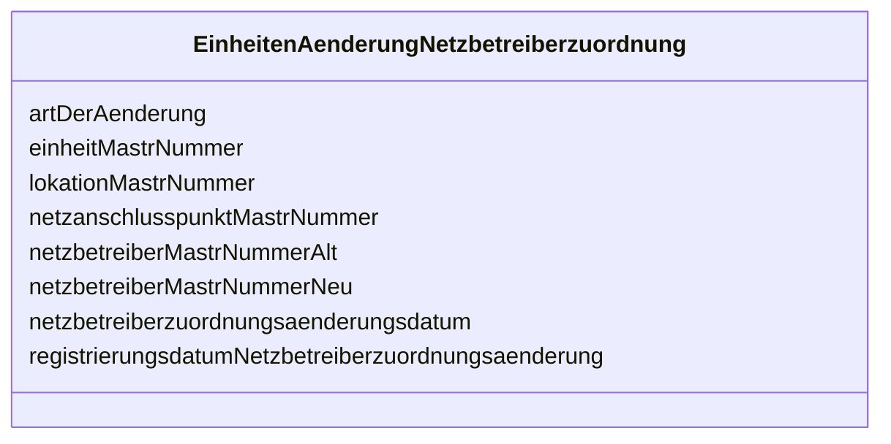

---
search:
  boost: 10.0
---

# Class: EinheitenAenderungNetzbetreiberzuordnung 

<div data-search-exclude markdown="1">


URI: [mastr:class/EinheitenAenderungNetzbetreiberzuordnung](https://example.org/mastr/class/EinheitenAenderungNetzbetreiberzuordnung)





<!-- no inheritance hierarchy -->

## Slots

| Name | Cardinality and Range | Description | Inheritance |
| ---  | --- | --- | --- |
| [einheitMastrNummer](../slots/einheitMastrNummer.md) | 0..1 <br/> [String](../types/String.md) | MaStR-Nummer der Einheit | direct |
| [lokationMastrNummer](../slots/lokationMastrNummer.md) | 0..1 <br/> [String](../types/String.md) | MaStR-Nummer der Lokation MaStR-Nummer des | direct |
| [netzanschlusspunktMastrNummer](../slots/netzanschlusspunktMastrNummer.md) | 0..1 <br/> [String](../types/String.md) | Netzanschlusspunktes, ggf | direct |
| [netzbetreiberMastrNummerAlt](../slots/netzbetreiberMastrNummerAlt.md) | 0..1 <br/> [String](../types/String.md) | Anschluss-Netzbetreibers MaStR-Nummer des neuen Anschluss- | direct |
| [netzbetreiberMastrNummerNeu](../slots/netzbetreiberMastrNummerNeu.md) | 0..1 <br/> [String](../types/String.md) | Netzbetreibers | direct |
| [artDerAenderung](../slots/artDerAenderung.md) | 0..1 <br/> [Integer](../types/Integer.md) | Art der Änderung der | direct |
| [registrierungsdatumNetzbetreiberzuordnungsaenderung](../slots/registrierungsdatumNetzbetreiberzuordnungsaenderung.md) | 0..1 <br/> [Datetime](../types/Datetime.md) | Netzbetreiberzuordnungsänderung | direct |
| [netzbetreiberzuordnungsaenderungsdatum](../slots/netzbetreiberzuordnungsaenderungsdatum.md) | 0..1 <br/> [Datetime](../types/Datetime.md) |  | direct |


## Identifier and Mapping Information


### Schema Source


* from schema: https://example.org/mastr


## Mappings

| Mapping Type | Mapped Value |
| ---  | ---  |
| self | mastr:EinheitenAenderungNetzbetreiberzuordnung |
| native | mastr:EinheitenAenderungNetzbetreiberzuordnung |


## LinkML Source

<!-- TODO: investigate https://stackoverflow.com/questions/37606292/how-to-create-tabbed-code-blocks-in-mkdocs-or-sphinx -->

### Direct

<details>
```yaml
name: EinheitenAenderungNetzbetreiberzuordnung
from_schema: https://example.org/mastr
attributes:
  einheitMastrNummer:
    name: einheitMastrNummer
    instantiates:
    - xsd:element
    description: MaStR-Nummer der Einheit
    from_schema: https://example.org/mastr
    domain_of:
    - Einheit
    - EinheitenAenderungNetzbetreiberzuordnung
    - GeloeschteUndDeaktivierteEinheit
    range: string
  lokationMastrNummer:
    name: lokationMastrNummer
    instantiates:
    - xsd:element
    description: MaStR-Nummer der Lokation MaStR-Nummer des
    from_schema: https://example.org/mastr
    rank: 1000
    domain_of:
    - EinheitenAenderungNetzbetreiberzuordnung
    range: string
  netzanschlusspunktMastrNummer:
    name: netzanschlusspunktMastrNummer
    instantiates:
    - xsd:element
    description: Netzanschlusspunktes, ggf. kommasepariert MaStR-Nummer des ehemaligen
    from_schema: https://example.org/mastr
    rank: 1000
    domain_of:
    - EinheitenAenderungNetzbetreiberzuordnung
    - Netzanschlusspunkt
    range: string
  netzbetreiberMastrNummerAlt:
    name: netzbetreiberMastrNummerAlt
    instantiates:
    - xsd:element
    description: Anschluss-Netzbetreibers MaStR-Nummer des neuen Anschluss-
    from_schema: https://example.org/mastr
    rank: 1000
    domain_of:
    - EinheitenAenderungNetzbetreiberzuordnung
    range: string
  netzbetreiberMastrNummerNeu:
    name: netzbetreiberMastrNummerNeu
    instantiates:
    - xsd:element
    description: Netzbetreibers
    from_schema: https://example.org/mastr
    rank: 1000
    domain_of:
    - EinheitenAenderungNetzbetreiberzuordnung
    range: string
  artDerAenderung:
    name: artDerAenderung
    instantiates:
    - xsd:element
    description: Art der Änderung der
    from_schema: https://example.org/mastr
    rank: 1000
    domain_of:
    - EinheitenAenderungNetzbetreiberzuordnung
    range: integer
  registrierungsdatumNetzbetreiberzuordnungsaenderung:
    name: registrierungsdatumNetzbetreiberzuordnungsaenderung
    instantiates:
    - xsd:element
    description: Netzbetreiberzuordnungsänderung
    from_schema: https://example.org/mastr
    rank: 1000
    domain_of:
    - EinheitenAenderungNetzbetreiberzuordnung
    range: datetime
  netzbetreiberzuordnungsaenderungsdatum:
    name: netzbetreiberzuordnungsaenderungsdatum
    instantiates:
    - xsd:element
    from_schema: https://example.org/mastr
    rank: 1000
    domain_of:
    - EinheitenAenderungNetzbetreiberzuordnung
    range: datetime

```
</details>

### Induced

<details>
```yaml
name: EinheitenAenderungNetzbetreiberzuordnung
from_schema: https://example.org/mastr
attributes:
  einheitMastrNummer:
    name: einheitMastrNummer
    instantiates:
    - xsd:element
    description: MaStR-Nummer der Einheit
    from_schema: https://example.org/mastr
    owner: EinheitenAenderungNetzbetreiberzuordnung
    domain_of:
    - Einheit
    - EinheitenAenderungNetzbetreiberzuordnung
    - GeloeschteUndDeaktivierteEinheit
    range: string
  lokationMastrNummer:
    name: lokationMastrNummer
    instantiates:
    - xsd:element
    description: MaStR-Nummer der Lokation MaStR-Nummer des
    from_schema: https://example.org/mastr
    rank: 1000
    owner: EinheitenAenderungNetzbetreiberzuordnung
    domain_of:
    - EinheitenAenderungNetzbetreiberzuordnung
    range: string
  netzanschlusspunktMastrNummer:
    name: netzanschlusspunktMastrNummer
    instantiates:
    - xsd:element
    description: Netzanschlusspunktes, ggf. kommasepariert MaStR-Nummer des ehemaligen
    from_schema: https://example.org/mastr
    rank: 1000
    owner: EinheitenAenderungNetzbetreiberzuordnung
    domain_of:
    - EinheitenAenderungNetzbetreiberzuordnung
    - Netzanschlusspunkt
    range: string
  netzbetreiberMastrNummerAlt:
    name: netzbetreiberMastrNummerAlt
    instantiates:
    - xsd:element
    description: Anschluss-Netzbetreibers MaStR-Nummer des neuen Anschluss-
    from_schema: https://example.org/mastr
    rank: 1000
    owner: EinheitenAenderungNetzbetreiberzuordnung
    domain_of:
    - EinheitenAenderungNetzbetreiberzuordnung
    range: string
  netzbetreiberMastrNummerNeu:
    name: netzbetreiberMastrNummerNeu
    instantiates:
    - xsd:element
    description: Netzbetreibers
    from_schema: https://example.org/mastr
    rank: 1000
    owner: EinheitenAenderungNetzbetreiberzuordnung
    domain_of:
    - EinheitenAenderungNetzbetreiberzuordnung
    range: string
  artDerAenderung:
    name: artDerAenderung
    instantiates:
    - xsd:element
    description: Art der Änderung der
    from_schema: https://example.org/mastr
    rank: 1000
    owner: EinheitenAenderungNetzbetreiberzuordnung
    domain_of:
    - EinheitenAenderungNetzbetreiberzuordnung
    range: integer
  registrierungsdatumNetzbetreiberzuordnungsaenderung:
    name: registrierungsdatumNetzbetreiberzuordnungsaenderung
    instantiates:
    - xsd:element
    description: Netzbetreiberzuordnungsänderung
    from_schema: https://example.org/mastr
    rank: 1000
    owner: EinheitenAenderungNetzbetreiberzuordnung
    domain_of:
    - EinheitenAenderungNetzbetreiberzuordnung
    range: datetime
  netzbetreiberzuordnungsaenderungsdatum:
    name: netzbetreiberzuordnungsaenderungsdatum
    instantiates:
    - xsd:element
    from_schema: https://example.org/mastr
    rank: 1000
    owner: EinheitenAenderungNetzbetreiberzuordnung
    domain_of:
    - EinheitenAenderungNetzbetreiberzuordnung
    range: datetime

```
</details></div>