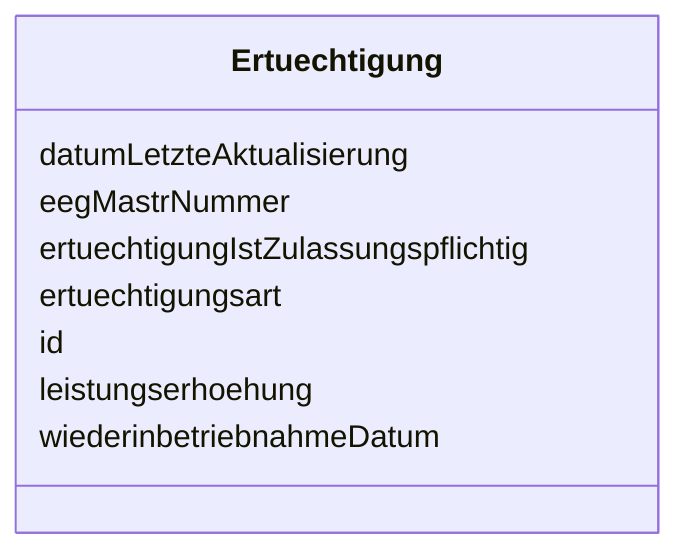

---
search:
  boost: 10.0
---

# Class: Ertuechtigung 

<div data-search-exclude markdown="1">


URI: [mastr:class/Ertuechtigung](https://example.org/mastr/class/Ertuechtigung)





<!-- no inheritance hierarchy -->

## Slots

| Name | Cardinality and Range | Description | Inheritance |
| ---  | --- | --- | --- |
| [id](../slots/id.md) | 0..1 <br/> [Integer](../types/Integer.md) | Eindeutiger Identifikator | direct |
| [datumLetzteAktualisierung](../slots/datumLetzteAktualisierung.md) | 0..1 <br/> [Datetime](../types/Datetime.md) | Datum der letzten Aktualisierung an diesem Objekt | direct |
| [eegMastrNummer](../slots/eegMastrNummer.md) | 0..1 <br/> [String](../types/String.md) | Die MaStR-Nummer der zugehörigen EEG-Anlage | direct |
| [ertuechtigungsart](../slots/ertuechtigungsart.md) | 0..1 <br/> [Integer](../types/Integer.md) | Art der Ertüchtigung | direct |
| [ertuechtigungIstZulassungspflichtig](../slots/ertuechtigungIstZulassungspflichtig.md) | 0..1 <br/> [Integer](../types/Integer.md) | Ist die Ertüchtigung Zulassungspflichtig | direct |
| [leistungserhoehung](../slots/leistungserhoehung.md) | 0..1 <br/> [Float](../types/Float.md) | Wert der Leistungserhöhung | direct |
| [wiederinbetriebnahmeDatum](../slots/wiederinbetriebnahmeDatum.md) | 0..1 <br/> [Datetime](../types/Datetime.md) | Datum der Wiederinbetriebnahme | direct |


## Identifier and Mapping Information


### Schema Source


* from schema: https://example.org/mastr


## Mappings

| Mapping Type | Mapped Value |
| ---  | ---  |
| self | mastr:Ertuechtigung |
| native | mastr:Ertuechtigung |


## LinkML Source

<!-- TODO: investigate https://stackoverflow.com/questions/37606292/how-to-create-tabbed-code-blocks-in-mkdocs-or-sphinx -->

### Direct

<details>
```yaml
name: Ertuechtigung
from_schema: https://example.org/mastr
attributes:
  id:
    name: id
    instantiates:
    - xsd:element
    description: Eindeutiger Identifikator
    from_schema: https://example.org/mastr
    domain_of:
    - Bilanzierungsgebiet
    - Einheitentyp
    - Ertuechtigung
    - Katalogkategorie
    - Katalogwert
    - Lokationstyp
    - Marktfunktion
    - Marktrolle
    range: integer
  datumLetzteAktualisierung:
    name: datumLetzteAktualisierung
    instantiates:
    - xsd:element
    description: Datum der letzten Aktualisierung an diesem Objekt
    from_schema: https://example.org/mastr
    domain_of:
    - Anlage
    - Einheit
    - EinheitGenehmigung
    - Ertuechtigung
    - GeloeschteUndDeaktivierteEinheit
    - GeloeschterUndDeaktivierterMarktakteur
    - Lokation
    - MarktakteurUndRolle
    - Netz
    range: datetime
  eegMastrNummer:
    name: eegMastrNummer
    instantiates:
    - xsd:element
    description: Die MaStR-Nummer der zugehörigen EEG-Anlage
    from_schema: https://example.org/mastr
    rank: 1000
    domain_of:
    - Ertuechtigung
    range: string
  ertuechtigungsart:
    name: ertuechtigungsart
    instantiates:
    - xsd:element
    description: 'Art der Ertüchtigung. Katalogkategorie: Ertüchtigungsart'
    from_schema: https://example.org/mastr
    rank: 1000
    domain_of:
    - Ertuechtigung
    range: integer
  ertuechtigungIstZulassungspflichtig:
    name: ertuechtigungIstZulassungspflichtig
    instantiates:
    - xsd:element
    description: Ist die Ertüchtigung Zulassungspflichtig
    from_schema: https://example.org/mastr
    rank: 1000
    domain_of:
    - Ertuechtigung
    range: integer
  leistungserhoehung:
    name: leistungserhoehung
    instantiates:
    - xsd:element
    description: Wert der Leistungserhöhung
    from_schema: https://example.org/mastr
    rank: 1000
    domain_of:
    - Ertuechtigung
    range: float
  wiederinbetriebnahmeDatum:
    name: wiederinbetriebnahmeDatum
    instantiates:
    - xsd:element
    description: Datum der Wiederinbetriebnahme
    from_schema: https://example.org/mastr
    rank: 1000
    domain_of:
    - Ertuechtigung
    range: datetime

```
</details>

### Induced

<details>
```yaml
name: Ertuechtigung
from_schema: https://example.org/mastr
attributes:
  id:
    name: id
    instantiates:
    - xsd:element
    description: Eindeutiger Identifikator
    from_schema: https://example.org/mastr
    owner: Ertuechtigung
    domain_of:
    - Bilanzierungsgebiet
    - Einheitentyp
    - Ertuechtigung
    - Katalogkategorie
    - Katalogwert
    - Lokationstyp
    - Marktfunktion
    - Marktrolle
    range: integer
  datumLetzteAktualisierung:
    name: datumLetzteAktualisierung
    instantiates:
    - xsd:element
    description: Datum der letzten Aktualisierung an diesem Objekt
    from_schema: https://example.org/mastr
    owner: Ertuechtigung
    domain_of:
    - Anlage
    - Einheit
    - EinheitGenehmigung
    - Ertuechtigung
    - GeloeschteUndDeaktivierteEinheit
    - GeloeschterUndDeaktivierterMarktakteur
    - Lokation
    - MarktakteurUndRolle
    - Netz
    range: datetime
  eegMastrNummer:
    name: eegMastrNummer
    instantiates:
    - xsd:element
    description: Die MaStR-Nummer der zugehörigen EEG-Anlage
    from_schema: https://example.org/mastr
    rank: 1000
    owner: Ertuechtigung
    domain_of:
    - Ertuechtigung
    range: string
  ertuechtigungsart:
    name: ertuechtigungsart
    instantiates:
    - xsd:element
    description: 'Art der Ertüchtigung. Katalogkategorie: Ertüchtigungsart'
    from_schema: https://example.org/mastr
    rank: 1000
    owner: Ertuechtigung
    domain_of:
    - Ertuechtigung
    range: integer
  ertuechtigungIstZulassungspflichtig:
    name: ertuechtigungIstZulassungspflichtig
    instantiates:
    - xsd:element
    description: Ist die Ertüchtigung Zulassungspflichtig
    from_schema: https://example.org/mastr
    rank: 1000
    owner: Ertuechtigung
    domain_of:
    - Ertuechtigung
    range: integer
  leistungserhoehung:
    name: leistungserhoehung
    instantiates:
    - xsd:element
    description: Wert der Leistungserhöhung
    from_schema: https://example.org/mastr
    rank: 1000
    owner: Ertuechtigung
    domain_of:
    - Ertuechtigung
    range: float
  wiederinbetriebnahmeDatum:
    name: wiederinbetriebnahmeDatum
    instantiates:
    - xsd:element
    description: Datum der Wiederinbetriebnahme
    from_schema: https://example.org/mastr
    rank: 1000
    owner: Ertuechtigung
    domain_of:
    - Ertuechtigung
    range: datetime

```
</details></div>