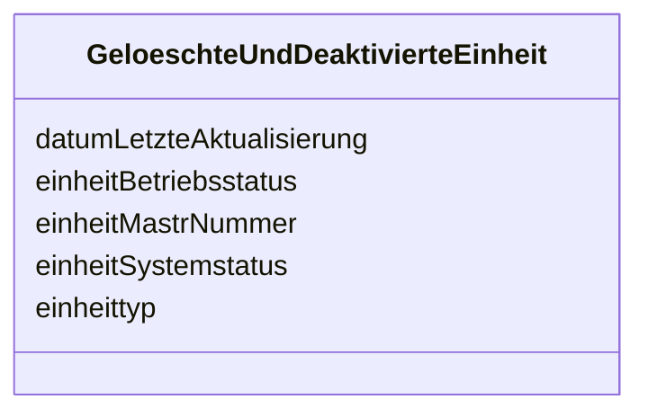

---
search:
  boost: 10.0
---

# Class: GeloeschteUndDeaktivierteEinheit 

<div data-search-exclude markdown="1">


URI: [mastr:class/GeloeschteUndDeaktivierteEinheit](https://example.org/mastr/class/GeloeschteUndDeaktivierteEinheit)





<!-- no inheritance hierarchy -->

## Slots

| Name | Cardinality and Range | Description | Inheritance |
| ---  | --- | --- | --- |
| [datumLetzteAktualisierung](../slots/datumLetzteAktualisierung.md) | 0..1 <br/> [Datetime](../types/Datetime.md) | Datum der letzten Aktualisierung an diesem Objekt | direct |
| [einheitMastrNummer](../slots/einheitMastrNummer.md) | 0..1 <br/> [String](../types/String.md) |  | direct |
| [einheittyp](../slots/einheittyp.md) | 0..1 <br/> [Integer](../types/Integer.md) | Typ der Einheit: Objekt: Einheitentyp | direct |
| [einheitSystemstatus](../slots/einheitSystemstatus.md) | 0..1 <br/> [Integer](../types/Integer.md) | Systemstatus der Einheit | direct |
| [einheitBetriebsstatus](../slots/einheitBetriebsstatus.md) | 0..1 <br/> [Integer](../types/Integer.md) | Betriebsstatus der Einheit | direct |


## Identifier and Mapping Information


### Schema Source


* from schema: https://example.org/mastr


## Mappings

| Mapping Type | Mapped Value |
| ---  | ---  |
| self | mastr:GeloeschteUndDeaktivierteEinheit |
| native | mastr:GeloeschteUndDeaktivierteEinheit |


## LinkML Source

<!-- TODO: investigate https://stackoverflow.com/questions/37606292/how-to-create-tabbed-code-blocks-in-mkdocs-or-sphinx -->

### Direct

<details>
```yaml
name: GeloeschteUndDeaktivierteEinheit
from_schema: https://example.org/mastr
attributes:
  datumLetzteAktualisierung:
    name: datumLetzteAktualisierung
    instantiates:
    - xsd:element
    description: Datum der letzten Aktualisierung an diesem Objekt
    from_schema: https://example.org/mastr
    domain_of:
    - Anlage
    - Einheit
    - EinheitGenehmigung
    - Ertuechtigung
    - GeloeschteUndDeaktivierteEinheit
    - GeloeschterUndDeaktivierterMarktakteur
    - Lokation
    - MarktakteurUndRolle
    - Netz
    range: datetime
  einheitMastrNummer:
    name: einheitMastrNummer
    instantiates:
    - xsd:element
    from_schema: https://example.org/mastr
    domain_of:
    - Einheit
    - EinheitenAenderungNetzbetreiberzuordnung
    - GeloeschteUndDeaktivierteEinheit
    range: string
  einheittyp:
    name: einheittyp
    instantiates:
    - xsd:element
    description: 'Typ der Einheit: Objekt: Einheitentyp'
    from_schema: https://example.org/mastr
    rank: 1000
    domain_of:
    - GeloeschteUndDeaktivierteEinheit
    range: integer
  einheitSystemstatus:
    name: einheitSystemstatus
    instantiates:
    - xsd:element
    description: 'Systemstatus der Einheit. Katalogkategorie: AnlagenSystemStatus'
    from_schema: https://example.org/mastr
    domain_of:
    - Einheit
    - GeloeschteUndDeaktivierteEinheit
    range: integer
  einheitBetriebsstatus:
    name: einheitBetriebsstatus
    instantiates:
    - xsd:element
    description: 'Betriebsstatus der Einheit. Katalogkategorie: Anlagenbetriebsstatus'
    from_schema: https://example.org/mastr
    domain_of:
    - Einheit
    - GeloeschteUndDeaktivierteEinheit
    range: integer

```
</details>

### Induced

<details>
```yaml
name: GeloeschteUndDeaktivierteEinheit
from_schema: https://example.org/mastr
attributes:
  datumLetzteAktualisierung:
    name: datumLetzteAktualisierung
    instantiates:
    - xsd:element
    description: Datum der letzten Aktualisierung an diesem Objekt
    from_schema: https://example.org/mastr
    owner: GeloeschteUndDeaktivierteEinheit
    domain_of:
    - Anlage
    - Einheit
    - EinheitGenehmigung
    - Ertuechtigung
    - GeloeschteUndDeaktivierteEinheit
    - GeloeschterUndDeaktivierterMarktakteur
    - Lokation
    - MarktakteurUndRolle
    - Netz
    range: datetime
  einheitMastrNummer:
    name: einheitMastrNummer
    instantiates:
    - xsd:element
    from_schema: https://example.org/mastr
    owner: GeloeschteUndDeaktivierteEinheit
    domain_of:
    - Einheit
    - EinheitenAenderungNetzbetreiberzuordnung
    - GeloeschteUndDeaktivierteEinheit
    range: string
  einheittyp:
    name: einheittyp
    instantiates:
    - xsd:element
    description: 'Typ der Einheit: Objekt: Einheitentyp'
    from_schema: https://example.org/mastr
    rank: 1000
    owner: GeloeschteUndDeaktivierteEinheit
    domain_of:
    - GeloeschteUndDeaktivierteEinheit
    range: integer
  einheitSystemstatus:
    name: einheitSystemstatus
    instantiates:
    - xsd:element
    description: 'Systemstatus der Einheit. Katalogkategorie: AnlagenSystemStatus'
    from_schema: https://example.org/mastr
    owner: GeloeschteUndDeaktivierteEinheit
    domain_of:
    - Einheit
    - GeloeschteUndDeaktivierteEinheit
    range: integer
  einheitBetriebsstatus:
    name: einheitBetriebsstatus
    instantiates:
    - xsd:element
    description: 'Betriebsstatus der Einheit. Katalogkategorie: Anlagenbetriebsstatus'
    from_schema: https://example.org/mastr
    owner: GeloeschteUndDeaktivierteEinheit
    domain_of:
    - Einheit
    - GeloeschteUndDeaktivierteEinheit
    range: integer

```
</details></div>