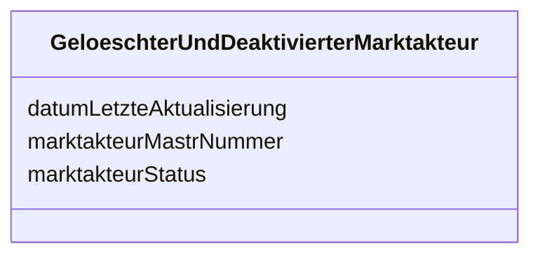

---
search:
  boost: 10.0
---

# Class: GeloeschterUndDeaktivierterMarktakteur 

<div data-search-exclude markdown="1">


URI: [mastr:class/GeloeschterUndDeaktivierterMarktakteur](https://example.org/mastr/class/GeloeschterUndDeaktivierterMarktakteur)





<!-- no inheritance hierarchy -->

## Slots

| Name | Cardinality and Range | Description | Inheritance |
| ---  | --- | --- | --- |
| [marktakteurMastrNummer](../slots/marktakteurMastrNummer.md) | 0..1 <br/> [String](../types/String.md) | Die MaStR-Nummer de s Marktakteurs | direct |
| [marktakteurStatus](../slots/marktakteurStatus.md) | 0..1 <br/> [String](../types/String.md) | Der Status des Marktakteurs | direct |
| [datumLetzteAktualisierung](../slots/datumLetzteAktualisierung.md) | 0..1 <br/> [String](../types/String.md) | Datum der letzten Aktualisierung an diesem Objekt | direct |


## Identifier and Mapping Information


### Schema Source


* from schema: https://example.org/mastr


## Mappings

| Mapping Type | Mapped Value |
| ---  | ---  |
| self | mastr:GeloeschterUndDeaktivierterMarktakteur |
| native | mastr:GeloeschterUndDeaktivierterMarktakteur |


## LinkML Source

<!-- TODO: investigate https://stackoverflow.com/questions/37606292/how-to-create-tabbed-code-blocks-in-mkdocs-or-sphinx -->

### Direct

<details>
```yaml
name: GeloeschterUndDeaktivierterMarktakteur
from_schema: https://example.org/mastr
attributes:
  marktakteurMastrNummer:
    name: marktakteurMastrNummer
    instantiates:
    - xsd:element
    description: Die MaStR-Nummer de s Marktakteurs
    from_schema: https://example.org/mastr
    rank: 1000
    domain_of:
    - GeloeschterUndDeaktivierterMarktakteur
    - MarktakteurUndRolle
    range: string
  marktakteurStatus:
    name: marktakteurStatus
    instantiates:
    - xsd:element
    description: 'Der Status des Marktakteurs. Katalogkategorie: MarktakteurStatusKatalog'
    from_schema: https://example.org/mastr
    rank: 1000
    domain_of:
    - GeloeschterUndDeaktivierterMarktakteur
    range: string
  datumLetzteAktualisierung:
    name: datumLetzteAktualisierung
    instantiates:
    - xsd:element
    description: Datum der letzten Aktualisierung an diesem Objekt
    from_schema: https://example.org/mastr
    domain_of:
    - Anlage
    - Einheit
    - EinheitGenehmigung
    - Ertuechtigung
    - GeloeschteUndDeaktivierteEinheit
    - GeloeschterUndDeaktivierterMarktakteur
    - Lokation
    - MarktakteurUndRolle
    - Netz
    range: string

```
</details>

### Induced

<details>
```yaml
name: GeloeschterUndDeaktivierterMarktakteur
from_schema: https://example.org/mastr
attributes:
  marktakteurMastrNummer:
    name: marktakteurMastrNummer
    instantiates:
    - xsd:element
    description: Die MaStR-Nummer de s Marktakteurs
    from_schema: https://example.org/mastr
    rank: 1000
    owner: GeloeschterUndDeaktivierterMarktakteur
    domain_of:
    - GeloeschterUndDeaktivierterMarktakteur
    - MarktakteurUndRolle
    range: string
  marktakteurStatus:
    name: marktakteurStatus
    instantiates:
    - xsd:element
    description: 'Der Status des Marktakteurs. Katalogkategorie: MarktakteurStatusKatalog'
    from_schema: https://example.org/mastr
    rank: 1000
    owner: GeloeschterUndDeaktivierterMarktakteur
    domain_of:
    - GeloeschterUndDeaktivierterMarktakteur
    range: string
  datumLetzteAktualisierung:
    name: datumLetzteAktualisierung
    instantiates:
    - xsd:element
    description: Datum der letzten Aktualisierung an diesem Objekt
    from_schema: https://example.org/mastr
    owner: GeloeschterUndDeaktivierterMarktakteur
    domain_of:
    - Anlage
    - Einheit
    - EinheitGenehmigung
    - Ertuechtigung
    - GeloeschteUndDeaktivierteEinheit
    - GeloeschterUndDeaktivierterMarktakteur
    - Lokation
    - MarktakteurUndRolle
    - Netz
    range: string

```
</details></div>