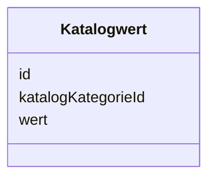

---
search:
  boost: 10.0
---

# Class: Katalogwert 

<div data-search-exclude markdown="1">


URI: [mastr:class/Katalogwert](https://example.org/mastr/class/Katalogwert)





<!-- no inheritance hierarchy -->

## Slots

| Name | Cardinality and Range | Description | Inheritance |
| ---  | --- | --- | --- |
| [id](../slots/id.md) | 0..1 <br/> [Integer](../types/Integer.md) | Id des Katalogwertes | direct |
| [wert](../slots/wert.md) | 0..1 <br/> [String](../types/String.md) | Wert des Katalogwertes | direct |
| [katalogKategorieId](../slots/katalogKategorieId.md) | 0..1 <br/> [Integer](../types/Integer.md) | Wert der Katalogkategorie | direct |


## Identifier and Mapping Information


### Schema Source


* from schema: https://example.org/mastr


## Mappings

| Mapping Type | Mapped Value |
| ---  | ---  |
| self | mastr:Katalogwert |
| native | mastr:Katalogwert |


## LinkML Source

<!-- TODO: investigate https://stackoverflow.com/questions/37606292/how-to-create-tabbed-code-blocks-in-mkdocs-or-sphinx -->

### Direct

<details>
```yaml
name: Katalogwert
from_schema: https://example.org/mastr
attributes:
  id:
    name: id
    instantiates:
    - xsd:element
    description: Id des Katalogwertes
    from_schema: https://example.org/mastr
    domain_of:
    - Bilanzierungsgebiet
    - Einheitentyp
    - Ertuechtigung
    - Katalogkategorie
    - Katalogwert
    - Lokationstyp
    - Marktfunktion
    - Marktrolle
    range: integer
  wert:
    name: wert
    instantiates:
    - xsd:element
    description: Wert des Katalogwertes
    from_schema: https://example.org/mastr
    domain_of:
    - Einheitentyp
    - Katalogwert
    - Lokationstyp
    - Marktfunktion
    - Marktrolle
    range: string
  katalogKategorieId:
    name: katalogKategorieId
    instantiates:
    - xsd:element
    description: Wert der Katalogkategorie
    from_schema: https://example.org/mastr
    rank: 1000
    domain_of:
    - Katalogwert
    range: integer

```
</details>

### Induced

<details>
```yaml
name: Katalogwert
from_schema: https://example.org/mastr
attributes:
  id:
    name: id
    instantiates:
    - xsd:element
    description: Id des Katalogwertes
    from_schema: https://example.org/mastr
    owner: Katalogwert
    domain_of:
    - Bilanzierungsgebiet
    - Einheitentyp
    - Ertuechtigung
    - Katalogkategorie
    - Katalogwert
    - Lokationstyp
    - Marktfunktion
    - Marktrolle
    range: integer
  wert:
    name: wert
    instantiates:
    - xsd:element
    description: Wert des Katalogwertes
    from_schema: https://example.org/mastr
    owner: Katalogwert
    domain_of:
    - Einheitentyp
    - Katalogwert
    - Lokationstyp
    - Marktfunktion
    - Marktrolle
    range: string
  katalogKategorieId:
    name: katalogKategorieId
    instantiates:
    - xsd:element
    description: Wert der Katalogkategorie
    from_schema: https://example.org/mastr
    rank: 1000
    owner: Katalogwert
    domain_of:
    - Katalogwert
    range: integer

```
</details></div>