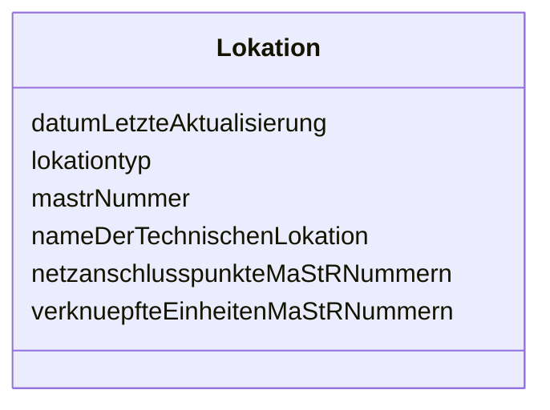

---
search:
  boost: 10.0
---

# Class: Lokation 

<div data-search-exclude markdown="1">


URI: [mastr:class/Lokation](https://example.org/mastr/class/Lokation)





<!-- no inheritance hierarchy -->

## Slots

| Name | Cardinality and Range | Description | Inheritance |
| ---  | --- | --- | --- |
| [datumLetzteAktualisierung](../slots/datumLetzteAktualisierung.md) | 0..1 <br/> [Datetime](../types/Datetime.md) | Datum der letzten Aktualisierung an diesem Objekt | direct |
| [mastrNummer](../slots/mastrNummer.md) | 0..1 <br/> [String](../types/String.md) | Die MaStR-Nummer der Lokation | direct |
| [nameDerTechnischenLokation](../slots/nameDerTechnischenLokation.md) | 0..1 <br/> [String](../types/String.md) | Name der technischen Lokation | direct |
| [lokationtyp](../slots/lokationtyp.md) | 0..1 <br/> [Integer](../types/Integer.md) | Typ der Lokation | direct |
| [verknuepfteEinheitenMaStRNummern](../slots/verknuepfteEinheitenMaStRNummern.md) | 0..1 <br/> [String](../types/String.md) | Liste von MaStR Nummern mit den verknüpften Stromerzeugern | direct |
| [netzanschlusspunkteMaStRNummern](../slots/netzanschlusspunkteMaStRNummern.md) | 0..1 <br/> [String](../types/String.md) | Liste der MaStR Nummern der Netzanschlusspunkte der Lokation | direct |


## Identifier and Mapping Information


### Schema Source


* from schema: https://example.org/mastr


## Mappings

| Mapping Type | Mapped Value |
| ---  | ---  |
| self | mastr:Lokation |
| native | mastr:Lokation |


## LinkML Source

<!-- TODO: investigate https://stackoverflow.com/questions/37606292/how-to-create-tabbed-code-blocks-in-mkdocs-or-sphinx -->

### Direct

<details>
```yaml
name: Lokation
from_schema: https://example.org/mastr
attributes:
  datumLetzteAktualisierung:
    name: datumLetzteAktualisierung
    instantiates:
    - xsd:element
    description: Datum der letzten Aktualisierung an diesem Objekt
    from_schema: https://example.org/mastr
    domain_of:
    - Anlage
    - Einheit
    - EinheitGenehmigung
    - Ertuechtigung
    - GeloeschteUndDeaktivierteEinheit
    - GeloeschterUndDeaktivierterMarktakteur
    - Lokation
    - MarktakteurUndRolle
    - Netz
    range: datetime
  mastrNummer:
    name: mastrNummer
    instantiates:
    - xsd:element
    description: Die MaStR-Nummer der Lokation
    from_schema: https://example.org/mastr
    rank: 1000
    domain_of:
    - Lokation
    - Marktakteur
    - MarktakteurUndRolle
    - Netz
    range: string
  nameDerTechnischenLokation:
    name: nameDerTechnischenLokation
    instantiates:
    - xsd:element
    description: Name der technischen Lokation
    from_schema: https://example.org/mastr
    rank: 1000
    domain_of:
    - Lokation
    - Netzanschlusspunkt
    range: string
  lokationtyp:
    name: lokationtyp
    instantiates:
    - xsd:element
    description: 'Typ der Lokation. Systemkatalog: Lokationstyp'
    from_schema: https://example.org/mastr
    rank: 1000
    domain_of:
    - Lokation
    - Netzanschlusspunkt
    range: integer
  verknuepfteEinheitenMaStRNummern:
    name: verknuepfteEinheitenMaStRNummern
    instantiates:
    - xsd:element
    description: Liste von MaStR Nummern mit den verknüpften Stromerzeugern
    from_schema: https://example.org/mastr
    domain_of:
    - Anlage
    - EinheitGasverbraucher
    - EinheitGenehmigung
    - Lokation
    range: string
  netzanschlusspunkteMaStRNummern:
    name: netzanschlusspunkteMaStRNummern
    instantiates:
    - xsd:element
    description: Liste der MaStR Nummern der Netzanschlusspunkte der Lokation
    from_schema: https://example.org/mastr
    rank: 1000
    domain_of:
    - Lokation
    range: string

```
</details>

### Induced

<details>
```yaml
name: Lokation
from_schema: https://example.org/mastr
attributes:
  datumLetzteAktualisierung:
    name: datumLetzteAktualisierung
    instantiates:
    - xsd:element
    description: Datum der letzten Aktualisierung an diesem Objekt
    from_schema: https://example.org/mastr
    owner: Lokation
    domain_of:
    - Anlage
    - Einheit
    - EinheitGenehmigung
    - Ertuechtigung
    - GeloeschteUndDeaktivierteEinheit
    - GeloeschterUndDeaktivierterMarktakteur
    - Lokation
    - MarktakteurUndRolle
    - Netz
    range: datetime
  mastrNummer:
    name: mastrNummer
    instantiates:
    - xsd:element
    description: Die MaStR-Nummer der Lokation
    from_schema: https://example.org/mastr
    rank: 1000
    owner: Lokation
    domain_of:
    - Lokation
    - Marktakteur
    - MarktakteurUndRolle
    - Netz
    range: string
  nameDerTechnischenLokation:
    name: nameDerTechnischenLokation
    instantiates:
    - xsd:element
    description: Name der technischen Lokation
    from_schema: https://example.org/mastr
    rank: 1000
    owner: Lokation
    domain_of:
    - Lokation
    - Netzanschlusspunkt
    range: string
  lokationtyp:
    name: lokationtyp
    instantiates:
    - xsd:element
    description: 'Typ der Lokation. Systemkatalog: Lokationstyp'
    from_schema: https://example.org/mastr
    rank: 1000
    owner: Lokation
    domain_of:
    - Lokation
    - Netzanschlusspunkt
    range: integer
  verknuepfteEinheitenMaStRNummern:
    name: verknuepfteEinheitenMaStRNummern
    instantiates:
    - xsd:element
    description: Liste von MaStR Nummern mit den verknüpften Stromerzeugern
    from_schema: https://example.org/mastr
    owner: Lokation
    domain_of:
    - Anlage
    - EinheitGasverbraucher
    - EinheitGenehmigung
    - Lokation
    range: string
  netzanschlusspunkteMaStRNummern:
    name: netzanschlusspunkteMaStRNummern
    instantiates:
    - xsd:element
    description: Liste der MaStR Nummern der Netzanschlusspunkte der Lokation
    from_schema: https://example.org/mastr
    rank: 1000
    owner: Lokation
    domain_of:
    - Lokation
    range: string

```
</details></div>