---
search:
  boost: 10.0
---

# Class: Marktakteur 

<div data-search-exclude markdown="1">


URI: [mastr:class/Marktakteur](https://example.org/mastr/class/Marktakteur)

```mermaid
 classDiagram
    class Marktakteur
    click Marktakteur href "../../classes/Marktakteur/"
      Marktakteur : acerCode
        
      Marktakteur : acerCodeNv
        
      Marktakteur : adresszusatz
        
      Marktakteur : adresszusatzAnZustelladresse
        
      Marktakteur : belieferungHaushaltskundenGas
        
      Marktakteur : belieferungHaushaltskundenStrom
        
      Marktakteur : belieferungVonLetztverbrauchernGas
        
      Marktakteur : belieferungVonLetztverbrauchernStrom
        
      Marktakteur : bundesland
        
      Marktakteur : bundesnetzagenturBetriebsnummer
        
      Marktakteur : bundesnetzagenturBetriebsnummerNv
        
      Marktakteur : datumLetzeAktualisierung
        
      Marktakteur : direktvermarktungsunternehmen
        
      Marktakteur : email
        
      Marktakteur : fax
        
      Marktakteur : faxNv
        
      Marktakteur : firmenname
        
      Marktakteur : gasgrosshaendler
        
      Marktakteur : hauptwirtdschaftszweigAbschnitt
        
      Marktakteur : hauptwirtdschaftszweigAbteilung
        
      Marktakteur : hauptwirtdschaftszweigGruppe
        
      Marktakteur : hausnummer
        
      Marktakteur : hausnummerAnZustelladresse
        
      Marktakteur : hausnummerAnZustelladresseNv
        
      Marktakteur : hausnummerNv
        
      Marktakteur : kmu
        
      Marktakteur : land
        
      Marktakteur : landAnZustelladresse
        
      Marktakteur : marktakteurAnrede
        
      Marktakteur : marktakteurNachname
        
      Marktakteur : marktakteurTitel
        
      Marktakteur : marktakteurVorname
        
      Marktakteur : marktfunktion
        
      Marktakteur : marktrollen
        
      Marktakteur : mastrNummer
        
      Marktakteur : netz
        
      Marktakteur : nuts2
        
      Marktakteur : ort
        
      Marktakteur : ortAnZustelladresse
        
      Marktakteur : personenart
        
      Marktakteur : postleitzahl
        
      Marktakteur : postleitzahlAnZustelladresse
        
      Marktakteur : rechtsform
        
      Marktakteur : region
        
      Marktakteur : registergericht
        
      Marktakteur : registergerichtAusland
        
      Marktakteur : registernummer
        
      Marktakteur : registernummerAusland
        
      Marktakteur : registernummerPraefix
        
      Marktakteur : registrierungsdatumMarktakteur
        
      Marktakteur : sonstigeRechtsform
        
      Marktakteur : strasse
        
      Marktakteur : strasseAnZustelladresse
        
      Marktakteur : stromgrosshaendler
        
      Marktakteur : taetigkeitsbeginn
        
      Marktakteur : taetigkeitsende
        
      Marktakteur : telefon
        
      Marktakteur : umsatzsteueridentifikationsnummer
        
      Marktakteur : umsatzsteueridentifikationsnummerNv
        
      Marktakteur : webportalDesNetzbetreibers
        
      Marktakteur : webseite
        
      Marktakteur : webseiteNv
        
      
```





<!-- no inheritance hierarchy -->

## Slots

| Name | Cardinality and Range | Description | Inheritance |
| ---  | --- | --- | --- |
| [mastrNummer](../slots/mastrNummer.md) | 0..1 <br/> [String](../types/String.md) | Die MaStR-Nummer des gewünschten Marktakteurs | direct |
| [datumLetzeAktualisierung](../slots/datumLetzeAktualisierung.md) | 0..1 <br/> [Datetime](../types/Datetime.md) |  | direct |
| [personenart](../slots/personenart.md) | 0..1 <br/> [Integer](../types/Integer.md) | Angabe der Personenart des Marktakteurs: Natürliche Person oder Organisation ... | direct |
| [marktakteurAnrede](../slots/marktakteurAnrede.md) | 0..1 <br/> [Integer](../types/Integer.md) | Details zur Personenart | direct |
| [marktakteurTitel](../slots/marktakteurTitel.md) | 0..1 <br/> [Integer](../types/Integer.md) | Titel der natürlichen Person | direct |
| [marktakteurVorname](../slots/marktakteurVorname.md) | 0..1 <br/> [String](../types/String.md) | Vorname der natürlichen Person | direct |
| [marktakteurNachname](../slots/marktakteurNachname.md) | 0..1 <br/> [String](../types/String.md) | Nachname der natürlichen Person | direct |
| [firmenname](../slots/firmenname.md) | 0..1 <br/> [String](../types/String.md) | Name der Firma mit dem rechtsformergänzenden Namenszusatz | direct |
| [marktfunktion](../slots/marktfunktion.md) | 0..1 <br/> [Integer](../types/Integer.md) | Marktfunktion des Marktakteurs | direct |
| [rechtsform](../slots/rechtsform.md) | 0..1 <br/> [Integer](../types/Integer.md) | Rechtsform der Organsiation | direct |
| [sonstigeRechtsform](../slots/sonstigeRechtsform.md) | 0..1 <br/> [String](../types/String.md) | Angabe der Rechtsform, wenn Sonstige gewählt wurde | direct |
| [marktrollen](../slots/marktrollen.md) | 0..1 <br/> [String](../types/String.md) | Auflistung der zugeordneten Marktrollen und deren Daten | direct |
| [land](../slots/land.md) | 0..1 <br/> [Integer](../types/Integer.md) | Das Land, in dem der Marktakteur seinen Sitz hat | direct |
| [region](../slots/region.md) | 0..1 <br/> [String](../types/String.md) | Region | direct |
| [strasse](../slots/strasse.md) | 0..1 <br/> [String](../types/String.md) | Die Straße, in der der Marktakteur seinen Sitz hat | direct |
| [hausnummer](../slots/hausnummer.md) | 0..1 <br/> [String](../types/String.md) | Die Hausnummer, an der der Marktakteur seinen Sitz hat | direct |
| [hausnummerNv](../slots/hausnummerNv.md) | 0..1 <br/> [Integer](../types/Integer.md) | Die Hausnummer, an der der Marktakteur seinen Sitz hat | direct |
| [adresszusatz](../slots/adresszusatz.md) | 0..1 <br/> [String](../types/String.md) | Optionaler Zusatz zur Anschrift des Marktakteurs | direct |
| [postleitzahl](../slots/postleitzahl.md) | 0..1 <br/> [String](../types/String.md) | Die Postleitzahl, in deren Gebiet der Marktakteur seinen Sitz hat | direct |
| [ort](../slots/ort.md) | 0..1 <br/> [String](../types/String.md) | Der Ort, in dem der Marktakteur seinen Sitz hat | direct |
| [bundesland](../slots/bundesland.md) | 0..1 <br/> [Integer](../types/Integer.md) | Das Bundesland, in dem der Marktakteur seinen Sitz hat | direct |
| [netz](../slots/netz.md) | 0..1 <br/> [String](../types/String.md) | Netz des Netzbetreibers (nur bei Netzbetreibern) | direct |
| [nuts2](../slots/nuts2.md) | 0..1 <br/> [String](../types/String.md) | NUTS-II-Region | direct |
| [email](../slots/email.md) | 0..1 <br/> [String](../types/String.md) | E-Mail des Marktakteurs | direct |
| [telefon](../slots/telefon.md) | 0..1 <br/> [String](../types/String.md) | Telefonnummer des Marktakteurs | direct |
| [fax](../slots/fax.md) | 0..1 <br/> [String](../types/String.md) | Faxnummer des Marktakteurs | direct |
| [faxNv](../slots/faxNv.md) | 0..1 <br/> [Integer](../types/Integer.md) | Faxnummer des Marktakteurs | direct |
| [webseite](../slots/webseite.md) | 0..1 <br/> [String](../types/String.md) | Internetadresse des Marktakteurs | direct |
| [webseiteNv](../slots/webseiteNv.md) | 0..1 <br/> [Integer](../types/Integer.md) | Internetadresse des Marktakteurs | direct |
| [registergericht](../slots/registergericht.md) | 0..1 <br/> [Integer](../types/Integer.md) | Angabe des Registergerichts, bei dem die Organisation registriert ist | direct |
| [registergerichtAusland](../slots/registergerichtAusland.md) | 0..1 <br/> [String](../types/String.md) | Angabe des Registergerichts, bei dem die Organisation registriert ist, wenn i... | direct |
| [registernummerPraefix](../slots/registernummerPraefix.md) | 0..1 <br/> [Integer](../types/Integer.md) | Präfix mit dem die Registernummer beginnt | direct |
| [registernummer](../slots/registernummer.md) | 0..1 <br/> [String](../types/String.md) | Registernummer des Marktakteurs | direct |
| [registernummerAusland](../slots/registernummerAusland.md) | 0..1 <br/> [String](../types/String.md) | Registernummer des Marktakteurs, wenn im Ausland | direct |
| [taetigkeitsbeginn](../slots/taetigkeitsbeginn.md) | 0..1 <br/> [Date](../types/Date.md) | Tätigkeitsbeginn des Marktakteurs | direct |
| [acerCode](../slots/acerCode.md) | 0..1 <br/> [String](../types/String.md) | Der ACER-Code des Marktakteurs | direct |
| [acerCodeNv](../slots/acerCodeNv.md) | 0..1 <br/> [Integer](../types/Integer.md) | Der ACER-Code des Marktakteurs | direct |
| [umsatzsteueridentifikationsnummer](../slots/umsatzsteueridentifikationsnummer.md) | 0..1 <br/> [String](../types/String.md) | Die USt-Id Nummer des Marktakteurs | direct |
| [umsatzsteueridentifikationsnummerNv](../slots/umsatzsteueridentifikationsnummerNv.md) | 0..1 <br/> [Integer](../types/Integer.md) | Die USt-Id Nummer des Marktakteurs | direct |
| [taetigkeitsende](../slots/taetigkeitsende.md) | 0..1 <br/> [Date](../types/Date.md) | Das Tätigkeitsende des Marktakteurs | direct |
| [bundesnetzagenturBetriebsnummer](../slots/bundesnetzagenturBetriebsnummer.md) | 0..1 <br/> [String](../types/String.md) | BNetzA-Betriebsnummer des Netzbetreibers (nur bei Stromnetzbetreiber, Gasnetz... | direct |
| [bundesnetzagenturBetriebsnummerNv](../slots/bundesnetzagenturBetriebsnummerNv.md) | 0..1 <br/> [Integer](../types/Integer.md) | BNetzA-Betriebsnummer des Netzbetreibers (nur bei Stromnetzbetreiber, Gasnetz... | direct |
| [landAnZustelladresse](../slots/landAnZustelladresse.md) | 0..1 <br/> [Integer](../types/Integer.md) | Land - Zustelladresse | direct |
| [postleitzahlAnZustelladresse](../slots/postleitzahlAnZustelladresse.md) | 0..1 <br/> [String](../types/String.md) | Postleitzahl - Zustelladresse | direct |
| [ortAnZustelladresse](../slots/ortAnZustelladresse.md) | 0..1 <br/> [String](../types/String.md) | Ort - Zustelladresse | direct |
| [strasseAnZustelladresse](../slots/strasseAnZustelladresse.md) | 0..1 <br/> [String](../types/String.md) | Straße - Zustelladresse | direct |
| [hausnummerAnZustelladresse](../slots/hausnummerAnZustelladresse.md) | 0..1 <br/> [String](../types/String.md) | Hausnummer - Zustelladresse | direct |
| [hausnummerAnZustelladresseNv](../slots/hausnummerAnZustelladresseNv.md) | 0..1 <br/> [Integer](../types/Integer.md) | Hausnummer - Zustelladresse | direct |
| [adresszusatzAnZustelladresse](../slots/adresszusatzAnZustelladresse.md) | 0..1 <br/> [String](../types/String.md) | Adresszusatz - Zustelladresse | direct |
| [kmu](../slots/kmu.md) | 0..1 <br/> [Integer](../types/Integer.md) | Kleinst-, Klein- oder mittleres Unternehmen? | direct |
| [registrierungsdatumMarktakteur](../slots/registrierungsdatumMarktakteur.md) | 0..1 <br/> [Datetime](../types/Datetime.md) | Registrierungsdatum | direct |
| [hauptwirtdschaftszweigAbteilung](../slots/hauptwirtdschaftszweigAbteilung.md) | 0..1 <br/> [Integer](../types/Integer.md) |  | direct |
| [hauptwirtdschaftszweigGruppe](../slots/hauptwirtdschaftszweigGruppe.md) | 0..1 <br/> [Integer](../types/Integer.md) |  | direct |
| [hauptwirtdschaftszweigAbschnitt](../slots/hauptwirtdschaftszweigAbschnitt.md) | 0..1 <br/> [Integer](../types/Integer.md) |  | direct |
| [direktvermarktungsunternehmen](../slots/direktvermarktungsunternehmen.md) | 0..1 <br/> [Integer](../types/Integer.md) | Direktvermarktungsunternehmen | direct |
| [belieferungVonLetztverbrauchernStrom](../slots/belieferungVonLetztverbrauchernStrom.md) | 0..1 <br/> [Integer](../types/Integer.md) | Belieferung von Letztverbrauchern | direct |
| [belieferungHaushaltskundenStrom](../slots/belieferungHaushaltskundenStrom.md) | 0..1 <br/> [Integer](../types/Integer.md) | Belieferung von Haushaltskunden mit Strom | direct |
| [gasgrosshaendler](../slots/gasgrosshaendler.md) | 0..1 <br/> [Integer](../types/Integer.md) | Gasgroßhändler | direct |
| [stromgrosshaendler](../slots/stromgrosshaendler.md) | 0..1 <br/> [Integer](../types/Integer.md) | Stromgroßhändler | direct |
| [belieferungVonLetztverbrauchernGas](../slots/belieferungVonLetztverbrauchernGas.md) | 0..1 <br/> [Integer](../types/Integer.md) | Belieferung von Letztverbrauchern | direct |
| [belieferungHaushaltskundenGas](../slots/belieferungHaushaltskundenGas.md) | 0..1 <br/> [Integer](../types/Integer.md) | Belieferung von Haushaltskunden mit Gas | direct |
| [webportalDesNetzbetreibers](../slots/webportalDesNetzbetreibers.md) | 0..1 <br/> [String](../types/String.md) | Webportal des Netzbetreibers | direct |


## Identifier and Mapping Information


### Schema Source


* from schema: https://example.org/mastr


## Mappings

| Mapping Type | Mapped Value |
| ---  | ---  |
| self | mastr:Marktakteur |
| native | mastr:Marktakteur |


## LinkML Source

<!-- TODO: investigate https://stackoverflow.com/questions/37606292/how-to-create-tabbed-code-blocks-in-mkdocs-or-sphinx -->

### Direct

<details>
```yaml
name: Marktakteur
from_schema: https://example.org/mastr
attributes:
  mastrNummer:
    name: mastrNummer
    instantiates:
    - xsd:element
    description: Die MaStR-Nummer des gewünschten Marktakteurs
    from_schema: https://example.org/mastr
    domain_of:
    - Lokation
    - Marktakteur
    - MarktakteurUndRolle
    - Netz
    range: string
  datumLetzeAktualisierung:
    name: datumLetzeAktualisierung
    instantiates:
    - xsd:element
    from_schema: https://example.org/mastr
    rank: 1000
    domain_of:
    - Marktakteur
    range: datetime
  personenart:
    name: personenart
    instantiates:
    - xsd:element
    description: 'Angabe der Personenart des Marktakteurs: Natürliche Person oder
      Organisation mit Personenbezug oder Organisation. Katalogkategorie: Personenart'
    from_schema: https://example.org/mastr
    rank: 1000
    domain_of:
    - Marktakteur
    range: integer
  marktakteurAnrede:
    name: marktakteurAnrede
    instantiates:
    - xsd:element
    description: 'Details zur Personenart. Katalogkategorie: Anrede'
    from_schema: https://example.org/mastr
    rank: 1000
    domain_of:
    - Marktakteur
    range: integer
  marktakteurTitel:
    name: marktakteurTitel
    instantiates:
    - xsd:element
    description: 'Titel der natürlichen Person. Katalogkategorie: Titel'
    from_schema: https://example.org/mastr
    rank: 1000
    domain_of:
    - Marktakteur
    range: integer
  marktakteurVorname:
    name: marktakteurVorname
    instantiates:
    - xsd:element
    description: Vorname der natürlichen Person
    from_schema: https://example.org/mastr
    rank: 1000
    domain_of:
    - Marktakteur
    range: string
  marktakteurNachname:
    name: marktakteurNachname
    instantiates:
    - xsd:element
    description: Nachname der natürlichen Person
    from_schema: https://example.org/mastr
    rank: 1000
    domain_of:
    - Marktakteur
    range: string
  firmenname:
    name: firmenname
    instantiates:
    - xsd:element
    description: Name der Firma mit dem rechtsformergänzenden Namenszusatz
    from_schema: https://example.org/mastr
    rank: 1000
    domain_of:
    - Marktakteur
    range: string
  marktfunktion:
    name: marktfunktion
    instantiates:
    - xsd:element
    description: 'Marktfunktion des Marktakteurs. Systemkatalog: Marktfunktion'
    from_schema: https://example.org/mastr
    rank: 1000
    domain_of:
    - Marktakteur
    range: integer
  rechtsform:
    name: rechtsform
    instantiates:
    - xsd:element
    description: 'Rechtsform der Organsiation. Katalogkategorie: Rechtsform'
    from_schema: https://example.org/mastr
    rank: 1000
    domain_of:
    - Marktakteur
    range: integer
  sonstigeRechtsform:
    name: sonstigeRechtsform
    instantiates:
    - xsd:element
    description: Angabe der Rechtsform, wenn Sonstige gewählt wurde
    from_schema: https://example.org/mastr
    rank: 1000
    domain_of:
    - Marktakteur
    range: string
  marktrollen:
    name: marktrollen
    instantiates:
    - xsd:element
    description: 'Auflistung der zugeordneten Marktrollen und deren Daten. Kommasepariert.
      Objekt: Marktrolle'
    from_schema: https://example.org/mastr
    rank: 1000
    domain_of:
    - Marktakteur
    range: string
  land:
    name: land
    instantiates:
    - xsd:element
    description: 'Das Land, in dem der Marktakteur seinen Sitz hat. Katalogkategorie:
      Land'
    from_schema: https://example.org/mastr
    domain_of:
    - Einheit
    - Marktakteur
    range: integer
  region:
    name: region
    instantiates:
    - xsd:element
    description: Region
    from_schema: https://example.org/mastr
    rank: 1000
    domain_of:
    - Marktakteur
    range: string
  strasse:
    name: strasse
    instantiates:
    - xsd:element
    description: Die Straße, in der der Marktakteur seinen Sitz hat.
    from_schema: https://example.org/mastr
    domain_of:
    - Einheit
    - Marktakteur
    range: string
  hausnummer:
    name: hausnummer
    instantiates:
    - xsd:element
    description: Die Hausnummer, an der der Marktakteur seinen Sitz hat.
    from_schema: https://example.org/mastr
    domain_of:
    - Einheit
    - Marktakteur
    range: string
  hausnummerNv:
    name: hausnummerNv
    instantiates:
    - xsd:element
    description: Die Hausnummer, an der der Marktakteur seinen Sitz hat. Nicht- vorhanden
      Flag
    from_schema: https://example.org/mastr
    domain_of:
    - Einheit
    - EinheitSolar
    - EinheitWasser
    - EinheitWind
    - Marktakteur
    range: integer
  adresszusatz:
    name: adresszusatz
    instantiates:
    - xsd:element
    description: Optionaler Zusatz zur Anschrift des Marktakteurs.
    from_schema: https://example.org/mastr
    domain_of:
    - EinheitBiomasse
    - EinheitGasErzeuger
    - EinheitGasSpeicher
    - EinheitGasverbraucher
    - EinheitGeothermieGrubengasDruckentspannung
    - EinheitSolar
    - EinheitStromSpeicher
    - EinheitStromVerbraucher
    - EinheitVerbrennung
    - EinheitWasser
    - EinheitWind
    - Marktakteur
    range: string
  postleitzahl:
    name: postleitzahl
    instantiates:
    - xsd:element
    description: Die Postleitzahl, in deren Gebiet der Marktakteur seinen Sitz hat.
    from_schema: https://example.org/mastr
    domain_of:
    - Einheit
    - Marktakteur
    range: string
  ort:
    name: ort
    instantiates:
    - xsd:element
    description: Der Ort, in dem der Marktakteur seinen Sitz hat.
    from_schema: https://example.org/mastr
    domain_of:
    - Einheit
    - Marktakteur
    range: string
  bundesland:
    name: bundesland
    instantiates:
    - xsd:element
    description: 'Das Bundesland, in dem der Marktakteur seinen Sitz hat. Katalogkategorie:
      Bundesland'
    from_schema: https://example.org/mastr
    domain_of:
    - Einheit
    - Marktakteur
    - Netz
    range: integer
  netz:
    name: netz
    instantiates:
    - xsd:element
    description: Netz des Netzbetreibers (nur bei Netzbetreibern)
    from_schema: https://example.org/mastr
    rank: 1000
    domain_of:
    - Marktakteur
    range: string
  nuts2:
    name: nuts2
    instantiates:
    - xsd:element
    description: NUTS-II-Region
    from_schema: https://example.org/mastr
    rank: 1000
    domain_of:
    - Marktakteur
    range: string
  email:
    name: email
    instantiates:
    - xsd:element
    description: E-Mail des Marktakteurs
    from_schema: https://example.org/mastr
    rank: 1000
    domain_of:
    - Marktakteur
    range: string
  telefon:
    name: telefon
    instantiates:
    - xsd:element
    description: Telefonnummer des Marktakteurs
    from_schema: https://example.org/mastr
    rank: 1000
    domain_of:
    - Marktakteur
    range: string
  fax:
    name: fax
    instantiates:
    - xsd:element
    description: Faxnummer des Marktakteurs
    from_schema: https://example.org/mastr
    rank: 1000
    domain_of:
    - Marktakteur
    range: string
  faxNv:
    name: faxNv
    instantiates:
    - xsd:element
    description: Faxnummer des Marktakteurs. Nicht-vorhanden Flag
    from_schema: https://example.org/mastr
    rank: 1000
    domain_of:
    - Marktakteur
    range: integer
  webseite:
    name: webseite
    instantiates:
    - xsd:element
    description: Internetadresse des Marktakteurs
    from_schema: https://example.org/mastr
    rank: 1000
    domain_of:
    - Marktakteur
    range: string
  webseiteNv:
    name: webseiteNv
    instantiates:
    - xsd:element
    description: Internetadresse des Marktakteurs. Nicht-vorhanden Flag
    from_schema: https://example.org/mastr
    rank: 1000
    domain_of:
    - Marktakteur
    range: integer
  registergericht:
    name: registergericht
    instantiates:
    - xsd:element
    description: 'Angabe des Registergerichts, bei dem die Organisation registriert
      ist. Katalogkategorie: Amtsgericht'
    from_schema: https://example.org/mastr
    rank: 1000
    domain_of:
    - Marktakteur
    range: integer
  registergerichtAusland:
    name: registergerichtAusland
    instantiates:
    - xsd:element
    description: Angabe des Registergerichts, bei dem die Organisation registriert
      ist, wenn im Ausland
    from_schema: https://example.org/mastr
    rank: 1000
    domain_of:
    - Marktakteur
    range: string
  registernummerPraefix:
    name: registernummerPraefix
    instantiates:
    - xsd:element
    description: Präfix mit dem die Registernummer beginnt
    from_schema: https://example.org/mastr
    rank: 1000
    domain_of:
    - Marktakteur
    range: integer
  registernummer:
    name: registernummer
    instantiates:
    - xsd:element
    description: Registernummer des Marktakteurs
    from_schema: https://example.org/mastr
    rank: 1000
    domain_of:
    - Marktakteur
    range: string
  registernummerAusland:
    name: registernummerAusland
    instantiates:
    - xsd:element
    description: Registernummer des Marktakteurs, wenn im Ausland
    from_schema: https://example.org/mastr
    rank: 1000
    domain_of:
    - Marktakteur
    range: string
  taetigkeitsbeginn:
    name: taetigkeitsbeginn
    instantiates:
    - xsd:element
    description: Tätigkeitsbeginn des Marktakteurs
    from_schema: https://example.org/mastr
    rank: 1000
    domain_of:
    - Marktakteur
    range: date
  acerCode:
    name: acerCode
    instantiates:
    - xsd:element
    description: Der ACER-Code des Marktakteurs
    from_schema: https://example.org/mastr
    rank: 1000
    domain_of:
    - Marktakteur
    range: string
  acerCodeNv:
    name: acerCodeNv
    instantiates:
    - xsd:element
    description: Der ACER-Code des Marktakteurs. Nicht-vorhanden Flag
    from_schema: https://example.org/mastr
    rank: 1000
    domain_of:
    - Marktakteur
    range: integer
  umsatzsteueridentifikationsnummer:
    name: umsatzsteueridentifikationsnummer
    instantiates:
    - xsd:element
    description: Die USt-Id Nummer des Marktakteurs
    from_schema: https://example.org/mastr
    rank: 1000
    domain_of:
    - Marktakteur
    range: string
  umsatzsteueridentifikationsnummerNv:
    name: umsatzsteueridentifikationsnummerNv
    instantiates:
    - xsd:element
    description: Die USt-Id Nummer des Marktakteurs. Nicht-vorhanden Flag
    from_schema: https://example.org/mastr
    rank: 1000
    domain_of:
    - Marktakteur
    range: integer
  taetigkeitsende:
    name: taetigkeitsende
    instantiates:
    - xsd:element
    description: Das Tätigkeitsende des Marktakteurs
    from_schema: https://example.org/mastr
    rank: 1000
    domain_of:
    - Marktakteur
    range: date
  bundesnetzagenturBetriebsnummer:
    name: bundesnetzagenturBetriebsnummer
    instantiates:
    - xsd:element
    description: BNetzA-Betriebsnummer des Netzbetreibers (nur bei Stromnetzbetreiber,
      Gasnetzbetreiber)
    from_schema: https://example.org/mastr
    rank: 1000
    domain_of:
    - Marktakteur
    - MarktakteurUndRolle
    range: string
  bundesnetzagenturBetriebsnummerNv:
    name: bundesnetzagenturBetriebsnummerNv
    instantiates:
    - xsd:element
    description: BNetzA-Betriebsnummer des Netzbetreibers (nur bei Stromnetzbetreiber,
      Gasnetzbetreiber). Nicht- vorhanden Flag
    from_schema: https://example.org/mastr
    rank: 1000
    domain_of:
    - Marktakteur
    - MarktakteurUndRolle
    range: integer
  landAnZustelladresse:
    name: landAnZustelladresse
    instantiates:
    - xsd:element
    description: 'Land - Zustelladresse. Katalogkategorie: Land'
    from_schema: https://example.org/mastr
    rank: 1000
    domain_of:
    - Marktakteur
    range: integer
  postleitzahlAnZustelladresse:
    name: postleitzahlAnZustelladresse
    instantiates:
    - xsd:element
    description: Postleitzahl - Zustelladresse
    from_schema: https://example.org/mastr
    rank: 1000
    domain_of:
    - Marktakteur
    range: string
  ortAnZustelladresse:
    name: ortAnZustelladresse
    instantiates:
    - xsd:element
    description: Ort - Zustelladresse
    from_schema: https://example.org/mastr
    rank: 1000
    domain_of:
    - Marktakteur
    range: string
  strasseAnZustelladresse:
    name: strasseAnZustelladresse
    instantiates:
    - xsd:element
    description: Straße - Zustelladresse
    from_schema: https://example.org/mastr
    rank: 1000
    domain_of:
    - Marktakteur
    range: string
  hausnummerAnZustelladresse:
    name: hausnummerAnZustelladresse
    instantiates:
    - xsd:element
    description: Hausnummer - Zustelladresse
    from_schema: https://example.org/mastr
    rank: 1000
    domain_of:
    - Marktakteur
    range: string
  hausnummerAnZustelladresseNv:
    name: hausnummerAnZustelladresseNv
    instantiates:
    - xsd:element
    description: Hausnummer - Zustelladresse
    from_schema: https://example.org/mastr
    rank: 1000
    domain_of:
    - Marktakteur
    range: integer
  adresszusatzAnZustelladresse:
    name: adresszusatzAnZustelladresse
    instantiates:
    - xsd:element
    description: Adresszusatz - Zustelladresse
    from_schema: https://example.org/mastr
    rank: 1000
    domain_of:
    - Marktakteur
    range: string
  kmu:
    name: kmu
    instantiates:
    - xsd:element
    description: Kleinst-, Klein- oder mittleres Unternehmen?
    from_schema: https://example.org/mastr
    rank: 1000
    domain_of:
    - Marktakteur
    range: integer
  registrierungsdatumMarktakteur:
    name: registrierungsdatumMarktakteur
    instantiates:
    - xsd:element
    description: Registrierungsdatum
    from_schema: https://example.org/mastr
    rank: 1000
    domain_of:
    - Marktakteur
    range: datetime
  hauptwirtdschaftszweigAbteilung:
    name: hauptwirtdschaftszweigAbteilung
    instantiates:
    - xsd:element
    from_schema: https://example.org/mastr
    rank: 1000
    domain_of:
    - Marktakteur
    range: integer
  hauptwirtdschaftszweigGruppe:
    name: hauptwirtdschaftszweigGruppe
    instantiates:
    - xsd:element
    from_schema: https://example.org/mastr
    rank: 1000
    domain_of:
    - Marktakteur
    range: integer
  hauptwirtdschaftszweigAbschnitt:
    name: hauptwirtdschaftszweigAbschnitt
    instantiates:
    - xsd:element
    from_schema: https://example.org/mastr
    rank: 1000
    domain_of:
    - Marktakteur
    range: integer
  direktvermarktungsunternehmen:
    name: direktvermarktungsunternehmen
    instantiates:
    - xsd:element
    description: Direktvermarktungsunternehmen
    from_schema: https://example.org/mastr
    rank: 1000
    domain_of:
    - Marktakteur
    range: integer
  belieferungVonLetztverbrauchernStrom:
    name: belieferungVonLetztverbrauchernStrom
    instantiates:
    - xsd:element
    description: Belieferung von Letztverbrauchern
    from_schema: https://example.org/mastr
    rank: 1000
    domain_of:
    - Marktakteur
    range: integer
  belieferungHaushaltskundenStrom:
    name: belieferungHaushaltskundenStrom
    instantiates:
    - xsd:element
    description: Belieferung von Haushaltskunden mit Strom
    from_schema: https://example.org/mastr
    rank: 1000
    domain_of:
    - Marktakteur
    range: integer
  gasgrosshaendler:
    name: gasgrosshaendler
    instantiates:
    - xsd:element
    description: Gasgroßhändler
    from_schema: https://example.org/mastr
    rank: 1000
    domain_of:
    - Marktakteur
    range: integer
  stromgrosshaendler:
    name: stromgrosshaendler
    instantiates:
    - xsd:element
    description: Stromgroßhändler
    from_schema: https://example.org/mastr
    rank: 1000
    domain_of:
    - Marktakteur
    range: integer
  belieferungVonLetztverbrauchernGas:
    name: belieferungVonLetztverbrauchernGas
    instantiates:
    - xsd:element
    description: Belieferung von Letztverbrauchern
    from_schema: https://example.org/mastr
    rank: 1000
    domain_of:
    - Marktakteur
    range: integer
  belieferungHaushaltskundenGas:
    name: belieferungHaushaltskundenGas
    instantiates:
    - xsd:element
    description: Belieferung von Haushaltskunden mit Gas
    from_schema: https://example.org/mastr
    rank: 1000
    domain_of:
    - Marktakteur
    range: integer
  webportalDesNetzbetreibers:
    name: webportalDesNetzbetreibers
    instantiates:
    - xsd:element
    description: Webportal des Netzbetreibers
    from_schema: https://example.org/mastr
    rank: 1000
    domain_of:
    - Marktakteur
    range: string

```
</details>

### Induced

<details>
```yaml
name: Marktakteur
from_schema: https://example.org/mastr
attributes:
  mastrNummer:
    name: mastrNummer
    instantiates:
    - xsd:element
    description: Die MaStR-Nummer des gewünschten Marktakteurs
    from_schema: https://example.org/mastr
    owner: Marktakteur
    domain_of:
    - Lokation
    - Marktakteur
    - MarktakteurUndRolle
    - Netz
    range: string
  datumLetzeAktualisierung:
    name: datumLetzeAktualisierung
    instantiates:
    - xsd:element
    from_schema: https://example.org/mastr
    rank: 1000
    owner: Marktakteur
    domain_of:
    - Marktakteur
    range: datetime
  personenart:
    name: personenart
    instantiates:
    - xsd:element
    description: 'Angabe der Personenart des Marktakteurs: Natürliche Person oder
      Organisation mit Personenbezug oder Organisation. Katalogkategorie: Personenart'
    from_schema: https://example.org/mastr
    rank: 1000
    owner: Marktakteur
    domain_of:
    - Marktakteur
    range: integer
  marktakteurAnrede:
    name: marktakteurAnrede
    instantiates:
    - xsd:element
    description: 'Details zur Personenart. Katalogkategorie: Anrede'
    from_schema: https://example.org/mastr
    rank: 1000
    owner: Marktakteur
    domain_of:
    - Marktakteur
    range: integer
  marktakteurTitel:
    name: marktakteurTitel
    instantiates:
    - xsd:element
    description: 'Titel der natürlichen Person. Katalogkategorie: Titel'
    from_schema: https://example.org/mastr
    rank: 1000
    owner: Marktakteur
    domain_of:
    - Marktakteur
    range: integer
  marktakteurVorname:
    name: marktakteurVorname
    instantiates:
    - xsd:element
    description: Vorname der natürlichen Person
    from_schema: https://example.org/mastr
    rank: 1000
    owner: Marktakteur
    domain_of:
    - Marktakteur
    range: string
  marktakteurNachname:
    name: marktakteurNachname
    instantiates:
    - xsd:element
    description: Nachname der natürlichen Person
    from_schema: https://example.org/mastr
    rank: 1000
    owner: Marktakteur
    domain_of:
    - Marktakteur
    range: string
  firmenname:
    name: firmenname
    instantiates:
    - xsd:element
    description: Name der Firma mit dem rechtsformergänzenden Namenszusatz
    from_schema: https://example.org/mastr
    rank: 1000
    owner: Marktakteur
    domain_of:
    - Marktakteur
    range: string
  marktfunktion:
    name: marktfunktion
    instantiates:
    - xsd:element
    description: 'Marktfunktion des Marktakteurs. Systemkatalog: Marktfunktion'
    from_schema: https://example.org/mastr
    rank: 1000
    owner: Marktakteur
    domain_of:
    - Marktakteur
    range: integer
  rechtsform:
    name: rechtsform
    instantiates:
    - xsd:element
    description: 'Rechtsform der Organsiation. Katalogkategorie: Rechtsform'
    from_schema: https://example.org/mastr
    rank: 1000
    owner: Marktakteur
    domain_of:
    - Marktakteur
    range: integer
  sonstigeRechtsform:
    name: sonstigeRechtsform
    instantiates:
    - xsd:element
    description: Angabe der Rechtsform, wenn Sonstige gewählt wurde
    from_schema: https://example.org/mastr
    rank: 1000
    owner: Marktakteur
    domain_of:
    - Marktakteur
    range: string
  marktrollen:
    name: marktrollen
    instantiates:
    - xsd:element
    description: 'Auflistung der zugeordneten Marktrollen und deren Daten. Kommasepariert.
      Objekt: Marktrolle'
    from_schema: https://example.org/mastr
    rank: 1000
    owner: Marktakteur
    domain_of:
    - Marktakteur
    range: string
  land:
    name: land
    instantiates:
    - xsd:element
    description: 'Das Land, in dem der Marktakteur seinen Sitz hat. Katalogkategorie:
      Land'
    from_schema: https://example.org/mastr
    owner: Marktakteur
    domain_of:
    - Einheit
    - Marktakteur
    range: integer
  region:
    name: region
    instantiates:
    - xsd:element
    description: Region
    from_schema: https://example.org/mastr
    rank: 1000
    owner: Marktakteur
    domain_of:
    - Marktakteur
    range: string
  strasse:
    name: strasse
    instantiates:
    - xsd:element
    description: Die Straße, in der der Marktakteur seinen Sitz hat.
    from_schema: https://example.org/mastr
    owner: Marktakteur
    domain_of:
    - Einheit
    - Marktakteur
    range: string
  hausnummer:
    name: hausnummer
    instantiates:
    - xsd:element
    description: Die Hausnummer, an der der Marktakteur seinen Sitz hat.
    from_schema: https://example.org/mastr
    owner: Marktakteur
    domain_of:
    - Einheit
    - Marktakteur
    range: string
  hausnummerNv:
    name: hausnummerNv
    instantiates:
    - xsd:element
    description: Die Hausnummer, an der der Marktakteur seinen Sitz hat. Nicht- vorhanden
      Flag
    from_schema: https://example.org/mastr
    owner: Marktakteur
    domain_of:
    - Einheit
    - EinheitSolar
    - EinheitWasser
    - EinheitWind
    - Marktakteur
    range: integer
  adresszusatz:
    name: adresszusatz
    instantiates:
    - xsd:element
    description: Optionaler Zusatz zur Anschrift des Marktakteurs.
    from_schema: https://example.org/mastr
    owner: Marktakteur
    domain_of:
    - EinheitBiomasse
    - EinheitGasErzeuger
    - EinheitGasSpeicher
    - EinheitGasverbraucher
    - EinheitGeothermieGrubengasDruckentspannung
    - EinheitSolar
    - EinheitStromSpeicher
    - EinheitStromVerbraucher
    - EinheitVerbrennung
    - EinheitWasser
    - EinheitWind
    - Marktakteur
    range: string
  postleitzahl:
    name: postleitzahl
    instantiates:
    - xsd:element
    description: Die Postleitzahl, in deren Gebiet der Marktakteur seinen Sitz hat.
    from_schema: https://example.org/mastr
    owner: Marktakteur
    domain_of:
    - Einheit
    - Marktakteur
    range: string
  ort:
    name: ort
    instantiates:
    - xsd:element
    description: Der Ort, in dem der Marktakteur seinen Sitz hat.
    from_schema: https://example.org/mastr
    owner: Marktakteur
    domain_of:
    - Einheit
    - Marktakteur
    range: string
  bundesland:
    name: bundesland
    instantiates:
    - xsd:element
    description: 'Das Bundesland, in dem der Marktakteur seinen Sitz hat. Katalogkategorie:
      Bundesland'
    from_schema: https://example.org/mastr
    owner: Marktakteur
    domain_of:
    - Einheit
    - Marktakteur
    - Netz
    range: integer
  netz:
    name: netz
    instantiates:
    - xsd:element
    description: Netz des Netzbetreibers (nur bei Netzbetreibern)
    from_schema: https://example.org/mastr
    rank: 1000
    owner: Marktakteur
    domain_of:
    - Marktakteur
    range: string
  nuts2:
    name: nuts2
    instantiates:
    - xsd:element
    description: NUTS-II-Region
    from_schema: https://example.org/mastr
    rank: 1000
    owner: Marktakteur
    domain_of:
    - Marktakteur
    range: string
  email:
    name: email
    instantiates:
    - xsd:element
    description: E-Mail des Marktakteurs
    from_schema: https://example.org/mastr
    rank: 1000
    owner: Marktakteur
    domain_of:
    - Marktakteur
    range: string
  telefon:
    name: telefon
    instantiates:
    - xsd:element
    description: Telefonnummer des Marktakteurs
    from_schema: https://example.org/mastr
    rank: 1000
    owner: Marktakteur
    domain_of:
    - Marktakteur
    range: string
  fax:
    name: fax
    instantiates:
    - xsd:element
    description: Faxnummer des Marktakteurs
    from_schema: https://example.org/mastr
    rank: 1000
    owner: Marktakteur
    domain_of:
    - Marktakteur
    range: string
  faxNv:
    name: faxNv
    instantiates:
    - xsd:element
    description: Faxnummer des Marktakteurs. Nicht-vorhanden Flag
    from_schema: https://example.org/mastr
    rank: 1000
    owner: Marktakteur
    domain_of:
    - Marktakteur
    range: integer
  webseite:
    name: webseite
    instantiates:
    - xsd:element
    description: Internetadresse des Marktakteurs
    from_schema: https://example.org/mastr
    rank: 1000
    owner: Marktakteur
    domain_of:
    - Marktakteur
    range: string
  webseiteNv:
    name: webseiteNv
    instantiates:
    - xsd:element
    description: Internetadresse des Marktakteurs. Nicht-vorhanden Flag
    from_schema: https://example.org/mastr
    rank: 1000
    owner: Marktakteur
    domain_of:
    - Marktakteur
    range: integer
  registergericht:
    name: registergericht
    instantiates:
    - xsd:element
    description: 'Angabe des Registergerichts, bei dem die Organisation registriert
      ist. Katalogkategorie: Amtsgericht'
    from_schema: https://example.org/mastr
    rank: 1000
    owner: Marktakteur
    domain_of:
    - Marktakteur
    range: integer
  registergerichtAusland:
    name: registergerichtAusland
    instantiates:
    - xsd:element
    description: Angabe des Registergerichts, bei dem die Organisation registriert
      ist, wenn im Ausland
    from_schema: https://example.org/mastr
    rank: 1000
    owner: Marktakteur
    domain_of:
    - Marktakteur
    range: string
  registernummerPraefix:
    name: registernummerPraefix
    instantiates:
    - xsd:element
    description: Präfix mit dem die Registernummer beginnt
    from_schema: https://example.org/mastr
    rank: 1000
    owner: Marktakteur
    domain_of:
    - Marktakteur
    range: integer
  registernummer:
    name: registernummer
    instantiates:
    - xsd:element
    description: Registernummer des Marktakteurs
    from_schema: https://example.org/mastr
    rank: 1000
    owner: Marktakteur
    domain_of:
    - Marktakteur
    range: string
  registernummerAusland:
    name: registernummerAusland
    instantiates:
    - xsd:element
    description: Registernummer des Marktakteurs, wenn im Ausland
    from_schema: https://example.org/mastr
    rank: 1000
    owner: Marktakteur
    domain_of:
    - Marktakteur
    range: string
  taetigkeitsbeginn:
    name: taetigkeitsbeginn
    instantiates:
    - xsd:element
    description: Tätigkeitsbeginn des Marktakteurs
    from_schema: https://example.org/mastr
    rank: 1000
    owner: Marktakteur
    domain_of:
    - Marktakteur
    range: date
  acerCode:
    name: acerCode
    instantiates:
    - xsd:element
    description: Der ACER-Code des Marktakteurs
    from_schema: https://example.org/mastr
    rank: 1000
    owner: Marktakteur
    domain_of:
    - Marktakteur
    range: string
  acerCodeNv:
    name: acerCodeNv
    instantiates:
    - xsd:element
    description: Der ACER-Code des Marktakteurs. Nicht-vorhanden Flag
    from_schema: https://example.org/mastr
    rank: 1000
    owner: Marktakteur
    domain_of:
    - Marktakteur
    range: integer
  umsatzsteueridentifikationsnummer:
    name: umsatzsteueridentifikationsnummer
    instantiates:
    - xsd:element
    description: Die USt-Id Nummer des Marktakteurs
    from_schema: https://example.org/mastr
    rank: 1000
    owner: Marktakteur
    domain_of:
    - Marktakteur
    range: string
  umsatzsteueridentifikationsnummerNv:
    name: umsatzsteueridentifikationsnummerNv
    instantiates:
    - xsd:element
    description: Die USt-Id Nummer des Marktakteurs. Nicht-vorhanden Flag
    from_schema: https://example.org/mastr
    rank: 1000
    owner: Marktakteur
    domain_of:
    - Marktakteur
    range: integer
  taetigkeitsende:
    name: taetigkeitsende
    instantiates:
    - xsd:element
    description: Das Tätigkeitsende des Marktakteurs
    from_schema: https://example.org/mastr
    rank: 1000
    owner: Marktakteur
    domain_of:
    - Marktakteur
    range: date
  bundesnetzagenturBetriebsnummer:
    name: bundesnetzagenturBetriebsnummer
    instantiates:
    - xsd:element
    description: BNetzA-Betriebsnummer des Netzbetreibers (nur bei Stromnetzbetreiber,
      Gasnetzbetreiber)
    from_schema: https://example.org/mastr
    rank: 1000
    owner: Marktakteur
    domain_of:
    - Marktakteur
    - MarktakteurUndRolle
    range: string
  bundesnetzagenturBetriebsnummerNv:
    name: bundesnetzagenturBetriebsnummerNv
    instantiates:
    - xsd:element
    description: BNetzA-Betriebsnummer des Netzbetreibers (nur bei Stromnetzbetreiber,
      Gasnetzbetreiber). Nicht- vorhanden Flag
    from_schema: https://example.org/mastr
    rank: 1000
    owner: Marktakteur
    domain_of:
    - Marktakteur
    - MarktakteurUndRolle
    range: integer
  landAnZustelladresse:
    name: landAnZustelladresse
    instantiates:
    - xsd:element
    description: 'Land - Zustelladresse. Katalogkategorie: Land'
    from_schema: https://example.org/mastr
    rank: 1000
    owner: Marktakteur
    domain_of:
    - Marktakteur
    range: integer
  postleitzahlAnZustelladresse:
    name: postleitzahlAnZustelladresse
    instantiates:
    - xsd:element
    description: Postleitzahl - Zustelladresse
    from_schema: https://example.org/mastr
    rank: 1000
    owner: Marktakteur
    domain_of:
    - Marktakteur
    range: string
  ortAnZustelladresse:
    name: ortAnZustelladresse
    instantiates:
    - xsd:element
    description: Ort - Zustelladresse
    from_schema: https://example.org/mastr
    rank: 1000
    owner: Marktakteur
    domain_of:
    - Marktakteur
    range: string
  strasseAnZustelladresse:
    name: strasseAnZustelladresse
    instantiates:
    - xsd:element
    description: Straße - Zustelladresse
    from_schema: https://example.org/mastr
    rank: 1000
    owner: Marktakteur
    domain_of:
    - Marktakteur
    range: string
  hausnummerAnZustelladresse:
    name: hausnummerAnZustelladresse
    instantiates:
    - xsd:element
    description: Hausnummer - Zustelladresse
    from_schema: https://example.org/mastr
    rank: 1000
    owner: Marktakteur
    domain_of:
    - Marktakteur
    range: string
  hausnummerAnZustelladresseNv:
    name: hausnummerAnZustelladresseNv
    instantiates:
    - xsd:element
    description: Hausnummer - Zustelladresse
    from_schema: https://example.org/mastr
    rank: 1000
    owner: Marktakteur
    domain_of:
    - Marktakteur
    range: integer
  adresszusatzAnZustelladresse:
    name: adresszusatzAnZustelladresse
    instantiates:
    - xsd:element
    description: Adresszusatz - Zustelladresse
    from_schema: https://example.org/mastr
    rank: 1000
    owner: Marktakteur
    domain_of:
    - Marktakteur
    range: string
  kmu:
    name: kmu
    instantiates:
    - xsd:element
    description: Kleinst-, Klein- oder mittleres Unternehmen?
    from_schema: https://example.org/mastr
    rank: 1000
    owner: Marktakteur
    domain_of:
    - Marktakteur
    range: integer
  registrierungsdatumMarktakteur:
    name: registrierungsdatumMarktakteur
    instantiates:
    - xsd:element
    description: Registrierungsdatum
    from_schema: https://example.org/mastr
    rank: 1000
    owner: Marktakteur
    domain_of:
    - Marktakteur
    range: datetime
  hauptwirtdschaftszweigAbteilung:
    name: hauptwirtdschaftszweigAbteilung
    instantiates:
    - xsd:element
    from_schema: https://example.org/mastr
    rank: 1000
    owner: Marktakteur
    domain_of:
    - Marktakteur
    range: integer
  hauptwirtdschaftszweigGruppe:
    name: hauptwirtdschaftszweigGruppe
    instantiates:
    - xsd:element
    from_schema: https://example.org/mastr
    rank: 1000
    owner: Marktakteur
    domain_of:
    - Marktakteur
    range: integer
  hauptwirtdschaftszweigAbschnitt:
    name: hauptwirtdschaftszweigAbschnitt
    instantiates:
    - xsd:element
    from_schema: https://example.org/mastr
    rank: 1000
    owner: Marktakteur
    domain_of:
    - Marktakteur
    range: integer
  direktvermarktungsunternehmen:
    name: direktvermarktungsunternehmen
    instantiates:
    - xsd:element
    description: Direktvermarktungsunternehmen
    from_schema: https://example.org/mastr
    rank: 1000
    owner: Marktakteur
    domain_of:
    - Marktakteur
    range: integer
  belieferungVonLetztverbrauchernStrom:
    name: belieferungVonLetztverbrauchernStrom
    instantiates:
    - xsd:element
    description: Belieferung von Letztverbrauchern
    from_schema: https://example.org/mastr
    rank: 1000
    owner: Marktakteur
    domain_of:
    - Marktakteur
    range: integer
  belieferungHaushaltskundenStrom:
    name: belieferungHaushaltskundenStrom
    instantiates:
    - xsd:element
    description: Belieferung von Haushaltskunden mit Strom
    from_schema: https://example.org/mastr
    rank: 1000
    owner: Marktakteur
    domain_of:
    - Marktakteur
    range: integer
  gasgrosshaendler:
    name: gasgrosshaendler
    instantiates:
    - xsd:element
    description: Gasgroßhändler
    from_schema: https://example.org/mastr
    rank: 1000
    owner: Marktakteur
    domain_of:
    - Marktakteur
    range: integer
  stromgrosshaendler:
    name: stromgrosshaendler
    instantiates:
    - xsd:element
    description: Stromgroßhändler
    from_schema: https://example.org/mastr
    rank: 1000
    owner: Marktakteur
    domain_of:
    - Marktakteur
    range: integer
  belieferungVonLetztverbrauchernGas:
    name: belieferungVonLetztverbrauchernGas
    instantiates:
    - xsd:element
    description: Belieferung von Letztverbrauchern
    from_schema: https://example.org/mastr
    rank: 1000
    owner: Marktakteur
    domain_of:
    - Marktakteur
    range: integer
  belieferungHaushaltskundenGas:
    name: belieferungHaushaltskundenGas
    instantiates:
    - xsd:element
    description: Belieferung von Haushaltskunden mit Gas
    from_schema: https://example.org/mastr
    rank: 1000
    owner: Marktakteur
    domain_of:
    - Marktakteur
    range: integer
  webportalDesNetzbetreibers:
    name: webportalDesNetzbetreibers
    instantiates:
    - xsd:element
    description: Webportal des Netzbetreibers
    from_schema: https://example.org/mastr
    rank: 1000
    owner: Marktakteur
    domain_of:
    - Marktakteur
    range: string

```
</details></div>