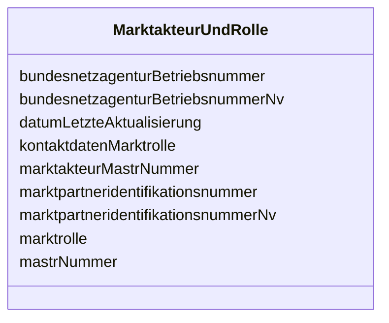

---
search:
  boost: 10.0
---

# Class: MarktakteurUndRolle 

<div data-search-exclude markdown="1">


URI: [mastr:class/MarktakteurUndRolle](https://example.org/mastr/class/MarktakteurUndRolle)





<!-- no inheritance hierarchy -->

## Slots

| Name | Cardinality and Range | Description | Inheritance |
| ---  | --- | --- | --- |
| [marktakteurMastrNummer](../slots/marktakteurMastrNummer.md) | 0..1 <br/> [String](../types/String.md) | MaStR-Nummer des Marktakteurs der diese Rolle angegeben hat | direct |
| [datumLetzteAktualisierung](../slots/datumLetzteAktualisierung.md) | 0..1 <br/> [Datetime](../types/Datetime.md) | Datum der letzten Aktualisierung an diesem Objekt | direct |
| [mastrNummer](../slots/mastrNummer.md) | 0..1 <br/> [String](../types/String.md) | Die MaStR-Nummer der Marktrolle des Marktakteurs entsprechend dem Nummernkrei... | direct |
| [marktrolle](../slots/marktrolle.md) | 0..1 <br/> [String](../types/String.md) | Die Marktrolle des Marktakteurs | direct |
| [bundesnetzagenturBetriebsnummer](../slots/bundesnetzagenturBetriebsnummer.md) | 0..1 <br/> [String](../types/String.md) | BNetzA-Betriebsnummer (nur bei Messtellenbetreiber, Stromlieferanten, Transpo... | direct |
| [bundesnetzagenturBetriebsnummerNv](../slots/bundesnetzagenturBetriebsnummerNv.md) | 0..1 <br/> [Integer](../types/Integer.md) | BNetzA-Betriebsnummer (nur bei Messtellenbetreiber, Stromlieferanten, Transpo... | direct |
| [marktpartneridentifikationsnummer](../slots/marktpartneridentifikationsnummer.md) | 0..1 <br/> [String](../types/String.md) | Die Marktpartneridentifikationsnummer (MP-ID) (nicht bei Übertragungsnetzbetr... | direct |
| [marktpartneridentifikationsnummerNv](../slots/marktpartneridentifikationsnummerNv.md) | 0..1 <br/> [Integer](../types/Integer.md) | Die Marktpartneridentifikationsnummer (MP-ID) (nicht bei Übertragungsnetzbetr... | direct |
| [kontaktdatenMarktrolle](../slots/kontaktdatenMarktrolle.md) | 0..1 <br/> [String](../types/String.md) | Name des verantwortlichen Marktakteursvertreter und dessen Kontaktdaten (E-Ma... | direct |


## Identifier and Mapping Information


### Schema Source


* from schema: https://example.org/mastr


## Mappings

| Mapping Type | Mapped Value |
| ---  | ---  |
| self | mastr:MarktakteurUndRolle |
| native | mastr:MarktakteurUndRolle |


## LinkML Source

<!-- TODO: investigate https://stackoverflow.com/questions/37606292/how-to-create-tabbed-code-blocks-in-mkdocs-or-sphinx -->

### Direct

<details>
```yaml
name: MarktakteurUndRolle
from_schema: https://example.org/mastr
attributes:
  marktakteurMastrNummer:
    name: marktakteurMastrNummer
    instantiates:
    - xsd:element
    description: MaStR-Nummer des Marktakteurs der diese Rolle angegeben hat
    from_schema: https://example.org/mastr
    domain_of:
    - GeloeschterUndDeaktivierterMarktakteur
    - MarktakteurUndRolle
    range: string
  datumLetzteAktualisierung:
    name: datumLetzteAktualisierung
    instantiates:
    - xsd:element
    description: Datum der letzten Aktualisierung an diesem Objekt
    from_schema: https://example.org/mastr
    domain_of:
    - Anlage
    - Einheit
    - EinheitGenehmigung
    - Ertuechtigung
    - GeloeschteUndDeaktivierteEinheit
    - GeloeschterUndDeaktivierterMarktakteur
    - Lokation
    - MarktakteurUndRolle
    - Netz
    range: datetime
  mastrNummer:
    name: mastrNummer
    instantiates:
    - xsd:element
    description: Die MaStR-Nummer der Marktrolle des Marktakteurs entsprechend dem
      Nummernkreis
    from_schema: https://example.org/mastr
    domain_of:
    - Lokation
    - Marktakteur
    - MarktakteurUndRolle
    - Netz
    range: string
  marktrolle:
    name: marktrolle
    instantiates:
    - xsd:element
    description: Die Marktrolle des Marktakteurs.
    from_schema: https://example.org/mastr
    rank: 1000
    domain_of:
    - MarktakteurUndRolle
    range: string
  bundesnetzagenturBetriebsnummer:
    name: bundesnetzagenturBetriebsnummer
    instantiates:
    - xsd:element
    description: BNetzA-Betriebsnummer (nur bei Messtellenbetreiber, Stromlieferanten,
      Transportkunden)
    from_schema: https://example.org/mastr
    domain_of:
    - Marktakteur
    - MarktakteurUndRolle
    range: string
  bundesnetzagenturBetriebsnummerNv:
    name: bundesnetzagenturBetriebsnummerNv
    instantiates:
    - xsd:element
    description: BNetzA-Betriebsnummer (nur bei Messtellenbetreiber, Stromlieferanten,
      Transportkunden). Nicht-vorhanden Flag
    from_schema: https://example.org/mastr
    domain_of:
    - Marktakteur
    - MarktakteurUndRolle
    range: integer
  marktpartneridentifikationsnummer:
    name: marktpartneridentifikationsnummer
    instantiates:
    - xsd:element
    description: Die Marktpartneridentifikationsnummer (MP-ID) (nicht bei Übertragungsnetzbetreiber,
      Marktgebietsverantwortlichen)
    from_schema: https://example.org/mastr
    rank: 1000
    domain_of:
    - MarktakteurUndRolle
    range: string
  marktpartneridentifikationsnummerNv:
    name: marktpartneridentifikationsnummerNv
    instantiates:
    - xsd:element
    description: Die Marktpartneridentifikationsnummer (MP-ID) (nicht bei Übertragungsnetzbetreiber,
      Marktgebietsverantwortlichen). Nicht-vorhanden Flag
    from_schema: https://example.org/mastr
    rank: 1000
    domain_of:
    - MarktakteurUndRolle
    range: integer
  kontaktdatenMarktrolle:
    name: kontaktdatenMarktrolle
    instantiates:
    - xsd:element
    description: Name des verantwortlichen Marktakteursvertreter und dessen Kontaktdaten
      (E-Mail, Telefon)
    from_schema: https://example.org/mastr
    rank: 1000
    domain_of:
    - MarktakteurUndRolle
    range: string

```
</details>

### Induced

<details>
```yaml
name: MarktakteurUndRolle
from_schema: https://example.org/mastr
attributes:
  marktakteurMastrNummer:
    name: marktakteurMastrNummer
    instantiates:
    - xsd:element
    description: MaStR-Nummer des Marktakteurs der diese Rolle angegeben hat
    from_schema: https://example.org/mastr
    owner: MarktakteurUndRolle
    domain_of:
    - GeloeschterUndDeaktivierterMarktakteur
    - MarktakteurUndRolle
    range: string
  datumLetzteAktualisierung:
    name: datumLetzteAktualisierung
    instantiates:
    - xsd:element
    description: Datum der letzten Aktualisierung an diesem Objekt
    from_schema: https://example.org/mastr
    owner: MarktakteurUndRolle
    domain_of:
    - Anlage
    - Einheit
    - EinheitGenehmigung
    - Ertuechtigung
    - GeloeschteUndDeaktivierteEinheit
    - GeloeschterUndDeaktivierterMarktakteur
    - Lokation
    - MarktakteurUndRolle
    - Netz
    range: datetime
  mastrNummer:
    name: mastrNummer
    instantiates:
    - xsd:element
    description: Die MaStR-Nummer der Marktrolle des Marktakteurs entsprechend dem
      Nummernkreis
    from_schema: https://example.org/mastr
    owner: MarktakteurUndRolle
    domain_of:
    - Lokation
    - Marktakteur
    - MarktakteurUndRolle
    - Netz
    range: string
  marktrolle:
    name: marktrolle
    instantiates:
    - xsd:element
    description: Die Marktrolle des Marktakteurs.
    from_schema: https://example.org/mastr
    rank: 1000
    owner: MarktakteurUndRolle
    domain_of:
    - MarktakteurUndRolle
    range: string
  bundesnetzagenturBetriebsnummer:
    name: bundesnetzagenturBetriebsnummer
    instantiates:
    - xsd:element
    description: BNetzA-Betriebsnummer (nur bei Messtellenbetreiber, Stromlieferanten,
      Transportkunden)
    from_schema: https://example.org/mastr
    owner: MarktakteurUndRolle
    domain_of:
    - Marktakteur
    - MarktakteurUndRolle
    range: string
  bundesnetzagenturBetriebsnummerNv:
    name: bundesnetzagenturBetriebsnummerNv
    instantiates:
    - xsd:element
    description: BNetzA-Betriebsnummer (nur bei Messtellenbetreiber, Stromlieferanten,
      Transportkunden). Nicht-vorhanden Flag
    from_schema: https://example.org/mastr
    owner: MarktakteurUndRolle
    domain_of:
    - Marktakteur
    - MarktakteurUndRolle
    range: integer
  marktpartneridentifikationsnummer:
    name: marktpartneridentifikationsnummer
    instantiates:
    - xsd:element
    description: Die Marktpartneridentifikationsnummer (MP-ID) (nicht bei Übertragungsnetzbetreiber,
      Marktgebietsverantwortlichen)
    from_schema: https://example.org/mastr
    rank: 1000
    owner: MarktakteurUndRolle
    domain_of:
    - MarktakteurUndRolle
    range: string
  marktpartneridentifikationsnummerNv:
    name: marktpartneridentifikationsnummerNv
    instantiates:
    - xsd:element
    description: Die Marktpartneridentifikationsnummer (MP-ID) (nicht bei Übertragungsnetzbetreiber,
      Marktgebietsverantwortlichen). Nicht-vorhanden Flag
    from_schema: https://example.org/mastr
    rank: 1000
    owner: MarktakteurUndRolle
    domain_of:
    - MarktakteurUndRolle
    range: integer
  kontaktdatenMarktrolle:
    name: kontaktdatenMarktrolle
    instantiates:
    - xsd:element
    description: Name des verantwortlichen Marktakteursvertreter und dessen Kontaktdaten
      (E-Mail, Telefon)
    from_schema: https://example.org/mastr
    rank: 1000
    owner: MarktakteurUndRolle
    domain_of:
    - MarktakteurUndRolle
    range: string

```
</details></div>