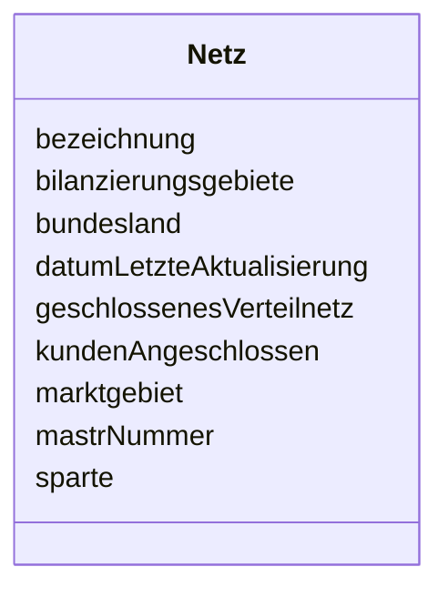

---
search:
  boost: 10.0
---

# Class: Netz 

<div data-search-exclude markdown="1">


URI: [mastr:class/Netz](https://example.org/mastr/class/Netz)





<!-- no inheritance hierarchy -->

## Slots

| Name | Cardinality and Range | Description | Inheritance |
| ---  | --- | --- | --- |
| [datumLetzteAktualisierung](../slots/datumLetzteAktualisierung.md) | 0..1 <br/> [Datetime](../types/Datetime.md) | Datum der letzten Aktualisierung an diesem Objekt | direct |
| [mastrNummer](../slots/mastrNummer.md) | 0..1 <br/> [String](../types/String.md) | Die MaStR-Nummer des Netzes | direct |
| [sparte](../slots/sparte.md) | 0..1 <br/> [Integer](../types/Integer.md) | Spartes des Netzes, Katalogkategorie: Sparte | direct |
| [kundenAngeschlossen](../slots/kundenAngeschlossen.md) | 0..1 <br/> [Integer](../types/Integer.md) | Sind Kunden angeschlossen | direct |
| [geschlossenesVerteilnetz](../slots/geschlossenesVerteilnetz.md) | 0..1 <br/> [Integer](../types/Integer.md) | Handelt es sich um ein geschlossenes Verteilnetz | direct |
| [bezeichnung](../slots/bezeichnung.md) | 0..1 <br/> [String](../types/String.md) | Die Bezeichnung des Netzes | direct |
| [marktgebiet](../slots/marktgebiet.md) | 0..1 <br/> [Integer](../types/Integer.md) | Marktgebiet des Gasnetzes | direct |
| [bundesland](../slots/bundesland.md) | 0..1 <br/> [String](../types/String.md) | Bundesländer des Netzes | direct |
| [bilanzierungsgebiete](../slots/bilanzierungsgebiete.md) | 0..1 <br/> [String](../types/String.md) | Stromnetzbetreibern), ggf | direct |


## Identifier and Mapping Information


### Schema Source


* from schema: https://example.org/mastr


## Mappings

| Mapping Type | Mapped Value |
| ---  | ---  |
| self | mastr:Netz |
| native | mastr:Netz |


## LinkML Source

<!-- TODO: investigate https://stackoverflow.com/questions/37606292/how-to-create-tabbed-code-blocks-in-mkdocs-or-sphinx -->

### Direct

<details>
```yaml
name: Netz
from_schema: https://example.org/mastr
attributes:
  datumLetzteAktualisierung:
    name: datumLetzteAktualisierung
    instantiates:
    - xsd:element
    description: Datum der letzten Aktualisierung an diesem Objekt
    from_schema: https://example.org/mastr
    domain_of:
    - Anlage
    - Einheit
    - EinheitGenehmigung
    - Ertuechtigung
    - GeloeschteUndDeaktivierteEinheit
    - GeloeschterUndDeaktivierterMarktakteur
    - Lokation
    - MarktakteurUndRolle
    - Netz
    range: datetime
  mastrNummer:
    name: mastrNummer
    instantiates:
    - xsd:element
    description: Die MaStR-Nummer des Netzes
    from_schema: https://example.org/mastr
    domain_of:
    - Lokation
    - Marktakteur
    - MarktakteurUndRolle
    - Netz
    range: string
  sparte:
    name: sparte
    instantiates:
    - xsd:element
    description: 'Spartes des Netzes, Katalogkategorie: Sparte'
    from_schema: https://example.org/mastr
    rank: 1000
    domain_of:
    - Netz
    range: integer
  kundenAngeschlossen:
    name: kundenAngeschlossen
    instantiates:
    - xsd:element
    description: Sind Kunden angeschlossen
    from_schema: https://example.org/mastr
    rank: 1000
    domain_of:
    - Netz
    range: integer
  geschlossenesVerteilnetz:
    name: geschlossenesVerteilnetz
    instantiates:
    - xsd:element
    description: Handelt es sich um ein geschlossenes Verteilnetz
    from_schema: https://example.org/mastr
    rank: 1000
    domain_of:
    - Netz
    range: integer
  bezeichnung:
    name: bezeichnung
    instantiates:
    - xsd:element
    description: Die Bezeichnung des Netzes
    from_schema: https://example.org/mastr
    rank: 1000
    domain_of:
    - Netz
    range: string
  marktgebiet:
    name: marktgebiet
    instantiates:
    - xsd:element
    description: 'Marktgebiet des Gasnetzes. Katalogkategorie: Marktgebiet'
    from_schema: https://example.org/mastr
    rank: 1000
    domain_of:
    - Netz
    - Netzanschlusspunkt
    range: integer
  bundesland:
    name: bundesland
    instantiates:
    - xsd:element
    description: 'Bundesländer des Netzes. Katalogkategorie: Bundesland Bilanzierungsgebiete
      des Netzgebietes (bei'
    from_schema: https://example.org/mastr
    domain_of:
    - Einheit
    - Marktakteur
    - Netz
    range: string
  bilanzierungsgebiete:
    name: bilanzierungsgebiete
    instantiates:
    - xsd:element
    description: Stromnetzbetreibern), ggf. Mehrfachangabe
    from_schema: https://example.org/mastr
    rank: 1000
    domain_of:
    - Netz
    range: string

```
</details>

### Induced

<details>
```yaml
name: Netz
from_schema: https://example.org/mastr
attributes:
  datumLetzteAktualisierung:
    name: datumLetzteAktualisierung
    instantiates:
    - xsd:element
    description: Datum der letzten Aktualisierung an diesem Objekt
    from_schema: https://example.org/mastr
    owner: Netz
    domain_of:
    - Anlage
    - Einheit
    - EinheitGenehmigung
    - Ertuechtigung
    - GeloeschteUndDeaktivierteEinheit
    - GeloeschterUndDeaktivierterMarktakteur
    - Lokation
    - MarktakteurUndRolle
    - Netz
    range: datetime
  mastrNummer:
    name: mastrNummer
    instantiates:
    - xsd:element
    description: Die MaStR-Nummer des Netzes
    from_schema: https://example.org/mastr
    owner: Netz
    domain_of:
    - Lokation
    - Marktakteur
    - MarktakteurUndRolle
    - Netz
    range: string
  sparte:
    name: sparte
    instantiates:
    - xsd:element
    description: 'Spartes des Netzes, Katalogkategorie: Sparte'
    from_schema: https://example.org/mastr
    rank: 1000
    owner: Netz
    domain_of:
    - Netz
    range: integer
  kundenAngeschlossen:
    name: kundenAngeschlossen
    instantiates:
    - xsd:element
    description: Sind Kunden angeschlossen
    from_schema: https://example.org/mastr
    rank: 1000
    owner: Netz
    domain_of:
    - Netz
    range: integer
  geschlossenesVerteilnetz:
    name: geschlossenesVerteilnetz
    instantiates:
    - xsd:element
    description: Handelt es sich um ein geschlossenes Verteilnetz
    from_schema: https://example.org/mastr
    rank: 1000
    owner: Netz
    domain_of:
    - Netz
    range: integer
  bezeichnung:
    name: bezeichnung
    instantiates:
    - xsd:element
    description: Die Bezeichnung des Netzes
    from_schema: https://example.org/mastr
    rank: 1000
    owner: Netz
    domain_of:
    - Netz
    range: string
  marktgebiet:
    name: marktgebiet
    instantiates:
    - xsd:element
    description: 'Marktgebiet des Gasnetzes. Katalogkategorie: Marktgebiet'
    from_schema: https://example.org/mastr
    rank: 1000
    owner: Netz
    domain_of:
    - Netz
    - Netzanschlusspunkt
    range: integer
  bundesland:
    name: bundesland
    instantiates:
    - xsd:element
    description: 'Bundesländer des Netzes. Katalogkategorie: Bundesland Bilanzierungsgebiete
      des Netzgebietes (bei'
    from_schema: https://example.org/mastr
    owner: Netz
    domain_of:
    - Einheit
    - Marktakteur
    - Netz
    range: string
  bilanzierungsgebiete:
    name: bilanzierungsgebiete
    instantiates:
    - xsd:element
    description: Stromnetzbetreibern), ggf. Mehrfachangabe
    from_schema: https://example.org/mastr
    rank: 1000
    owner: Netz
    domain_of:
    - Netz
    range: string

```
</details></div>