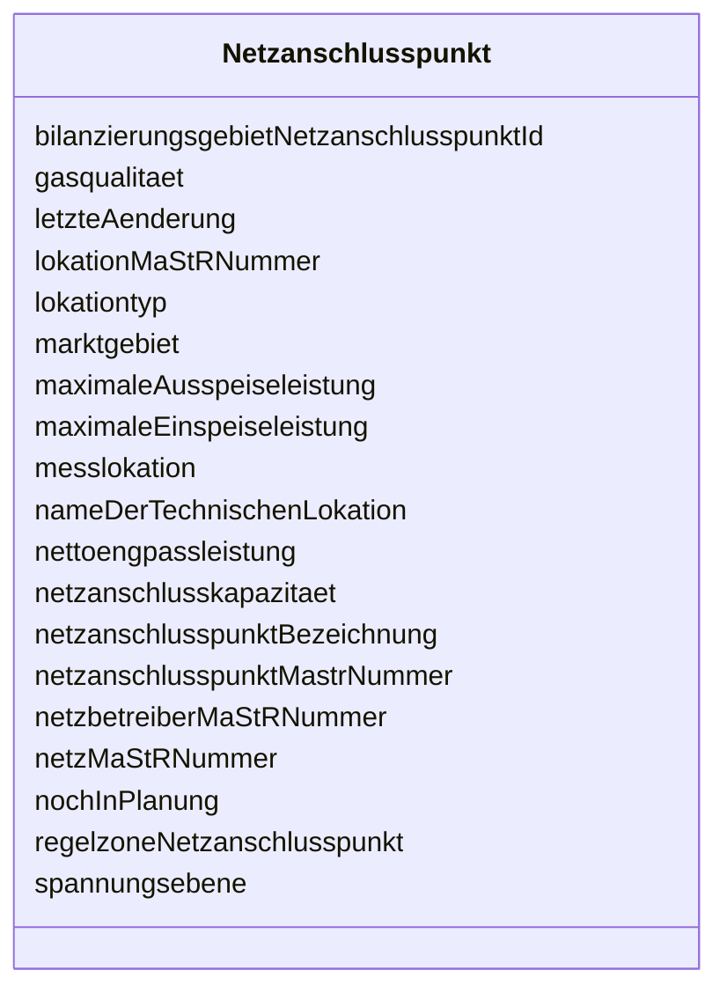

---
search:
  boost: 10.0
---

# Class: Netzanschlusspunkt 

<div data-search-exclude markdown="1">


URI: [mastr:class/Netzanschlusspunkt](https://example.org/mastr/class/Netzanschlusspunkt)





<!-- no inheritance hierarchy -->

## Slots

| Name | Cardinality and Range | Description | Inheritance |
| ---  | --- | --- | --- |
| [netzanschlusspunktMastrNummer](../slots/netzanschlusspunktMastrNummer.md) | 0..1 <br/> [String](../types/String.md) | MaStR-Nummer des Netzanschlusspunktes | direct |
| [netzanschlusspunktBezeichnung](../slots/netzanschlusspunktBezeichnung.md) | 0..1 <br/> [String](../types/String.md) | Bezeichnung des Netzanschlusspunktes | direct |
| [letzteAenderung](../slots/letzteAenderung.md) | 0..1 <br/> [Datetime](../types/Datetime.md) | Datum der letzten Aktualisierung an diesem Objekt | direct |
| [lokationMaStRNummer](../slots/lokationMaStRNummer.md) | 0..1 <br/> [String](../types/String.md) | MaStR-Nummer der Lokation | direct |
| [nameDerTechnischenLokation](../slots/nameDerTechnischenLokation.md) | 0..1 <br/> [String](../types/String.md) | Name der technischen Lokation | direct |
| [lokationtyp](../slots/lokationtyp.md) | 0..1 <br/> [Integer](../types/Integer.md) | Typ der Lokation | direct |
| [maximaleEinspeiseleistung](../slots/maximaleEinspeiseleistung.md) | 0..1 <br/> [Float](../types/Float.md) | Maximale Einspeiseleistung am Netzanschlusspunkt | direct |
| [maximaleAusspeiseleistung](../slots/maximaleAusspeiseleistung.md) | 0..1 <br/> [Float](../types/Float.md) | Technisch maximale Ausspeiseleistung am jeweiligen Netzanschlusspunkt (nur be... | direct |
| [gasqualitaet](../slots/gasqualitaet.md) | 0..1 <br/> [Integer](../types/Integer.md) | Gasqualität am Netzanschlusspunkt | direct |
| [messlokation](../slots/messlokation.md) | 0..1 <br/> [String](../types/String.md) | Messlokation gemäß Metering Code, VDE-AR-N 4400 | direct |
| [marktgebiet](../slots/marktgebiet.md) | 0..1 <br/> [Integer](../types/Integer.md) | Marktgebiet des Netzanschlusspunktes | direct |
| [spannungsebene](../slots/spannungsebene.md) | 0..1 <br/> [Integer](../types/Integer.md) | Spannungsebene des Netzanschlusspunktes | direct |
| [nettoengpassleistung](../slots/nettoengpassleistung.md) | 0..1 <br/> [Float](../types/Float.md) | Erzielbare Dauerleistung der Erzeugungseinheiten am jeweiligen Netzanschlussp... | direct |
| [bilanzierungsgebietNetzanschlusspunktId](../slots/bilanzierungsgebietNetzanschlusspunktId.md) | 0..1 <br/> [Integer](../types/Integer.md) | Id des Bilanzierungsgebietes | direct |
| [netzanschlusskapazitaet](../slots/netzanschlusskapazitaet.md) | 0..1 <br/> [Float](../types/Float.md) | Kapazität des Netzanschlusspunktes | direct |
| [regelzoneNetzanschlusspunkt](../slots/regelzoneNetzanschlusspunkt.md) | 0..1 <br/> [Integer](../types/Integer.md) | Regelzone des Netzanschlusspunktes | direct |
| [netzMaStRNummer](../slots/netzMaStRNummer.md) | 0..1 <br/> [String](../types/String.md) | MaStR-Nummer des Netzes an dem der Netzanschlusspunkt angeschlossen ist | direct |
| [nochInPlanung](../slots/nochInPlanung.md) | 0..1 <br/> [Integer](../types/Integer.md) | Kennzeichen, ob der Anschluss noch in Planung ist MaStR-Nummer des | direct |
| [netzbetreiberMaStRNummer](../slots/netzbetreiberMaStRNummer.md) | 0..1 <br/> [String](../types/String.md) | Netzbetreibers | direct |


## Identifier and Mapping Information


### Schema Source


* from schema: https://example.org/mastr


## Mappings

| Mapping Type | Mapped Value |
| ---  | ---  |
| self | mastr:Netzanschlusspunkt |
| native | mastr:Netzanschlusspunkt |


## LinkML Source

<!-- TODO: investigate https://stackoverflow.com/questions/37606292/how-to-create-tabbed-code-blocks-in-mkdocs-or-sphinx -->

### Direct

<details>
```yaml
name: Netzanschlusspunkt
from_schema: https://example.org/mastr
attributes:
  netzanschlusspunktMastrNummer:
    name: netzanschlusspunktMastrNummer
    instantiates:
    - xsd:element
    description: MaStR-Nummer des Netzanschlusspunktes
    from_schema: https://example.org/mastr
    domain_of:
    - EinheitenAenderungNetzbetreiberzuordnung
    - Netzanschlusspunkt
    range: string
  netzanschlusspunktBezeichnung:
    name: netzanschlusspunktBezeichnung
    instantiates:
    - xsd:element
    description: Bezeichnung des Netzanschlusspunktes
    from_schema: https://example.org/mastr
    rank: 1000
    domain_of:
    - Netzanschlusspunkt
    range: string
  letzteAenderung:
    name: letzteAenderung
    instantiates:
    - xsd:element
    description: Datum der letzten Aktualisierung an diesem Objekt
    from_schema: https://example.org/mastr
    rank: 1000
    domain_of:
    - Netzanschlusspunkt
    range: datetime
  lokationMaStRNummer:
    name: lokationMaStRNummer
    instantiates:
    - xsd:element
    description: MaStR-Nummer der Lokation
    from_schema: https://example.org/mastr
    domain_of:
    - Einheit
    - Netzanschlusspunkt
    range: string
  nameDerTechnischenLokation:
    name: nameDerTechnischenLokation
    instantiates:
    - xsd:element
    description: Name der technischen Lokation
    from_schema: https://example.org/mastr
    domain_of:
    - Lokation
    - Netzanschlusspunkt
    range: string
  lokationtyp:
    name: lokationtyp
    instantiates:
    - xsd:element
    description: 'Typ der Lokation. Systemkatalog: Lokationstyp'
    from_schema: https://example.org/mastr
    domain_of:
    - Lokation
    - Netzanschlusspunkt
    range: integer
  maximaleEinspeiseleistung:
    name: maximaleEinspeiseleistung
    instantiates:
    - xsd:element
    description: Maximale Einspeiseleistung am Netzanschlusspunkt
    from_schema: https://example.org/mastr
    rank: 1000
    domain_of:
    - Netzanschlusspunkt
    range: float
  maximaleAusspeiseleistung:
    name: maximaleAusspeiseleistung
    instantiates:
    - xsd:element
    description: Technisch maximale Ausspeiseleistung am jeweiligen Netzanschlusspunkt
      (nur bei Gasverbrauchern)
    from_schema: https://example.org/mastr
    rank: 1000
    domain_of:
    - Netzanschlusspunkt
    range: float
  gasqualitaet:
    name: gasqualitaet
    instantiates:
    - xsd:element
    description: 'Gasqualität am Netzanschlusspunkt. Katalogwert: Gasqualität'
    from_schema: https://example.org/mastr
    rank: 1000
    domain_of:
    - Netzanschlusspunkt
    range: integer
  messlokation:
    name: messlokation
    instantiates:
    - xsd:element
    description: Messlokation gemäß Metering Code, VDE-AR-N 4400
    from_schema: https://example.org/mastr
    rank: 1000
    domain_of:
    - Netzanschlusspunkt
    range: string
  marktgebiet:
    name: marktgebiet
    instantiates:
    - xsd:element
    description: 'Marktgebiet des Netzanschlusspunktes. Katalogkategorie: Marktgebiet'
    from_schema: https://example.org/mastr
    domain_of:
    - Netz
    - Netzanschlusspunkt
    range: integer
  spannungsebene:
    name: spannungsebene
    instantiates:
    - xsd:element
    description: 'Spannungsebene des Netzanschlusspunktes. Katalogwert: Spannungsebene'
    from_schema: https://example.org/mastr
    rank: 1000
    domain_of:
    - Netzanschlusspunkt
    range: integer
  nettoengpassleistung:
    name: nettoengpassleistung
    instantiates:
    - xsd:element
    description: Erzielbare Dauerleistung der Erzeugungseinheiten am jeweiligen Netzanschlusspunkt
    from_schema: https://example.org/mastr
    rank: 1000
    domain_of:
    - Netzanschlusspunkt
    range: float
  bilanzierungsgebietNetzanschlusspunktId:
    name: bilanzierungsgebietNetzanschlusspunktId
    instantiates:
    - xsd:element
    description: Id des Bilanzierungsgebietes
    from_schema: https://example.org/mastr
    rank: 1000
    domain_of:
    - Netzanschlusspunkt
    range: integer
  netzanschlusskapazitaet:
    name: netzanschlusskapazitaet
    instantiates:
    - xsd:element
    description: Kapazität des Netzanschlusspunktes
    from_schema: https://example.org/mastr
    rank: 1000
    domain_of:
    - Netzanschlusspunkt
    range: float
  regelzoneNetzanschlusspunkt:
    name: regelzoneNetzanschlusspunkt
    instantiates:
    - xsd:element
    description: 'Regelzone des Netzanschlusspunktes. Katalogkategorie: Regelzone'
    from_schema: https://example.org/mastr
    domain_of:
    - Bilanzierungsgebiet
    - Netzanschlusspunkt
    range: integer
  netzMaStRNummer:
    name: netzMaStRNummer
    instantiates:
    - xsd:element
    description: MaStR-Nummer des Netzes an dem der Netzanschlusspunkt angeschlossen
      ist
    from_schema: https://example.org/mastr
    rank: 1000
    domain_of:
    - Netzanschlusspunkt
    range: string
  nochInPlanung:
    name: nochInPlanung
    instantiates:
    - xsd:element
    description: Kennzeichen, ob der Anschluss noch in Planung ist MaStR-Nummer des
    from_schema: https://example.org/mastr
    rank: 1000
    domain_of:
    - Netzanschlusspunkt
    range: integer
  netzbetreiberMaStRNummer:
    name: netzbetreiberMaStRNummer
    instantiates:
    - xsd:element
    description: Netzbetreibers
    from_schema: https://example.org/mastr
    rank: 1000
    domain_of:
    - Netzanschlusspunkt
    range: string

```
</details>

### Induced

<details>
```yaml
name: Netzanschlusspunkt
from_schema: https://example.org/mastr
attributes:
  netzanschlusspunktMastrNummer:
    name: netzanschlusspunktMastrNummer
    instantiates:
    - xsd:element
    description: MaStR-Nummer des Netzanschlusspunktes
    from_schema: https://example.org/mastr
    owner: Netzanschlusspunkt
    domain_of:
    - EinheitenAenderungNetzbetreiberzuordnung
    - Netzanschlusspunkt
    range: string
  netzanschlusspunktBezeichnung:
    name: netzanschlusspunktBezeichnung
    instantiates:
    - xsd:element
    description: Bezeichnung des Netzanschlusspunktes
    from_schema: https://example.org/mastr
    rank: 1000
    owner: Netzanschlusspunkt
    domain_of:
    - Netzanschlusspunkt
    range: string
  letzteAenderung:
    name: letzteAenderung
    instantiates:
    - xsd:element
    description: Datum der letzten Aktualisierung an diesem Objekt
    from_schema: https://example.org/mastr
    rank: 1000
    owner: Netzanschlusspunkt
    domain_of:
    - Netzanschlusspunkt
    range: datetime
  lokationMaStRNummer:
    name: lokationMaStRNummer
    instantiates:
    - xsd:element
    description: MaStR-Nummer der Lokation
    from_schema: https://example.org/mastr
    owner: Netzanschlusspunkt
    domain_of:
    - Einheit
    - Netzanschlusspunkt
    range: string
  nameDerTechnischenLokation:
    name: nameDerTechnischenLokation
    instantiates:
    - xsd:element
    description: Name der technischen Lokation
    from_schema: https://example.org/mastr
    owner: Netzanschlusspunkt
    domain_of:
    - Lokation
    - Netzanschlusspunkt
    range: string
  lokationtyp:
    name: lokationtyp
    instantiates:
    - xsd:element
    description: 'Typ der Lokation. Systemkatalog: Lokationstyp'
    from_schema: https://example.org/mastr
    owner: Netzanschlusspunkt
    domain_of:
    - Lokation
    - Netzanschlusspunkt
    range: integer
  maximaleEinspeiseleistung:
    name: maximaleEinspeiseleistung
    instantiates:
    - xsd:element
    description: Maximale Einspeiseleistung am Netzanschlusspunkt
    from_schema: https://example.org/mastr
    rank: 1000
    owner: Netzanschlusspunkt
    domain_of:
    - Netzanschlusspunkt
    range: float
  maximaleAusspeiseleistung:
    name: maximaleAusspeiseleistung
    instantiates:
    - xsd:element
    description: Technisch maximale Ausspeiseleistung am jeweiligen Netzanschlusspunkt
      (nur bei Gasverbrauchern)
    from_schema: https://example.org/mastr
    rank: 1000
    owner: Netzanschlusspunkt
    domain_of:
    - Netzanschlusspunkt
    range: float
  gasqualitaet:
    name: gasqualitaet
    instantiates:
    - xsd:element
    description: 'Gasqualität am Netzanschlusspunkt. Katalogwert: Gasqualität'
    from_schema: https://example.org/mastr
    rank: 1000
    owner: Netzanschlusspunkt
    domain_of:
    - Netzanschlusspunkt
    range: integer
  messlokation:
    name: messlokation
    instantiates:
    - xsd:element
    description: Messlokation gemäß Metering Code, VDE-AR-N 4400
    from_schema: https://example.org/mastr
    rank: 1000
    owner: Netzanschlusspunkt
    domain_of:
    - Netzanschlusspunkt
    range: string
  marktgebiet:
    name: marktgebiet
    instantiates:
    - xsd:element
    description: 'Marktgebiet des Netzanschlusspunktes. Katalogkategorie: Marktgebiet'
    from_schema: https://example.org/mastr
    owner: Netzanschlusspunkt
    domain_of:
    - Netz
    - Netzanschlusspunkt
    range: integer
  spannungsebene:
    name: spannungsebene
    instantiates:
    - xsd:element
    description: 'Spannungsebene des Netzanschlusspunktes. Katalogwert: Spannungsebene'
    from_schema: https://example.org/mastr
    rank: 1000
    owner: Netzanschlusspunkt
    domain_of:
    - Netzanschlusspunkt
    range: integer
  nettoengpassleistung:
    name: nettoengpassleistung
    instantiates:
    - xsd:element
    description: Erzielbare Dauerleistung der Erzeugungseinheiten am jeweiligen Netzanschlusspunkt
    from_schema: https://example.org/mastr
    rank: 1000
    owner: Netzanschlusspunkt
    domain_of:
    - Netzanschlusspunkt
    range: float
  bilanzierungsgebietNetzanschlusspunktId:
    name: bilanzierungsgebietNetzanschlusspunktId
    instantiates:
    - xsd:element
    description: Id des Bilanzierungsgebietes
    from_schema: https://example.org/mastr
    rank: 1000
    owner: Netzanschlusspunkt
    domain_of:
    - Netzanschlusspunkt
    range: integer
  netzanschlusskapazitaet:
    name: netzanschlusskapazitaet
    instantiates:
    - xsd:element
    description: Kapazität des Netzanschlusspunktes
    from_schema: https://example.org/mastr
    rank: 1000
    owner: Netzanschlusspunkt
    domain_of:
    - Netzanschlusspunkt
    range: float
  regelzoneNetzanschlusspunkt:
    name: regelzoneNetzanschlusspunkt
    instantiates:
    - xsd:element
    description: 'Regelzone des Netzanschlusspunktes. Katalogkategorie: Regelzone'
    from_schema: https://example.org/mastr
    owner: Netzanschlusspunkt
    domain_of:
    - Bilanzierungsgebiet
    - Netzanschlusspunkt
    range: integer
  netzMaStRNummer:
    name: netzMaStRNummer
    instantiates:
    - xsd:element
    description: MaStR-Nummer des Netzes an dem der Netzanschlusspunkt angeschlossen
      ist
    from_schema: https://example.org/mastr
    rank: 1000
    owner: Netzanschlusspunkt
    domain_of:
    - Netzanschlusspunkt
    range: string
  nochInPlanung:
    name: nochInPlanung
    instantiates:
    - xsd:element
    description: Kennzeichen, ob der Anschluss noch in Planung ist MaStR-Nummer des
    from_schema: https://example.org/mastr
    rank: 1000
    owner: Netzanschlusspunkt
    domain_of:
    - Netzanschlusspunkt
    range: integer
  netzbetreiberMaStRNummer:
    name: netzbetreiberMaStRNummer
    instantiates:
    - xsd:element
    description: Netzbetreibers
    from_schema: https://example.org/mastr
    rank: 1000
    owner: Netzanschlusspunkt
    domain_of:
    - Netzanschlusspunkt
    range: string

```
</details></div>